# SỔ TAY HƯỚNG DẪN SỬ DỤNG & VẬN HÀNH BWP NOTEBOOK

## Hệ Thống Quản Trị Công Việc & Điều Hành Doanh Nghiệp Tinh Gọn

---

### THÔNG TIN TÀI LIỆU & BẢN QUYỀN

| Thuộc Tính                 | Thông Tin Chi Tiết                                                                                |
| :------------------------- | :------------------------------------------------------------------------------------------------ |
| **Tên tài liệu**           | **Tài liệu Hướng dẫn Sử dụng & Vận hành BWP Notebook (User Guide)**                               |
| **Phiên bản hệ thống**     | **2.0** (Bản phát hành Doanh nghiệp - Enterprise Edition)                                         |
| **Ngày phát hành**         | **13/09/2026**                                                                                    |
| **Tác quyền & Kiến trúc**  | **Code & Architecture by BWP Engineering Team** (BWP Engineering Team)                            |
| **Nền tảng công nghệ lõi** | Plane CE v1.4.2 Tùy biến sâu (Spreadsheet-first, Supporters, Room, Notes, Activity Audit Trail)   |
| **Môi trường triển khai**  | Máy chủ nội bộ Debian GNU/Linux 11/12 (`192.168.3.168:18080`)                                     |
| **Đối tượng áp dụng**      | Ban Giám đốc, Quản trị viên hệ thống (DevOps/Admin), Trưởng phòng ban & Toàn thể Cán bộ Nhân viên |
| **Trạng thái lưu hành**    | **Tài liệu Nội bộ Doanh nghiệp** - Hướng dẫn vận hành và đào tạo quy trình chuẩn hóa              |

---

<a id="loi-noi-dau"></a>

## Lời Nói Đầu

Trong kỷ nguyên chuyển đổi số doanh nghiệp, việc phân mảnh thông tin qua các ứng dụng chat rời rạc hoặc sổ tay viết tay truyền thống thường dẫn đến tình trạng bỏ sót đầu việc, chậm trễ tiến độ xử lý sự cố và thiếu minh bạch trong quy trách nhiệm cá nhân.

**BWP Notebook** được nghiên cứu, kiến trúc và phát triển bởi đội ngũ kỹ sư BWP (dẫn dắt bởi BWP Engineering Team) nhằm mang lại một giải pháp điều hành công việc tinh gọn, hiệu quả và phù hợp nhất với văn hóa tác nghiệp tại các doanh nghiệp Việt Nam. Kế thừa nền tảng mã nguồn mở vững chãi **Plane CE (v1.4.2)**, BWP Notebook đã được tái cấu trúc toàn diện từ giao diện người dùng (React Router SPA) đến tầng dịch vụ nghiệp vụ cốt lõi (Django REST Framework), chuyển đổi các khái niệm trừu tượng thành mô hình **Sổ tay phòng ban (Notebook)** và **Bảng tính lưới (Spreadsheet-first)** thân thuộc.

Sổ tay này là tài liệu hướng dẫn chính thức, chuẩn mực và toàn diện nhất, đóng vai trò cẩm nang tác nghiệp hàng ngày cho người dùng cuối cũng như tài liệu quy chuẩn kỹ thuật cho đội ngũ quản trị hạ tầng.

---

<a id="muc-luc"></a>

## Mục Lục Tổng Quan

- [Lời Nói Đầu](#loi-noi-dau)
- [Mục Lục Tổng Quan](#muc-luc)
- [Chương 1: Tổng Quan và Khởi Động Hệ Thống](#chuong-1)
  - [1. Giới thiệu BWP Notebook](#c1-sec-1)
    - [1.1. Mục tiêu và sứ mệnh](#c1-sec-1-1)
    - [1.2. Triết lý thiết kế cốt lõi](#c1-sec-1-2)
  - [2. Kiến trúc Hạ tầng & Các Service Docker](#c1-sec-2)
    - [2.1. Chi tiết các dịch vụ thành phần](#c1-sec-2-1)
  - [3. Cấu hình Môi trường & File Biến Môi Trường (`.env`)](#c1-sec-3)
    - [3.1. Tránh xung đột cổng mạng (Port Collision Avoidance)](#c1-sec-3-1)
    - [3.2. Mẫu cấu hình chuẩn (`.env`)](#c1-sec-3-2)
  - [4. Quy trình Khởi chạy trên Máy chủ Debian](#c1-sec-4)
    - [4.1. Yêu cầu tiên quyết về máy chủ](#c1-sec-4-1)
    - [4.2. Các bước khởi chạy chi tiết](#c1-sec-4-2)
  - [5. Khởi Tạo Tài Khoản SuperAdmin & Đổi Mật Khẩu Lần Đầu](#c1-sec-5)
    - [5.1. Vai trò của tài khoản SuperAdmin](#c1-sec-5-1)
    - [5.2. Khởi tạo tài khoản SuperAdmin ban đầu](#c1-sec-5-2)
    - [5.3. Quy trình Đặt lại & Đổi Mật khẩu Lần Đầu Bắt Buộc](#c1-sec-5-3)
  - [6. Xử Lý Sự Cố Khởi Động Thường Gặp (Troubleshooting)](#c1-sec-6)
    - [6.1. Lỗi xung đột cổng `18080` (Port is already allocated)](#c1-sec-6-1)
    - [6.2. Container `migrator` báo lỗi kết nối database](#c1-sec-6-2)
    - [6.3. Khởi động lại toàn bộ hệ thống sạch sẽ](#c1-sec-6-3)
- [Chương 2: Quản Lý Tài Khoản và Phân Quyền RBAC](#chuong-2)
  - [1. Phân Cấp 4 Vai Trò Người Dùng](#c2-sec-1)
    - [1.1. SuperAdmin (Quản trị viên Cấp cao / Toàn hệ thống)](#c2-sec-1-1)
    - [1.2. Quản trị viên đơn vị (Workspace Admin)](#c2-sec-1-2)
    - [1.3. Thành viên (Member)](#c2-sec-1-3)
    - [1.4. Khách (Guest / Cộng tác viên)](#c2-sec-1-4)
  - [2. Bảng Ma Trận Phân Quyền Chi Tiết (RBAC Matrix)](#c2-sec-2)
  - [3. Nguyên Tắc Cô Lập Dữ Liệu Theo Phòng Ban (Department Isolation)](#c2-sec-3)
    - [3.1. Các nguyên tắc an toàn bất khả xâm phạm](#c2-sec-3-1)
  - [4. Quy Trình Mời Nhân Sự & Quản Lý Phiên Đăng Nhập An Toàn](#c2-sec-4)
    - [4.1. Quy trình mời nhân sự mới vào hệ thống](#c2-sec-4-1)
    - [4.2. Phân bổ nhân sự vào từng Phòng ban / Notebook](#c2-sec-4-2)
    - [4.3. Quản lý phiên đăng nhập an toàn (Session & Token Management)](#c2-sec-4-3)
  - [5. Quy Trình Thu Hồi Quyền & Bàn Giao Khi Nhân Sự Nghỉ Việc (Offboarding)](#c2-sec-5)
- [Chương 3: Quản Lý Công Ty và Sổ Tay Phòng Ban (Notebook)](#chuong-3)
  - [1. Quản Trị Công Ty / Đơn Vị (Workspace Administration)](#c3-sec-1)
    - [1.1. Cấu hình thông tin nhận diện tổ chức](#c3-sec-1-1)
    - [1.2. Thiết lập múi giờ, lịch làm việc và định dạng ngày tháng](#c3-sec-1-2)
    - [1.3. Quản lý dung lượng lưu trữ & Hạn ngạch tệp đính kèm](#c3-sec-1-3)
  - [2. Quản Lý Phòng Ban / Sổ Tay Công Việc (Notebook / Project)](#c3-sec-2)
    - [2.1. Triết lý phân vùng dữ liệu theo Phòng ban (Department Partitioning)](#c3-sec-2-1)
    - [2.2. Quy trình khởi tạo Phòng ban / Notebook mới](#c3-sec-2-2)
    - [2.3. Quản lý nhân sự và phân quyền theo từng Notebook](#c3-sec-2-3)
  - [3. Cấu Hình Quy Trình Làm Việc (Workflow States Configuration)](#c3-sec-3)
    - [3.1. Kiến trúc 5 Nhóm Trạng Thái Chuẩn Hóa](#c3-sec-3-1)
    - [3.2. Tùy chỉnh trạng thái công việc theo đặc thù phòng ban](#c3-sec-3-2)
    - [3.3. Quy tắc chuyển đổi trạng thái và đóng vết hoàn tất](#c3-sec-3-3)
  - [4. Chính Sách Lưu Trữ & Đóng Băng An Toàn (Archive & Soft Delete)](#c3-sec-4)
    - [4.1. Phân biệt Lưu Trữ (Archive), Xóa Mềm (Soft Delete) và Xóa Vĩnh Viễn (Hard Delete)](#c3-sec-4-1)
    - [4.2. Quy trình đóng băng an toàn một Phòng ban (Archive Notebook)](#c3-sec-4-2)
    - [4.3. Quy trình khôi phục Phòng ban từ kho lưu trữ (Restore Notebook)](#c3-sec-4-3)
- [Chương 4: Quy Trình Xử Lý và Điều Hành Công Việc](#chuong-4)
  - [1. Vòng Đời Công Việc Toàn Diện (Work Item Lifecycle)](#c4-sec-1)
    - [1.1. Chi tiết các trường thông tin nghiệp vụ cốt lõi](#c4-sec-1-1)
  - [2. Phân Loại Công Việc Nghiệp Vụ & Ràng Buộc Phân Quyền Backend](#c4-sec-2)
    - [2.1. Công việc vận hành (Operational Task - `TASK_TYPE_OPERATIONAL`)](#c4-sec-2-1)
    - [2.2. Công việc khác (Other Task - `TASK_TYPE_OTHER`)](#c4-sec-2-2)
    - [2.3. Quy tắc bảo vệ phân bổ lại (Reassignment Guard)](#c4-sec-2-3)
    - [2.4. Bảng đối chiếu chi tiết hai loại công việc](#c4-sec-2-4)
  - [3. Các Chế Độ Hiển Thị Trực Quan (Multi-View System)](#c4-sec-3)
    - [3.1. Chế độ Bảng tính lưới (Spreadsheet / Table View) - Màn hình Trọng tâm](#c4-sec-3-1)
    - [3.2. Chế độ Bảng Kanban (Board View)](#c4-sec-3-2)
    - [3.3. Chế độ Danh sách (List View)](#c4-sec-3-3)
    - [3.4. Chế độ Lịch biểu (Calendar View)](#c4-sec-3-4)
  - [4. Cập Nhật Tiến Độ, Bình Luận & Quản Lý Tệp Đính Kèm](#c4-sec-4)
    - [4.1. Luồng trao đổi và bình luận thời gian thực (Real-time Collaboration)](#c4-sec-4-1)
    - [4.2. Tải lên tệp đính kèm và ảnh chụp hiện trường](#c4-sec-4-2)
    - [4.3. Thiết lập mối liên kết công việc (Issue Relations & Sub-tasks)](#c4-sec-4-3)
- [Chương 5: Nhật Ký Hoạt Động, Kiểm Toán và Quản Trị Hệ Thống](#chuong-5)
  - [1. Theo Dõi & Kiểm Toán Qua Nhật Ký Hoạt Động (Activity & Audit Log)](#c5-sec-1)
    - [1.1. Tầm quan trọng của Dấu vết Kiểm toán Số (Digital Audit Trail)](#c5-sec-1-1)
    - [1.2. Danh mục các bản ghi hoạt động được Việt hóa 100%](#c5-sec-1-2)
    - [1.3. Giao diện tra cứu và kiểm tra lịch sử](#c5-sec-1-3)
  - [2. Quy Trình Sao Lưu & Phục Hồi Cơ Sở Dữ Liệu (Backup & Disaster Recovery)](#c5-sec-2)
    - [2.1. Lệnh sao lưu cơ sở dữ liệu PostgreSQL thủ công](#c5-sec-2-1)
    - [2.2. Thiết lập Cron Job tự động sao lưu hàng ngày](#c5-sec-2-2)
    - [2.3. Quy trình khôi phục dữ liệu khẩn cấp khi gặp sự cố (Disaster Recovery)](#c5-sec-2-3)
  - [3. Danh Mục Câu Hỏi Thường Gặp (FAQs)](#c5-sec-3)
  - [4. Hướng Dẫn Xử Lý Sự Cố Kỹ Thuật (Troubleshooting Guide)](#c5-sec-4)
    - [4.1. Bảng tra cứu sự cố & phản ứng nhanh](#c5-sec-4-1)
    - [4.2. Hướng dẫn xử lý chi tiết từng sự cố](#c5-sec-4-2)
    - [4.3. Bộ lệnh chẩn đoán nhanh một chạm (One-liner Health Check)](#c5-sec-4-3)
- [Phụ Lục & Thông Tin Hỗ Trợ Kỹ Thuật](#phu-luc)

---

<div style="page-break-after: always;"></div>

<a id="chuong-1"></a>

# Chương 1: Tổng Quan và Khởi Động Hệ Thống

> **Tài liệu Hướng dẫn Vận hành BWP Notebook (User Guide)**  
> **Phiên bản:** 2.0 (Bản phát hành Doanh nghiệp)  
> **Đơn vị phát triển:** BWP Engineering Team  
> **Môi trường mục tiêu:** Debian GNU/Linux 11/12 (Máy chủ nội bộ `192.168.3.168`)

---

<a id="c1-sec-1"></a>

## 1. Giới thiệu BWP Notebook

<a id="c1-sec-1-1"></a>

### 1.1. Mục tiêu và sứ mệnh

**BWP Notebook** là giải pháp phần mềm quản lý công việc và điều hành nội bộ chuyên sâu, được thiết kế để giải quyết bài toán phân mảnh thông tin, thiếu nhất quán trong giao nhận việc và chậm trễ tiến độ tại các doanh nghiệp có cơ cấu tổ chức đa phòng ban.

Được kế thừa và phát triển từ nền tảng mã nguồn mở vững chắc **Plane CE (v1.4.2)**, BWP Notebook đã được đội ngũ kỹ sư BWP (dẫn dắt bởi BWP Engineering Team) tùy biến toàn diện cả ở tầng lõi backend (Django REST Framework) lẫn giao diện người dùng frontend (React Router SPA). Hệ thống chuyển đổi toàn bộ thuật ngữ phần mềm quản lý dự án công nghệ sang mô hình sổ tay công việc thực tiễn, thân thiện và gần gũi với môi trường vận hành doanh nghiệp Việt Nam.

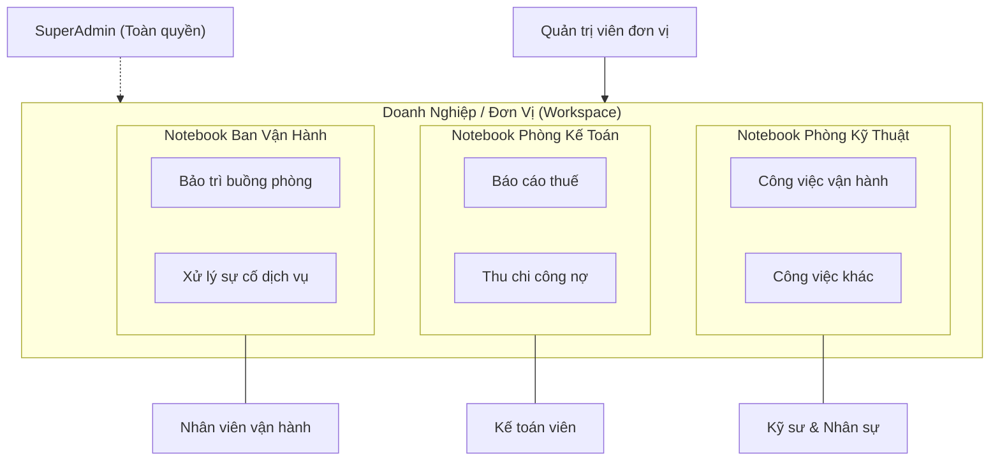

<a id="c1-sec-1-2"></a>

### 1.2. Triết lý thiết kế cốt lõi

1. **Quản lý theo mô hình phân cấp thực tiễn:**
   - **Đơn vị / Công ty (Workspace):** Không gian dữ liệu cấp cao nhất đại diện cho toàn bộ tổ chức hoặc pháp nhân doanh nghiệp.
   - **Phòng ban / Notebook (Project):** Mỗi phòng ban sở hữu một sổ tay công việc riêng biệt, hoạt động độc lập và bảo mật cao.
   - **Công việc (Work Item / Task):** Đơn vị hạt nhân của quy trình xử lý, hỗ trợ gán một người phụ trách chính, nhiều người hỗ trợ, phân loại công việc và định danh số phòng/khu vực.
2. **Giao diện bảng lưới dạng Excel (Spreadsheet-first):**
   - Loại bỏ sự cồng kềnh của các bảng Kanban phức tạp đối với người dùng văn phòng thông thường.
   - Hiển thị đầy đủ thông tin: Tên công việc, Người phụ trách, Người hỗ trợ, Trạng thái, Phòng, Ghi chú trực tiếp trên một màn hình bảng.
3. **Chuẩn hóa ngôn ngữ và văn hóa doanh nghiệp:**
   - Việt hóa 100% giao diện với bộ thuật ngữ chuẩn xác, dễ hiểu.
   - Đơn giản hóa quy trình chuyển giao trạng thái công việc qua 4 bước: **Chưa bắt đầu**, **Chờ xử lý**, **Đang thực hiện**, **Hoàn thành**.

---

<a id="c1-sec-2"></a>

## 2. Kiến trúc Hạ tầng & Các Service Docker

Hệ thống BWP Notebook được đóng gói hoàn chỉnh bằng Docker Compose, hoạt động trên một mạng ảo nội bộ cô lập (`bwp_notebook_net`). Cấu trúc hệ thống bao gồm 11 dịch vụ phối hợp nhịp nhàng:

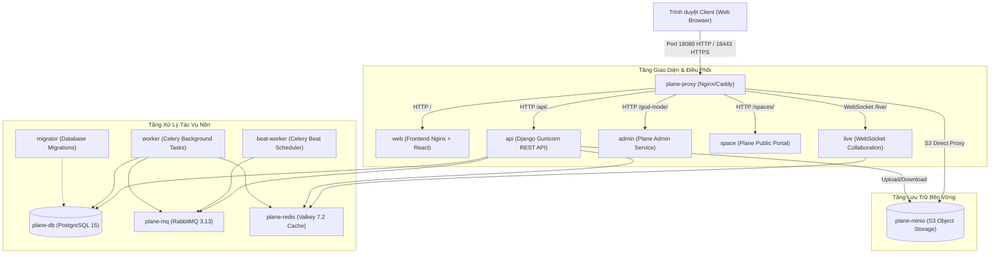

<a id="c1-sec-2-1"></a>

### 2.1. Chi tiết các dịch vụ thành phần

| Tên Dịch Vụ Docker | Image Gốc                           | Vai Trò & Chức Năng Nghiệp Vụ                                                                                                                                          | Cổng Mạng & Volume                                                            |
| :----------------- | :---------------------------------- | :--------------------------------------------------------------------------------------------------------------------------------------------------------------------- | :---------------------------------------------------------------------------- |
| `plane-db`         | `postgres:15.7-alpine`              | Cơ sở dữ liệu quan hệ lưu trữ toàn bộ người dùng, quyền, phòng ban, công việc, bình luận và nhật ký kiểm toán. Tối ưu `max_connections=200`.                           | Cổng nội bộ `5432`<br>Volume: `bwp_plane_pgdata`                              |
| `plane-redis`      | `valkey/valkey:7.2.11-alpine`       | Hệ thống lưu trữ in-memory hiệu năng cao (fork tương thích hoàn toàn Redis). Đảm nhiệm lưu session, caching, và giới hạn tần suất gọi API (Rate limiting `60/minute`). | Cổng nội bộ `6379`<br>Volume: `bwp_plane_redisdata`                           |
| `plane-mq`         | `rabbitmq:3.13.6-management-alpine` | Message Broker điều phối các hàng đợi tác vụ bất đồng bộ qua giao thức AMQP. Sử dụng vhost `bwp_plane`.                                                                | Cổng nội bộ `5672`<br>Volume: `bwp_plane_rabbitmq_data`                       |
| `plane-minio`      | `quay.io/minio/minio:latest`        | Máy chủ lưu trữ đối tượng tương thích S3 (Object Storage). Lưu trữ hình ảnh đính kèm, tệp tài liệu, ảnh đại diện vào bucket `bwp-notebook-uploads`.                    | Cổng nội bộ `9000` (API) / `9090` (Console)<br>Volume: `bwp_plane_uploads`    |
| `migrator`         | `makeplane/plane-backend:v1.4.2`    | Tác vụ chạy một lần (`restart: "no"`) để tự động kiểm tra database, nạp migration mở rộng (như `0123_issue_supporters_room_notes.py`) và tạo task types ban đầu.       | Chạy trước khi `api` kích hoạt.                                               |
| `api`              | `makeplane/plane-backend:v1.4.2`    | Ứng dụng Backend Django REST Framework chạy dưới Gunicorn, xử lý toàn bộ logic nghiệp vụ, xác thực JWT, RBAC authorization và ghi audit logs.                          | Cổng nội bộ `8000`<br>Volume: `bwp_plane_logs_api`                            |
| `worker`           | `makeplane/plane-backend:v1.4.2`    | Celery Worker nhận nhiệm vụ từ RabbitMQ để xử lý các tác vụ nền tiêu tốn tài nguyên: gửi email thông báo, tính toán chỉ số, ghi lịch sử hoạt động.                     | Volume: `bwp_plane_logs_worker`                                               |
| `beat-worker`      | `makeplane/plane-backend:v1.4.2`    | Celery Beat định thời điều phối các tác vụ định kỳ: dọn dẹp token hết hạn, đồng bộ chu kỳ công việc.                                                                   | Volume: `bwp_plane_logs_beat_worker`                                          |
| `web`              | `makeplane/plane-frontend:v1.4.2`   | Máy chủ Nginx phục vụ gói mã nguồn React Router SPA tùy biến (`custom_frontend/build/client`), tích hợp sẵn gói dịch tiếng Việt chuẩn hóa.                             | Nạp đè HTML tĩnh vào `/usr/share/nginx/html`                                  |
| `admin`            | `makeplane/plane-admin:v1.4.2`      | Dịch vụ quản trị instance, quản lý bản quyền cục bộ và cấu hình toàn hệ thống.                                                                                         | Cổng nội bộ phục vụ bảng điều khiển quản trị.                                 |
| `space`            | `makeplane/plane-space:v1.4.2`      | Cổng thông tin công khai hoặc tài liệu chia sẻ bên ngoài nếu được cấp quyền xuất bản.                                                                                  | Cổng nội bộ phục vụ Space.                                                    |
| `live`             | `makeplane/plane-live:v1.4.2`       | Dịch vụ WebSocket xử lý tương tác thời gian thực: cộng tác trực tiếp khi nhiều nhân sự cùng mở một trang tài liệu hoặc công việc.                                      | Cổng nội bộ kết nối với `plane-redis`.                                        |
| `proxy`            | `makeplane/plane-proxy:v1.4.2`      | Điểm tiếp nhận lưu lượng duy nhất từ bên ngoài, điều hướng các request đến các container tương ứng, bảo vệ an ninh mạng nội bộ.                                        | Cổng máy chủ: `18080` (HTTP) / `18443` (HTTPS)<br>Volume: `bwp_plane_proxy_*` |

---

<a id="c1-sec-3"></a>

## 3. Cấu hình Môi trường & File Biến Môi Trường (`.env`)

Để hệ thống hoạt động chính xác trên máy chủ Debian mà không xung đột với các dịch vụ mạng có sẵn, toàn bộ cấu hình được quản lý tập trung qua file môi trường.

<a id="c1-sec-3-1"></a>

### 3.1. Tránh xung đột cổng mạng (Port Collision Avoidance)

Trên các máy chủ nội bộ (ví dụ Debian IP `192.168.3.168`), các cổng mạng tiêu chuẩn như `80`, `443`, `3000`, `8080`, `5432`, `6379` thường đã được sử dụng bởi các hệ thống phần mềm khác hoặc web server của hạ tầng mạng.

> [!IMPORTANT]
> **Quy ước cổng mạng BWP Notebook:**
>
> - Cổng Web chính (HTTP): **`18080`** (Ánh xạ từ máy chủ vào cổng 80 của container `proxy`).
> - Cổng Web bảo mật (HTTPS): **`18443`** (Ánh xạ vào cổng 443 của container `proxy`).
> - Mọi service cơ sở dữ liệu (`plane-db`), cache (`plane-redis`), message queue (`plane-mq`), object storage (`plane-minio`) đều **hoạt động hoàn toàn bên trong Docker Network `bwp_notebook_net`**, không mở cổng (expose) trực tiếp ra mạng LAN của máy chủ nhằm đảm bảo an toàn tuyệt đối.

<a id="c1-sec-3-2"></a>

### 3.2. Mẫu cấu hình chuẩn (`.env`)

Tạo file `.env` tại thư mục gốc của dự án (`c:\Code\nora-notebook\.env` hoặc `/opt/nora-notebook/.env` trên máy chủ Debian) bằng cách sao chép từ file mẫu `variables.prod.env.example`:

```bash
cp variables.prod.env.example .env
```

Nội dung chi tiết của tệp cấu hình:

```ini
# ==============================================================================
# BWP-Notebook-v2 Environment Configuration
# Architecture by BWP Engineering Team (BWP Engineering Team)
# Target Server: Debian 192.168.3.168 (Port 18080)
# Base Platform: Plane CE v1.4.2
# ==============================================================================

# 1. Phiên bản nền tảng và Tên miền truy cập
APP_RELEASE=v1.4.2
APP_DOMAIN=192.168.3.168:18080
WEB_URL=http://192.168.3.168:18080

# 2. Cổng mạng lắng nghe dịch vụ ngoài
LISTEN_HTTP_PORT=18080
LISTEN_HTTPS_PORT=18443

# 3. Khóa bảo mật hệ thống (Bắt buộc sinh chuỗi ngẫu nhiên mạnh)
SECRET_KEY=bwp-notebook-secret-key-super-secure-2026-leon
LIVE_SERVER_SECRET_KEY=bwp-live-secret-key-2026-leon

# 4. Cấu hình Cơ sở dữ liệu PostgreSQL (Mạng nội bộ bwp_notebook_net)
POSTGRES_USER=bwp_plane_user
POSTGRES_PASSWORD=bwp_secret_pw_2026
POSTGRES_DB=bwp_plane

# 5. Cấu hình RabbitMQ Message Broker
RABBITMQ_USER=bwp_mq
RABBITMQ_PASSWORD=bwp_mq_password_2026

# 6. Cấu hình Lưu trữ Tệp Đối tượng (MinIO S3)
AWS_ACCESS_KEY_ID=bwp_minio_access
AWS_SECRET_ACCESS_KEY=bwp_minio_secret_key_2026
AWS_S3_BUCKET_NAME=bwp-notebook-uploads
```

> [!WARNING]
> Khi triển khai trên môi trường sản xuất thực tế, quản trị viên **phải thay đổi** các giá trị mật khẩu mặc định (`SECRET_KEY`, `POSTGRES_PASSWORD`, `RABBITMQ_PASSWORD`, `AWS_SECRET_ACCESS_KEY`) thành các chuỗi mật mã ngẫu nhiên có độ dài tối thiểu 32 ký tự.

---

<a id="c1-sec-4"></a>

## 4. Quy trình Khởi chạy trên Máy chủ Debian

<a id="c1-sec-4-1"></a>

### 4.1. Yêu cầu tiên quyết về máy chủ

- **Hệ điều hành:** Debian GNU/Linux 11 (Bullseye) hoặc 12 (Bookworm) 64-bit.
- **Tài nguyên tối thiểu:**
  - CPU: 2 Cores (Khuyến nghị 4 Cores).
  - RAM: 4 GB (Khuyến nghị 8 GB để vận hành mượt mà cùng lúc PostgreSQL, Redis, MinIO và Elasticsearch/Valkey).
  - Ổ cứng: Tối thiểu 30 GB dung lượng trống chuẩn SSD.
- **Phần mềm bắt buộc:**
  - Docker Engine phiên bản `>= 24.0.0`.
  - Docker Compose plugin phiên bản `>= 2.20.0`.

<a id="c1-sec-4-2"></a>

### 4.2. Các bước khởi chạy chi tiết

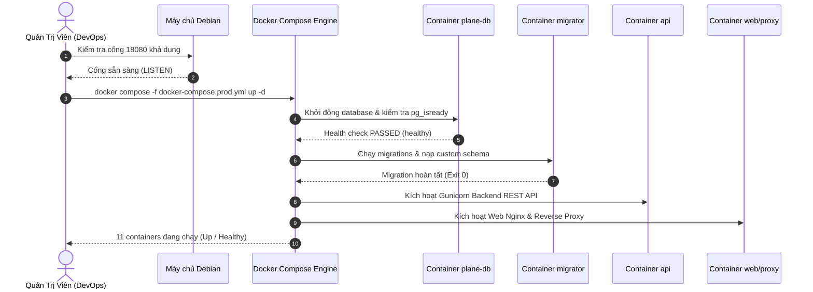

#### Bước 1: Kiểm tra cổng mạng khả dụng

Trước khi kích hoạt container, kiểm tra xem cổng `18080` có bị chiếm dụng bởi tiến trình nào khác trên Debian hay không:

```bash
sudo ss -tulpn | grep 18080
```

Nếu lệnh không trả về kết quả nào, cổng `18080` đang hoàn toàn khả dụng.

#### Bước 2: Tải image và khởi động cụm container

Thực thi lệnh Docker Compose với cấu hình sản xuất `docker-compose.prod.yml`:

```bash
docker compose -f docker-compose.prod.yml up -d
```

Quá trình này sẽ kéo các Docker image cần thiết từ registry, tạo Docker Network `bwp_notebook_net`, khởi tạo các ổ lưu trữ dữ liệu (persistent volumes) và khởi chạy 11 container theo đúng thứ tự phụ thuộc (`depends_on`).

#### Bước 3: Kiểm tra trạng thái các container

Xác nhận tất cả các container đã khởi động thành công và chuyển sang trạng thái hoạt động bình thường:

```bash
docker compose -f docker-compose.prod.yml ps
```

Kết quả mong đợi:

- `bwp_notebook_plane_db`: `Up (healthy)`
- `bwp_notebook_plane_redis`: `Up`
- `bwp_notebook_plane_mq`: `Up`
- `bwp_notebook_plane_minio`: `Up`
- `bwp_notebook_plane_migrator`: `Exited (0)` _(Container này kết thúc sau khi hoàn thành migration)_
- `bwp_notebook_plane_api`: `Up`
- `bwp_notebook_plane_worker`: `Up`
- `bwp_notebook_plane_beat_worker`: `Up`
- `bwp_notebook_plane_web`: `Up`
- `bwp_notebook_plane_proxy`: `Up (0.0.0.0:18080->80/tcp)`

#### Bước 4: Theo dõi nhật ký khởi động (Logs)

Nếu cần kiểm tra tiến trình áp dụng cơ sở dữ liệu và khởi động backend API:

```bash
# Kiểm tra nhật ký migration
docker compose -f docker-compose.prod.yml logs migrator

# Theo dõi trực tiếp log của backend API
docker compose -f docker-compose.prod.yml logs -f api
```

---

<a id="c1-sec-5"></a>

## 5. Khởi Tạo Tài Khoản SuperAdmin & Đổi Mật Khẩu Lần Đầu

<a id="c1-sec-5-1"></a>

### 5.1. Vai trò của tài khoản SuperAdmin

Tài khoản **SuperAdmin** là cấp quản trị tối cao của toàn bộ máy chủ BWP Notebook (tương ứng vai trò `InstanceAdmin` với Role cấp độ `20`). SuperAdmin có thẩm quyền:

- Truy cập bảng điều khiển hệ thống **God Mode** tại địa chỉ: `http://192.168.3.168:18080/god-mode`.
- Quản trị tất cả các Đơn vị / Công ty (Workspaces) tạo trên hệ thống.
- Xem toàn bộ dữ liệu kiểm toán bảo mật và giám sát dung lượng lưu trữ.
- Khôi phục quyền truy cập cho các tài khoản quản trị viên đơn vị khi gặp sự cố.

<a id="c1-sec-5-2"></a>

### 5.2. Khởi tạo tài khoản SuperAdmin ban đầu

Tài khoản quản trị viên tối cao mặc định của hệ thống được chỉ định theo định danh email:

- **Email quản trị viên:** `norahieunguyen@gmail.com`

Để khởi tạo hoặc cấp quyền SuperAdmin cho tài khoản này trực tiếp từ máy chủ, thực hiện lệnh quản trị sau thông qua container `api`:

```bash
# 1. Cấp quyền Instance Admin (SuperAdmin) cho email
docker compose -f docker-compose.prod.yml exec api python manage.py create_instance_admin norahieunguyen@gmail.com

# 2. Khởi tạo các loại công việc chuẩn hóa (Công việc vận hành, Công việc khác) và trạng thái tiếng Việt
docker compose -f docker-compose.prod.yml exec api python manage.py seed_task_types
```

<a id="c1-sec-5-3"></a>

### 5.3. Quy trình Đặt lại & Đổi Mật khẩu Lần Đầu Bắt Buộc

Khi tài khoản được tạo tự động hoặc khởi tạo lần đầu từ hệ thống, cờ `is_password_autoset` trong database được đặt là `True`. Hệ thống áp dụng chính sách bảo mật bắt buộc người dùng phải đổi mật khẩu để bảo vệ an toàn thông tin:

1. **Thiết lập mật khẩu an toàn ban đầu qua CLI:**
   Quản trị viên hạ tầng có thể kích hoạt lệnh đổi mật khẩu an toàn với tính năng kiểm tra độ phức tạp bằng thuật toán `zxcvbn`:

   ```bash
   docker compose -f docker-compose.prod.yml exec api python manage.py reset_password norahieunguyen@gmail.com
   ```

   - Nhập mật khẩu mới và xác nhận mật khẩu.
   - Hệ thống sẽ tự động chấm điểm độ phức tạp (yêu cầu điểm `score >= 3`).
   - Sau khi hoàn thành, cờ `is_password_autoset` được gỡ bỏ (`False`).

2. **Quy trình đổi mật khẩu trên giao diện Web:**
   - Truy cập trang đăng nhập tại: `http://192.168.3.168:18080`.
   - Đăng nhập bằng email `norahieunguyen@gmail.com` và mật khẩu vừa tạo.
   - Nhấp vào ảnh đại diện cá nhân ở góc dưới bên trái $\rightarrow$ chọn **Cài đặt cá nhân (Profile Settings)**.
   - Chọn tab **Bảo mật (Security)** $\rightarrow$ **Đổi mật khẩu (Change Password)**.
   - Nhập mật khẩu hiện tại, nhập mật khẩu mới và bấm **Lưu thay đổi**.

> [!TIP]
> **Tiêu chuẩn mật khẩu doanh nghiệp an toàn:**
>
> - Độ dài tối thiểu 10 ký tự.
> - Kết hợp chữ hoa (`A-Z`), chữ thường (`a-z`), chữ số (`0-9`) và ít nhất một ký tự đặc biệt (`!@#$%^&*`).
> - Không sử dụng thông tin dễ đoán như ngày sinh, số điện thoại hay tên đơn vị.

---

<a id="c1-sec-6"></a>

## 6. Xử Lý Sự Cố Khởi Động Thường Gặp (Troubleshooting)

<a id="c1-sec-6-1"></a>

### 6.1. Lỗi xung đột cổng `18080` (Port is already allocated)

- **Hiện tượng:** Lệnh `docker compose up` báo lỗi: `Bind for 0.0.0.0:18080 failed: port is already allocated`.
- **Nguyên nhân:** Có một tiến trình web server khác đang chiếm cổng `18080`.
- **Cách xử lý:**
  1. Kiểm tra tiến trình đang chiếm cổng: `sudo lsof -i :18080` hoặc `sudo netstat -tlpn | grep 18080`.
  2. Dừng tiến trình xung đột, hoặc mở file `.env` chỉnh sửa `LISTEN_HTTP_PORT=18081` rồi khởi động lại container `proxy`:
     ```bash
     docker compose -f docker-compose.prod.yml up -d --force-recreate proxy
     ```

<a id="c1-sec-6-2"></a>

### 6.2. Container `migrator` báo lỗi kết nối database

- **Hiện tượng:** Log `migrator` hiển thị `django.db.utils.OperationalError: could not connect to server: Connection refused`.
- **Nguyên nhân:** PostgreSQL khởi động chậm hơn dự kiến hoặc cấu hình credentials trong `.env` chưa đồng bộ giữa `POSTGRES_*` và `DATABASE_URL`.
- **Cách xử lý:**
  1. Đảm bảo container `plane-db` đã đạt trạng thái `healthy`:
     ```bash
     docker compose -f docker-compose.prod.yml ps plane-db
     ```
  2. Khởi chạy lại container migrator sau khi database sẵn sàng:
     ```bash
     docker compose -f docker-compose.prod.yml restart migrator
     ```

<a id="c1-sec-6-3"></a>

### 6.3. Khởi động lại toàn bộ hệ thống sạch sẽ

Trong trường hợp cần khởi động lại toàn bộ các dịch vụ để áp dụng cấu hình mới:

```bash
# Dừng cụm dịch vụ an toàn (không mất dữ liệu vì dữ liệu nằm trong volume)
docker compose -f docker-compose.prod.yml down

# Khởi động lại toàn bộ
docker compose -f docker-compose.prod.yml up -d
```

---

<div style="page-break-after: always;"></div>

<a id="chuong-2"></a>

# Chương 2: Quản Lý Tài Khoản và Phân Quyền RBAC

> **Tài liệu Hướng dẫn Vận hành BWP Notebook (User Guide)**  
> **Phiên bản:** 2.0 (Bản phát hành Doanh nghiệp)  
> **Đơn vị phát triển:** BWP Engineering Team  
> **Cơ chế Phân quyền:** Role-Based Access Control (RBAC) & Cô lập Phòng ban (Department Partitioning)

---

<a id="c2-sec-1"></a>

## 1. Phân Cấp 4 Vai Trò Người Dùng

Trong BWP Notebook, mọi hành vi truy cập dữ liệu và thực thi nghiệp vụ đều được kiểm soát nghiêm ngặt thông qua mô hình phân quyền dựa trên vai trò (**Role-Based Access Control - RBAC**). Hệ thống định nghĩa 4 cấp vai trò phân cấp từ cao xuống thấp:

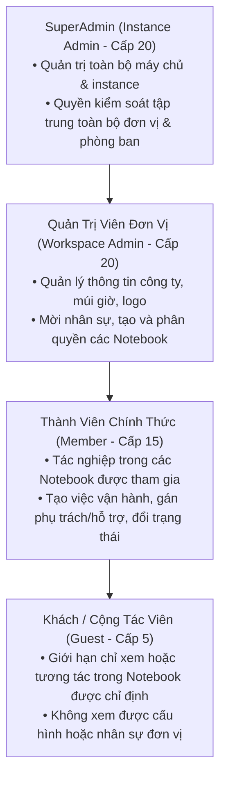

<a id="c2-sec-1-1"></a>

### 1.1. SuperAdmin (Quản trị viên Cấp cao / Toàn hệ thống)

- **Định danh kỹ thuật:** `InstanceAdmin` với thuộc tính `role = 20`.
- **Phạm vi quyền hạn:** Toàn bộ hệ thống máy chủ, không bị giới hạn bởi bất kỳ ranh giới Đơn vị (Workspace) hay Phòng ban (Notebook/Project) nào.
- **Quyền hạn đặc thù:**
  - Truy cập bảng điều khiển quản trị toàn cục **God Mode** (`/god-mode`).
  - Quản lý, khởi tạo, kích hoạt hoặc đóng băng bất kỳ Đơn vị (Công ty) nào trên máy chủ.
  - Xem toàn bộ dữ liệu kiểm toán hệ thống (System Audit Logs) để phục vụ công tác thanh tra bảo mật.
  - Cấp quyền quản trị viên cho các tài khoản mới hoặc khôi phục quyền truy cập khi đơn vị gặp sự cố.

<a id="c2-sec-1-2"></a>

### 1.2. Quản trị viên đơn vị (Workspace Admin)

- **Định danh kỹ thuật:** `WorkspaceMember` với thuộc tính `role = 20`.
- **Phạm vi quyền hạn:** Toàn bộ không gian làm việc của Công ty / Đơn vị được phân công quản lý.
- **Quyền hạn đặc thù:**
  - Cấu hình thông tin tổ chức: Tên công ty, logo nhận diện, địa chỉ URL rút gọn (slug), múi giờ và lịch làm việc.
  - Quản lý danh bạ nhân sự: Mời nhân sự mới qua email, phân bổ vai trò ban đầu, thu hồi quyền truy cập hoặc vô hiệu hóa tài khoản rời tổ chức.
  - Quản trị danh mục Notebook: Khởi tạo các phòng ban mới (Kỹ thuật, Kế toán, Vận hành, v.v.), gán trưởng bộ phận và quản lý danh sách thành viên tham gia từng phòng.
  - Đóng băng hoặc lưu trữ (Archive) các Notebook không còn hoạt động.

<a id="c2-sec-1-3"></a>

### 1.3. Thành viên (Member)

- **Định danh kỹ thuật:** `WorkspaceMember` (`role = 15`) và `ProjectMember` (`role = 15`).
- **Phạm vi quyền hạn:** Hoạt động tác nghiệp hàng ngày bên trong các Phòng ban / Notebook mà mình được thêm vào danh sách thành viên.
- **Quyền hạn đặc thù:**
  - Xem danh sách và chi tiết toàn bộ công việc trong các Notebook được quyền truy cập.
  - Tạo mới **Công việc vận hành (Operational Task)** phát sinh hằng ngày.
  - Tiếp nhận và xử lý **Công việc khác (Other Task)** do cấp trên giao.
  - Gán người phụ trách chính (Assignee), bổ sung danh sách người hỗ trợ (Supporters).
  - Cập nhật thông tin số phòng/khu vực (Room), ghi chú nội bộ (Notes), tiến độ và chuyển đổi trạng thái công việc.
  - Tham gia trao đổi, bình luận và đính kèm hồ sơ chứng từ liên quan.

<a id="c2-sec-1-4"></a>

### 1.4. Khách (Guest / Cộng tác viên)

- **Định danh kỹ thuật:** `WorkspaceMember` (`role = 5`) và `ProjectMember` (`role = 5`).
- **Phạm vi quyền hạn:** Bị cô lập cao độ, chỉ có quyền truy cập vào duy nhất một hoặc một số Notebook cụ thể được chỉ định bằng văn bản mời.
- **Đặc điểm giới hạn:**
  - Không thể xem danh sách nhân sự hay cấu hình chung của Công ty.
  - Không thể tạo mới phòng ban hay tự ý mời người khác vào hệ thống.
  - Quyền hạn trên công việc bị thu hẹp: Chỉ xem các công việc được giao hoặc bình luận góp ý mà không thể tự ý xóa hoặc thay đổi cấu hình workflow.

---

<a id="c2-sec-2"></a>

## 2. Bảng Ma Trận Phân Quyền Chi Tiết (RBAC Matrix)

Dưới đây là ma trận đối chiếu quyền thực thi chi tiết trên **5 nhóm tài nguyên nghiệp vụ** của BWP Notebook:

| Nhóm Tài Nguyên                         | Thao Tác / Quyền Nghiệp Vụ                 | SuperAdmin | Quản Trị Viên (Admin) |     Thành Viên (Member)     |    Khách (Guest)    |
| :-------------------------------------- | :----------------------------------------- | :--------: | :-------------------: | :-------------------------: | :-----------------: |
| **1. Tài Khoản & Người Dùng**           | Xem danh sách người dùng toàn máy chủ      |     Có     |         Không         |            Không            |        Không        |
|                                         | Xem danh bạ nhân sự trong đơn vị           |     Có     |          Có           |             Có              | Chỉ xem trong phòng |
|                                         | Mời / Tạo tài khoản nhân sự mới            |     Có     |          Có           |            Không            |        Không        |
|                                         | Chỉnh sửa thông tin / hồ sơ cá nhân        |     Có     |          Có           |             Có              |         Có          |
|                                         | Chỉnh sửa thông tin nhân sự khác           |     Có     |          Có           |            Không            |        Không        |
|                                         | Khóa / Vô hiệu hóa tài khoản               |     Có     |          Có           |            Không            |        Không        |
|                                         | Gán vai trò SuperAdmin                     |     Có     |         Không         |            Không            |        Không        |
|                                         | Gán / Đổi vai trò Admin / Member / Guest   |     Có     |          Có           |            Không            |        Không        |
| **2. Đơn Vị / Công Ty (Workspace)**     | Xem thông tin cấu hình công ty             |     Có     |          Có           |             Có              |      Giới hạn       |
|                                         | Thay đổi tên công ty, logo, múi giờ        |     Có     |          Có           |            Không            |        Không        |
|                                         | Quản lý tích hợp webhooks & dịch vụ ngoài  |     Có     |          Có           |            Không            |        Không        |
|                                         | Quản lý thành viên đơn vị                  |     Có     |          Có           |            Không            |        Không        |
|                                         | Lưu trữ (Archive) / Xóa đơn vị             |     Có     |         Không         |            Không            |        Không        |
| **3. Phòng Ban / Notebook (Project)**   | Xem phòng ban được mời tham gia            |     Có     |          Có           |             Có              |         Có          |
|                                         | Xem tất cả phòng ban trong công ty         |     Có     |          Có           |            Không            |        Không        |
|                                         | Tạo mới Phòng ban / Notebook               |     Có     |          Có           |            Không            |        Không        |
|                                         | Thay đổi tên, mô tả, nhận diện Notebook    |     Có     |          Có           |            Không            |        Không        |
|                                         | Cấu hình quy trình trạng thái (Workflow)   |     Có     |          Có           |            Không            |        Không        |
|                                         | Quản lý thành viên trong từng Notebook     |     Có     |          Có           |            Không            |        Không        |
|                                         | Lưu trữ / Khôi phục phòng ban (Archive)    |     Có     |          Có           |            Không            |        Không        |
|                                         | Xóa vĩnh viễn phòng ban                    |     Có     |   Có (Cần xác nhận)   |            Không            |        Không        |
| **4. Công Việc (Task / Work Item)**     | Xem danh sách & chi tiết việc trong phòng  |     Có     |          Có           |             Có              |  Có (Nếu được mời)  |
|                                         | Tạo "Công việc vận hành" (Operational)     |     Có     |          Có           |             Có              |         Có          |
|                                         | Tạo / Giao "Công việc khác" (Other)        |     Có     |          Có           | Có (Nếu có quyền giao việc) |        Không        |
|                                         | Đổi loại công việc (Vận hành <-> Khác)     |     Có     |          Có           |    Không (Chặn backend)     |        Không        |
|                                         | Gán / Đổi người phụ trách chính (Assignee) |     Có     |          Có           |             Có              |      Giới hạn       |
|                                         | Gán người hỗ trợ (Supporters)              |     Có     |          Có           |             Có              |         Có          |
|                                         | Cập nhật số phòng / khu vực (Room)         |     Có     |          Có           |             Có              |         Có          |
|                                         | Thêm / Sửa ghi chú nội bộ (Notes)          |     Có     |          Có           |             Có              |         Có          |
|                                         | Đổi trạng thái xử lý công việc             |     Có     |          Có           |             Có              |      Giới hạn       |
|                                         | Bình luận, trao đổi, đính kèm tài liệu     |     Có     |          Có           |             Có              |         Có          |
|                                         | Lưu trữ / Xóa công việc                    |     Có     |          Có           |      Chỉ việc mình tạo      |        Không        |
| **5. Nhật Ký & Kiểm Toán (Audit Logs)** | Xem lịch sử thao tác của chính mình        |     Có     |          Có           |             Có              |         Có          |
|                                         | Xem nhật ký hoạt động của phòng ban        |     Có     |          Có           |             Có              |        Không        |
|                                         | Xem toàn bộ nhật ký hệ thống (System Log)  |     Có     |         Không         |            Không            |        Không        |
|                                         | Xuất báo cáo hoạt động / kiểm toán         |     Có     |          Có           |            Không            |        Không        |

> [!NOTE]
> **Ký hiệu:**
>
> - **Có**: Được phép thực hiện đầy đủ.
> - **Không**: Bị nghiêm cấm và bị chặn ngay từ backend API.
> - **Giới hạn**: Chỉ được phép thao tác trên các bản ghi do chính mình tạo hoặc được chỉ định đích danh.

---

<a id="c2-sec-3"></a>

## 3. Nguyên Tắc Cô Lập Dữ Liệu Theo Phòng Ban (Department Isolation)

Một trong những tiêu chuẩn an toàn thông tin cốt lõi nhất của BWP Notebook là **cô lập dữ liệu theo ranh giới phòng ban** (Departmental Silo). Mỗi phòng ban được xem như một chiếc "sổ tay đóng kín", ngăn chặn hoàn toàn nguy cơ rò rỉ dữ liệu nhạy cảm giữa các bộ phận trong cùng doanh nghiệp.

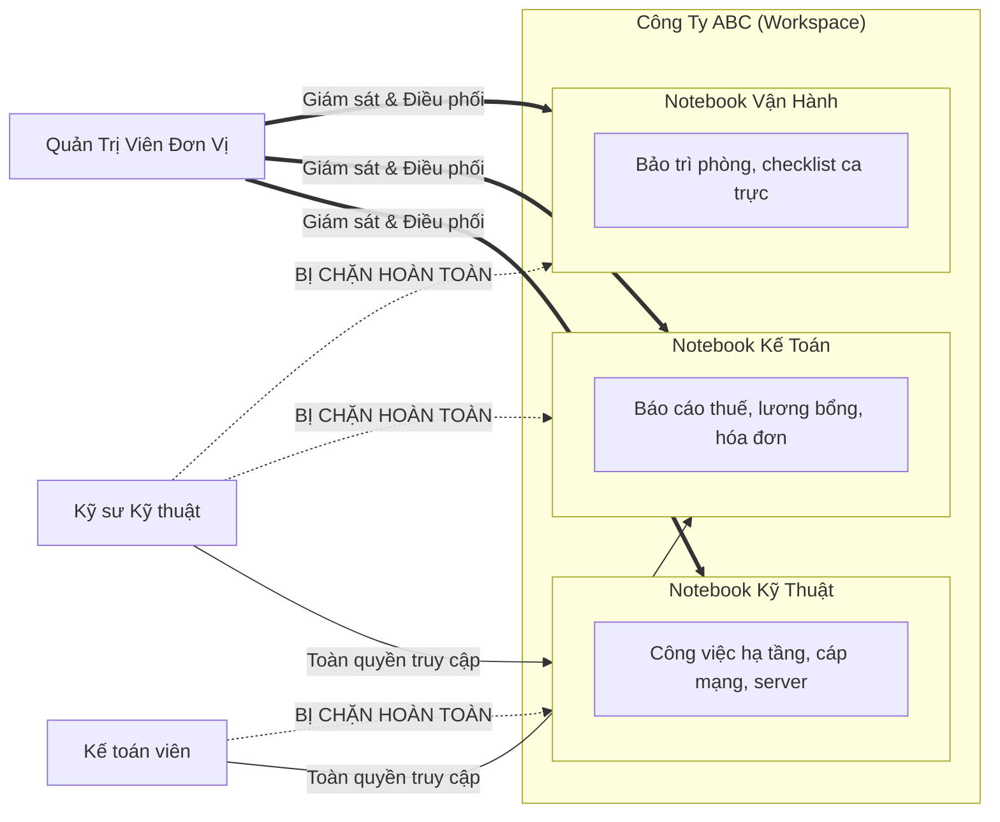

<a id="c2-sec-3-1"></a>

### 3.1. Các nguyên tắc an toàn bất khả xâm phạm

1. **Nguyên tắc "Cần biết mới thấy" (Need-to-Know Basis):**
   - Nhân sự thuộc phòng Kỹ thuật **tuyệt đối không thể nhìn thấy** danh sách công việc, ghi chú nội bộ, tệp đính kèm hay bình luận thuộc phòng Kế toán hoặc Nhân sự, trừ khi quản trị viên chủ động thêm nhân sự đó vào danh sách thành viên của phòng tương ứng.
2. **Kiểm tra thẩm quyền 2 lớp (Two-tier Enforcement):**
   - **Tầng Giao diện (Frontend Guard):** Thanh điều hướng và danh sách phòng ban chỉ hiển thị những Notebook mà tài khoản hiện tại đang là thành viên. Các nút thao tác nhạy cảm (Xóa phòng, Đổi cấu hình) tự động bị ẩn hoặc vô hiệu hóa.
   - **Tầng Dịch vụ Lõi (Backend Enforcement):** Mọi truy vấn API đến backend Django đều đi qua middleware kiểm tra quyền (`ProjectMemberBasePermission`) và lọc trực tiếp tại câu lệnh cơ sở dữ liệu:
     ```python
     # Logic cốt lõi chặn truy cập trái phép ở tầng cơ sở dữ liệu
     queryset = Issue.objects.filter(
         project__members=request.user,
         workspace__members=request.user
     )
     ```
   - Điều này đảm bảo rằng người dùng cố tình can thiệp mã JavaScript hay gọi trực tiếp REST API bằng Postman/cURL đều sẽ nhận về mã lỗi `403 Forbidden` hoặc `404 Not Found`.

> [!IMPORTANT]
> **Quyền kiểm soát tập trung của SuperAdmin & Admin:**
>
> - Quản trị viên đơn vị (Admin) có quyền xem và cấu hình toàn bộ các phòng ban trong công ty của mình để giải quyết ách tắc vận hành.
> - SuperAdmin có quyền kiểm soát xuyên suốt trên toàn máy chủ nhằm phục vụ mục đích sao lưu, bảo trì kỹ thuật và thanh tra hệ thống.

---

<a id="c2-sec-4"></a>

## 4. Quy Trình Mời Nhân Sự & Quản Lý Phiên Đăng Nhập An Toàn

<a id="c2-sec-4-1"></a>

### 4.1. Quy trình mời nhân sự mới vào hệ thống

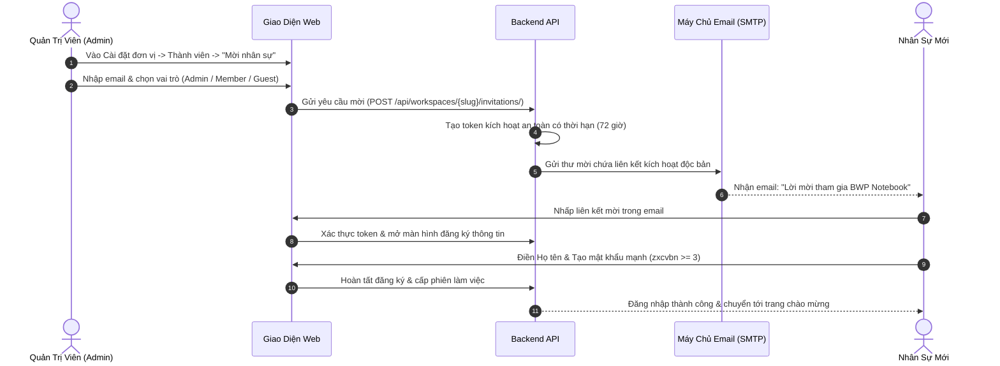

#### Các bước thao tác của Quản trị viên:

1. Đăng nhập vào hệ thống với tài khoản Admin.
2. Tại thanh bên trái, chọn **Cài đặt đơn vị (Workspace Settings)** $\rightarrow$ chọn mục **Thành viên (Members)**.
3. Bấm vào nút **Mời nhân sự (Invite Member)** ở góc trên bên phải.
4. Nhập địa chỉ email của nhân sự cần mời.
5. Tại trường **Vai trò**, chọn cấp độ phù hợp:
   - Chọn **Thành viên (Member)** cho nhân sự làm việc thông thường.
   - Chọn **Quản trị viên (Admin)** nếu người này là phó ban hoặc người hỗ trợ quản trị hệ thống.
   - Chọn **Khách (Guest)** nếu là cộng tác viên thời vụ hoặc đối tác ngoài.
6. Bấm **Gửi lời mời**.

#### Các bước tiếp nhận của Nhân sự mới:

1. Mở hộp thư điện tử cá nhân, tìm email có tiêu đề: _"Lời mời tham gia không gian làm việc BWP Notebook"_.
2. Nhấp vào nút **Chấp nhận lời mời (Accept Invitation)**.
3. Trên trang kích hoạt tài khoản:
   - Điền **Họ và tên đầy đủ**.
   - Thiết lập **Mật khẩu cá nhân**. Hệ thống tự động kiểm tra độ mạnh mật khẩu; mật khẩu phải đạt chuẩn an toàn doanh nghiệp (tối thiểu 8 ký tự, bao gồm chữ hoa, chữ thường, chữ số và ký hiệu đặc biệt).
4. Nhấn **Hoàn tất và Đăng nhập**. Hệ thống sẽ tự động đăng nhập và hiển thị giao diện tiếng Việt chuẩn hóa.

<a id="c2-sec-4-2"></a>

### 4.2. Phân bổ nhân sự vào từng Phòng ban / Notebook

Sau khi nhân sự đã gia nhập Công ty, Quản trị viên cần phân bổ nhân sự vào đúng các phòng ban nghiệp vụ:

1. Nhấp vào tên **Phòng ban / Notebook** cần cấu hình (ví dụ: _Notebook Kỹ Thuật_).
2. Chọn **Cài đặt phòng ban (Project Settings)** $\rightarrow$ mục **Thành viên (Members)**.
3. Bấm **Thêm thành viên (Add Member)**.
4. Chọn tên nhân sự từ danh sách danh bạ công ty, thiết lập vai trò trong phòng ban đó rồi nhấn **Lưu**.
5. Ngay lập tức, nhân sự sẽ nhìn thấy sổ tay này trên thanh điều hướng của mình và có thể bắt đầu tiếp nhận công việc.

<a id="c2-sec-4-3"></a>

### 4.3. Quản lý phiên đăng nhập an toàn (Session & Token Management)

Để ngăn chặn nguy cơ đánh cắp phiên và truy cập trái phép, BWP Notebook áp dụng cơ chế quản lý phiên tiêu chuẩn doanh nghiệp:

1. **Cơ chế xác thực kép Access Token & Refresh Token (JWT):**
   - **Access Token:** Có thời hạn ngắn (mặc định 60 phút), được đính kèm trong header `Authorization: Bearer <token>` cho mọi lệnh gọi API.
   - **Refresh Token:** Lưu trữ an toàn trong cookie `HttpOnly`, `SameSite=Lax`, dùng để cấp mới Access Token tự động khi người dùng vẫn đang làm việc.
2. **Cơ chế thu hồi phiên tức thời (Session Revocation):**
   - Khi Quản trị viên thay đổi vai trò hoặc khóa tài khoản của một nhân sự, backend sẽ ghi nhận sự kiện vào bộ nhớ đệm `plane-redis` (Valkey). Toàn bộ Access Token hiện có của tài khoản đó sẽ bị từ chối ngay lập tức mà không cần đợi token hết hạn.
3. **Chính sách Đăng xuất an toàn (Safe Logout):**
   - Khi người dùng bấm **Đăng xuất**, hệ thống sẽ xóa cookie phiên, hủy token trên trình duyệt và gửi tín hiệu vô hiệu hóa refresh token về máy chủ.

---

<a id="c2-sec-5"></a>

## 5. Quy Trình Thu Hồi Quyền & Bàn Giao Khi Nhân Sự Nghỉ Việc (Offboarding)

Khi có nhân sự luân chuyển công tác hoặc nghỉ việc, Quản trị viên phải thực hiện quy trình bàn giao 3 bước để đảm bảo dữ liệu công việc không bị gián đoạn và an toàn thông tin:

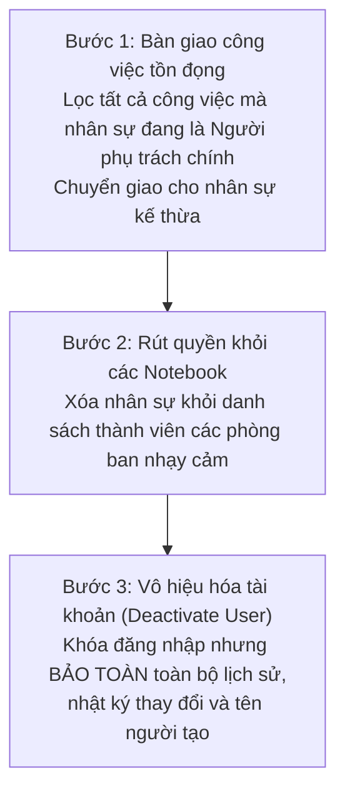

> [!WARNING]
> **Không thực hiện xóa vĩnh viễn (Hard Delete) tài khoản nhân sự:**  
> Hãy sử dụng tính năng **Khóa tài khoản (Deactivate Member)** thay vì xóa hoàn toàn khỏi cơ sở dữ liệu. Thao tác này giúp hệ thống giữ nguyên vẹn các bản ghi lịch sử, dấu vết kiểm toán và thông tin người tạo công việc trong quá khứ mà không cho phép tài khoản đó đăng nhập trở lại.

---

<div style="page-break-after: always;"></div>

<a id="chuong-3"></a>

# Chương 3: Quản Lý Công Ty và Sổ Tay Phòng Ban (Notebook)

> **Tài liệu Hướng dẫn Vận hành BWP Notebook (User Guide)**  
> **Phiên bản:** 2.0 (Bản phát hành Doanh nghiệp)  
> **Đơn vị phát triển:** BWP Engineering Team  
> **Mục tiêu Nghiệp vụ:** Quản trị Đơn vị (Workspace), Phân vùng Phòng ban (Notebook/Project) & Chuẩn hóa Workflow

---

<a id="c3-sec-1"></a>

## 1. Quản Trị Công Ty / Đơn Vị (Workspace Administration)

Trong cấu trúc dữ liệu phân tầng của BWP Notebook, **Công ty / Đơn vị (Workspace)** là thực thể cấp cao nhất, đại diện cho một pháp nhân doanh nghiệp, một tổng công ty hoặc một đơn vị tổ chức độc lập. Mọi phòng ban, nhân sự, luồng công việc và dữ liệu đính kèm đều trực thuộc phạm vi của một Đơn vị cụ thể.

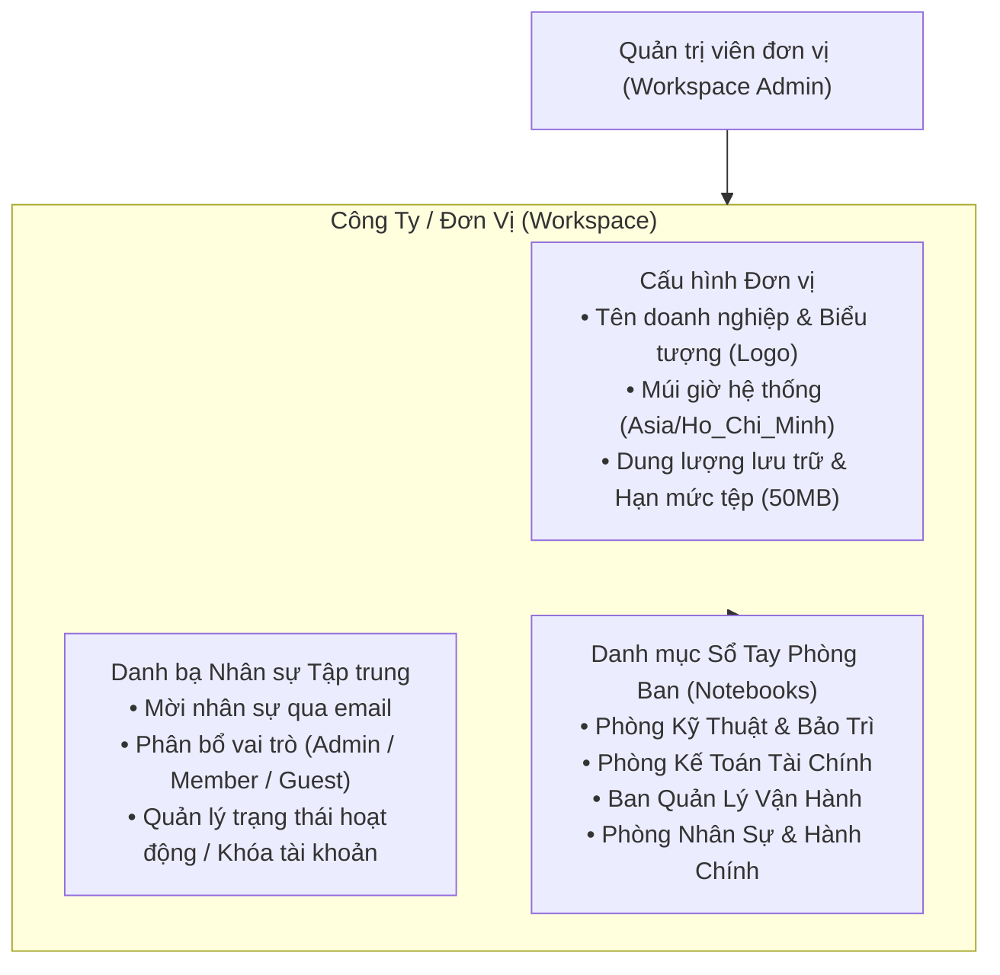

<a id="c3-sec-1-1"></a>

### 1.1. Cấu hình thông tin nhận diện tổ chức

Để thiết lập hoặc điều chỉnh thông tin doanh nghiệp, Quản trị viên đơn vị thực hiện theo các bước sau:

1. Đăng nhập vào hệ thống với tài khoản có vai trò **Quản trị viên (Admin)** hoặc **SuperAdmin**.
2. Tại thanh điều hướng bên trái màn hình, nhấp vào biểu tượng bánh răng **Cài đặt đơn vị (Workspace Settings)** $\rightarrow$ chọn thẻ **Chung (General)**.
3. Cập nhật các trường thông tin cơ bản:
   - **Tên đơn vị (Workspace Name):** Nhập tên pháp nhân hoặc thương hiệu doanh nghiệp (ví dụ: _Công ty Cổ phần Quản lý Bất động sản BWP_, _Tập đoàn Khách sạn & Nghỉ dưỡng NORA_). Tên này sẽ xuất hiện trên thanh tiêu đề, đầu trang sổ tay và trong các email thông báo.
   - **Biểu tượng đơn vị (Logo):** Tải lên logo chính thức của doanh nghiệp (định dạng hỗ trợ: PNG, SVG, JPEG; dung lượng khuyến nghị $< 2\text{MB}$, tỷ lệ vuông $1:1$). Logo sẽ được lưu trữ tự động trên máy chủ đối tượng nội bộ `plane-minio` (S3).
   - **Định danh đường dẫn (Workspace Slug):** Chuỗi ký tự định danh ngắn gọn dùng để tạo đường dẫn URL truy cập (ví dụ: `bwp`, `nora-hotel`).
   - **Mô tả đơn vị (Description):** Tóm tắt chức năng nhiệm vụ, lĩnh vực hoạt động hoặc địa chỉ trụ sở chính của đơn vị.
4. Bấm **Lưu thay đổi (Save Changes)** để áp dụng ngay lập tức cho toàn bộ người dùng trong hệ thống.

> [!WARNING]
> **Lưu ý về việc thay đổi Định danh đường dẫn (Slug):**  
> Việc thay đổi Slug sẽ làm thay đổi toàn bộ cấu trúc đường dẫn URL truy cập của hệ thống (ví dụ từ `http://192.168.3.168:18080/bwp/` sang `http://192.168.3.168:18080/bwp-group/`). Mọi liên kết đã lưu trong bookmark trình duyệt hoặc gửi qua email trước đó sẽ cần được cập nhật lại. Quản trị viên chỉ nên cấu hình Slug một lần duy nhất khi khởi tạo đơn vị.

<a id="c3-sec-1-2"></a>

### 1.2. Thiết lập múi giờ, lịch làm việc và định dạng ngày tháng

Múi giờ chuẩn xác là yếu tố sống còn để hệ thống ghi nhận thời điểm phát sinh sự cố, mốc thời gian hoàn thành công việc và cảnh báo quá hạn chính xác đến từng phút:

- **Múi giờ hệ thống (Timezone):** Mặc định thiết lập là `Asia/Ho_Chi_Minh` ($\text{GMT}+7$). Mọi mốc thời gian hiển thị trên giao diện (Activity log, bình luận, ngày tạo việc) đều được tự động quy đổi theo múi giờ này.
- **Ngày bắt đầu tuần làm việc (Week Start Day):** Chọn **Thứ Hai (Monday)** phù hợp với quy chuẩn hành chính doanh nghiệp tại Việt Nam. Thiết lập này ảnh hưởng trực tiếp đến chế độ xem Lịch (Calendar View) và các bộ đếm chu kỳ báo cáo.
- **Định dạng hiển thị thời gian:** Chuẩn hóa theo định dạng ngày/tháng/năm của Việt Nam (`DD/MM/YYYY`, ví dụ: `13/09/2026`).

<a id="c3-sec-1-3"></a>

### 1.3. Quản lý dung lượng lưu trữ & Hạn ngạch tệp đính kèm

BWP Notebook tích hợp trực tiếp với dịch vụ máy chủ đối tượng S3 nội bộ (`plane-minio`) hoạt động bên trong mạng ảo cách ly `bwp_notebook_net`:

- **Hạn mức kích thước tệp tải lên (File Size Limit):** Mặc định hệ thống giới hạn tối đa **$50\text{MB}$** cho mỗi tệp tin đính kèm (`FILE_SIZE_LIMIT=52428800` bytes). Giới hạn này ngăn chặn người dùng vô tình tải lên các video hoặc tệp nén quá lớn gây nghẽn băng thông mạng nội bộ.
- **Phân loại tệp được chấp thuận:** Hỗ trợ mọi định dạng tệp văn phòng (DOCX, XLSX, PPTX, PDF), tệp hình ảnh hiện trường (JPEG, PNG, WEBP), và tệp nén kỹ thuật (ZIP, RAR).
- **Cơ chế lưu trữ bảo mật:** Toàn bộ tệp tin được mã hóa đường dẫn lưu trữ trong bucket `bwp-notebook-uploads`. Quyền tải về được bảo vệ nghiêm ngặt qua chữ ký URL tạm thời (Signed URLs) sinh ra bởi backend API Django, ngăn chặn truy cập trái phép từ bên ngoài mạng nội bộ.

---

<a id="c3-sec-2"></a>

## 2. Quản Lý Phòng Ban / Sổ Tay Công Việc (Notebook / Project)

<a id="c3-sec-2-1"></a>

### 2.1. Triết lý phân vùng dữ liệu theo Phòng ban (Department Partitioning)

Trong mô hình điều hành BWP Notebook, khái niệm **Dự án (Project)** của nền tảng Plane gốc được chuyển đổi ngữ nghĩa thành **Phòng ban / Sổ tay công việc (Notebook)**. Mỗi phòng ban chức năng trong doanh nghiệp là một không gian sổ tay riêng biệt, khép kín và có quy chế bảo mật độc lập:

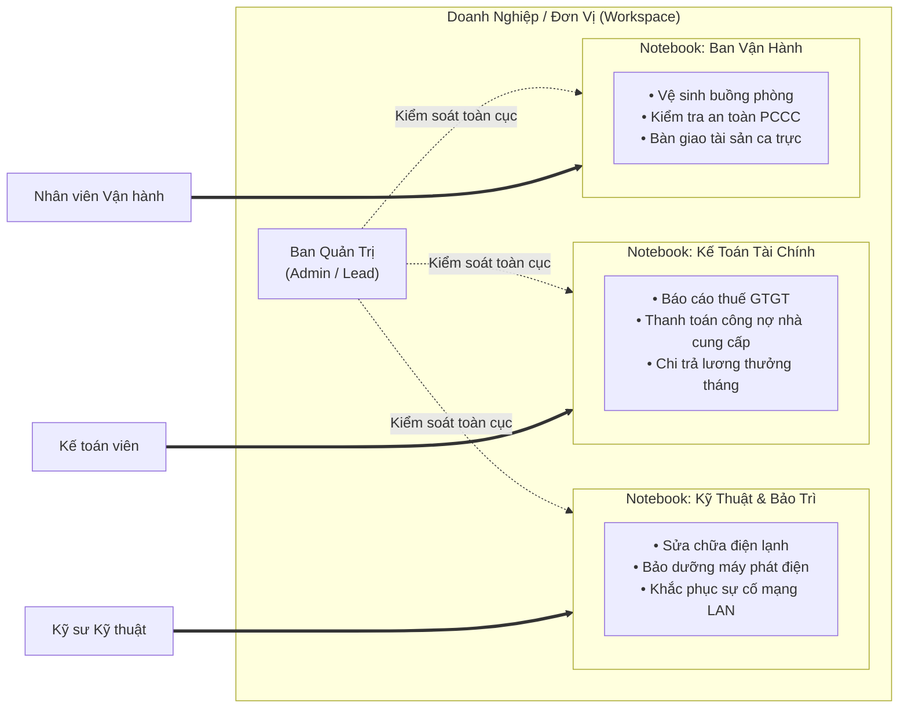

#### Các nguyên tắc phân vùng cốt lõi:

1. **Cô lập thông tin tác nghiệp:** Nhân viên thuộc Phòng Kỹ thuật chỉ nhìn thấy và xử lý các đầu việc trong Notebook Kỹ thuật. Họ hoàn toàn không có quyền xem các sổ tay nhạy cảm như Kế toán tài chính hoặc Nhân sự tiền lương.
2. **Quyền kiểm soát tập trung:** SuperAdmin và Quản trị viên đơn vị (Workspace Admin) có thẩm quyền giám sát bao quát toàn bộ các Notebook để nắm bắt bức tranh vận hành tổng thể của công ty.
3. **Mã nhận diện độc lập (Project Identifier):** Mỗi Notebook sở hữu một mã định danh viết tắt riêng (ví dụ: `KT`, `KTTC`, `NS`, `VH`). Mọi công việc sinh ra trong phòng ban sẽ tự động gắn liền với tiền tố này (ví dụ: `KT-101`, `KTTC-45`), giúp nhận diện nguồn gốc công việc ngay lập tức.

<a id="c3-sec-2-2"></a>

### 2.2. Quy trình khởi tạo Phòng ban / Notebook mới

Để tạo một sổ tay phòng ban mới, Quản trị viên thực hiện theo quy trình 5 bước sau:

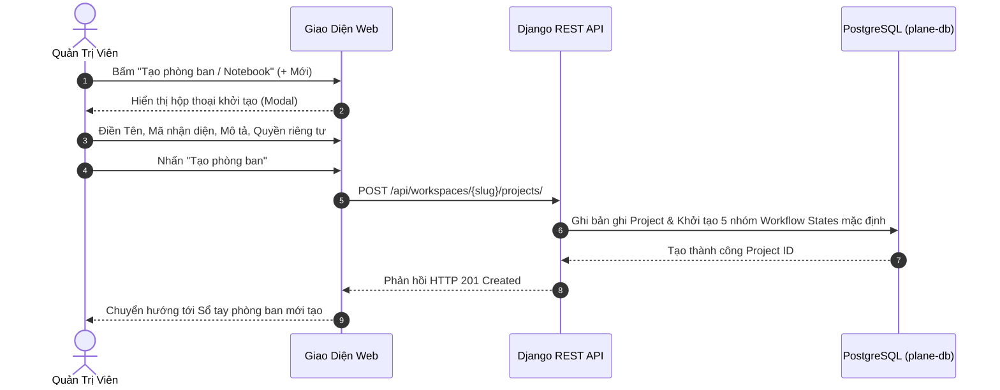

#### Hướng dẫn thao tác chi tiết:

1. **Bước 1: Mở giao diện tạo mới**
   - Tại thanh điều hướng bên trái, rê chuột vào tiêu đề mục **Phòng ban / Notebook** và bấm vào nút dấu cộng **(+)** hoặc chọn nút **Tạo phòng ban mới (Create Project)** trên màn hình Tổng quan.
2. **Bước 2: Thiết lập Tên và Mã nhận diện**
   - **Tên phòng ban (Project Name):** Đặt tên rõ ràng, chuẩn tiếng Việt (ví dụ: _Phòng Kỹ Thuật & Bảo Trì_, _Tổ Vận Hành Tòa Nhà_).
   - **Mã nhận diện (Project Identifier / Key):** Nhập chuỗi viết tắt từ 2 đến 6 ký tự in hoa không dấu (ví dụ: `KT`, `VH`, `KTTC`). Hệ thống sẽ tự động kiểm tra tính duy nhất trong đơn vị.
3. **Bước 3: Nhập mô tả chức năng & biểu tượng**
   - **Mô tả (Description):** Nêu rõ chức năng nhiệm vụ của phòng ban để các thành viên dễ nắm bắt.
   - **Biểu tượng (Icon / Emoji) & Màu sắc:** Chọn biểu tượng đại diện (ví dụ: biểu tượng cờ lê 🔧 cho Kỹ thuật, biểu tượng tòa nhà 🏢 cho Vận hành) và tông màu nhận diện để phân biệt nhanh trên thanh menu.
4. **Bước 4: Cấu hình Chế độ hiển thị & Quyền riêng tư (Network / Visibility)**
   - **Công khai nội bộ (Public to Workspace):** Mọi thành viên chính thức trong công ty đều có thể nhìn thấy phòng ban này và tự do tham gia xem thông tin nếu cần phối hợp liên phòng ban.
   - **Riêng tư / Bảo mật (Secret / Private):** **Khuyến nghị sử dụng** cho các phòng ban nhạy cảm (Kế toán, Ban Giám đốc, Nhân sự). Chỉ những nhân sự được Quản trị viên thêm đích danh vào danh sách thành viên mới có thể nhìn thấy và truy cập vào Notebook này.
5. **Bước 5: Hoàn tất khởi tạo**
   - Bấm nút **Tạo phòng ban**. Hệ thống sẽ tự động khởi tạo sổ tay cùng bộ trạng thái quy trình mặc định (_Chưa bắt đầu, Chờ xử lý, Đang thực hiện, Hoàn thành, Đã hủy_).

<a id="c3-sec-2-3"></a>

### 2.3. Quản lý nhân sự và phân quyền theo từng Notebook

Sau khi khởi tạo Notebook, Quản trị viên cần phân bổ đúng nhân sự vào phòng ban:

1. Truy cập vào Notebook vừa tạo $\rightarrow$ Chọn **Cài đặt phòng ban (Project Settings)** tại góc dưới bên trái thanh menu.
2. Chọn thẻ **Thành viên (Members)**.
3. Bấm nút **Thêm thành viên (Add Member)** ở góc trên bên phải.
4. Chọn nhân sự từ danh bạ công ty và chỉ định vai trò nội bộ trong phòng ban:
   - **Trưởng bộ phận / Quản lý (Project Admin / Lead - Cấp 20):** Có toàn quyền điều chỉnh cấu hình phòng ban, tùy chỉnh quy trình trạng thái, thêm/bớt nhân viên và giao các _Công việc khác (Other tasks)_.
   - **Nhân viên tác nghiệp (Project Member - Cấp 15):** Nhận việc, tự tạo _Công việc vận hành (Operational tasks)_, cập nhật tiến độ, số phòng và trao đổi bình luận.
   - **Cộng tác viên / Khách (Project Guest - Cấp 5):** Chỉ được xem hoặc bình luận trên các công việc được giao trực tiếp.
5. Bấm **Xác nhận**. Nhân sự sẽ thấy phòng ban này xuất hiện trên thanh điều hướng làm việc của họ ngay tức thì.

---

<a id="c3-sec-3"></a>

## 3. Cấu Hình Quy Trình Làm Việc (Workflow States Configuration)

Quy trình làm việc (Workflow) trong BWP Notebook định nghĩa hành trình tiến triển của một công việc từ lúc tiếp nhận sự cố cho đến khi nghiệm thu hoàn tất. Mỗi phòng ban có thể sở hữu một quy trình làm việc được đo ni đóng giày phù hợp với đặc thù nghiệp vụ riêng.

<a id="c3-sec-3-1"></a>

### 3.1. Kiến trúc 5 Nhóm Trạng Thái Chuẩn Hóa

Mọi trạng thái công việc trong hệ thống đều phải thuộc về một trong **5 nhóm trạng thái cốt lõi (State Groups)** sau:

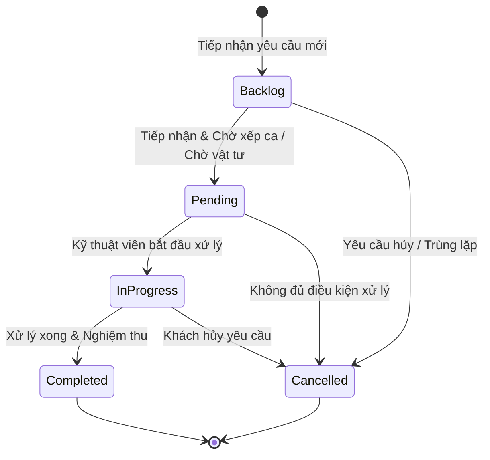

| Nhóm Trạng Thái (Group) | Tên Trạng Thái Mặc Định | Mã Màu HEX | Ý Nghĩa Nghiệp Vụ & Hành Vi Hệ Thống                                                                                       |
| :---------------------- | :---------------------- | :--------: | :------------------------------------------------------------------------------------------------------------------------- |
| **1. Backlog**          | **Chưa bắt đầu**        | `#A3A3A3`  | Công việc mới ghi nhận từ khách hàng hoặc hệ thống, đang chờ phân loại, chờ gán nhân sự xử lý.                             |
| **2. Unstarted**        | **Chờ xử lý**           | `#F59E0B`  | Đã phân công nhân sự nhưng chưa thể triển khai ngay do đang chờ vật tư thay thế, chờ đến giờ hẹn hoặc chờ khách trả phòng. |
| **3. Started**          | **Đang thực hiện**      | `#3B82F6`  | Nhân sự hoặc kỹ thuật viên đang trực tiếp tác nghiệp tại phòng/hiện trường. Hệ thống bắt đầu tính thời gian xử lý.         |
| **4. Completed**        | **Hoàn thành**          | `#10B981`  | Sự cố đã được xử lý triệt để, đã nghiệm thu kỹ thuật. Hệ thống tự động ghi nhận thời điểm hoàn thành (`completed_at`).     |
| **5. Cancelled**        | **Đã hủy**              | `#EF4444`  | Công việc bị hủy do thông tin báo sai, công việc trùng lặp hoặc khách hàng hủy yêu cầu dịch vụ.                            |

<a id="c3-sec-3-2"></a>

### 3.2. Tùy chỉnh trạng thái công việc theo đặc thù phòng ban

Mỗi phòng ban có thể bổ sung các trạng thái con chi tiết để phản ánh chính xác từng bước xử lý thực tế:

#### Ví dụ tùy chỉnh cho Phòng Kỹ Thuật & Bảo Trì:

- Nhóm _Chờ xử lý (Unstarted)_: Bổ sung thêm trạng thái **Chờ xuất kho vật tư** (Màu cam đậm `#D97706`).
- Nhóm _Đang thực hiện (Started)_: Bổ sung thêm trạng thái **Đang kiểm tra chạy thử** (Màu tím `#8B5CF6`).

#### Ví dụ tùy chỉnh cho Phòng Kế Toán Tài Chính:

- Nhóm _Chờ xử lý (Unstarted)_: Bổ sung trạng thái **Chờ Kế toán trưởng ký duyệt** (Màu vàng chanh `#EAB308`).
- Nhóm _Đang thực hiện (Started)_: Bổ sung trạng thái **Đang lập ủy nhiệm chi** (Màu lam `#2563EB`).

#### Các bước thêm trạng thái mới:

1. Vào **Cài đặt phòng ban (Project Settings)** $\rightarrow$ chọn mục **Trạng thái công việc (States)**.
2. Bấm nút **Thêm trạng thái (Add State)**.
3. Nhập **Tên trạng thái** (ví dụ: _Chờ duyệt mua vật tư_).
4. Chọn **Nhóm trạng thái cha (State Group)** tương ứng (Backlog, Unstarted, Started, Completed, Cancelled).
5. Chọn màu sắc nhận diện trực quan từ bảng mã màu.
6. Kéo thả để sắp xếp thứ tự hiển thị ưu tiên trên bảng Kanban và bảng tính. Bấm **Lưu (Save)**.

<a id="c3-sec-3-3"></a>

### 3.3. Quy tắc chuyển đổi trạng thái và đóng vết hoàn tất

- **Tự động cập nhật mốc thời gian:** Khi một công việc được chuyển sang bất kỳ trạng thái nào thuộc nhóm **Completed**, backend tự động cập nhật trường thời gian hoàn tất (`completed_at = timezone.now()`). Nếu công việc bị kéo ngược lại trạng thái _Đang thực hiện_, trường này sẽ tự động được xóa rỗng để đảm bảo tính chính xác của báo cáo hiệu suất.
- **Ràng buộc hoàn tất việc con (Sub-issues guard):** Hệ thống sẽ đưa ra cảnh báo nhắc nhở nếu người dùng cố gắng chuyển một công việc cha sang trạng thái _Hoàn thành_ trong khi các công việc con trực thuộc vẫn đang ở trạng thái _Chưa bắt đầu_ hoặc _Đang thực hiện_.

---

<a id="c3-sec-4"></a>

## 4. Chính Sách Lưu Trữ & Đóng Băng An Toàn (Archive & Soft Delete)

Trong môi trường doanh nghiệp, dữ liệu lịch sử vận hành, chi phí bảo trì và nhật ký sửa chữa phòng ốc là tài sản vô giá phục vụ công tác thanh tra, kiểm toán và bảo hiểm. BWP Notebook tuân thủ nghiêm ngặt nguyên tắc **"Không xóa cứng dữ liệu (Zero Hard-Delete Policy)"**.

<a id="c3-sec-4-1"></a>

### 4.1. Phân biệt Lưu Trữ (Archive), Xóa Mềm (Soft Delete) và Xóa Vĩnh Viễn (Hard Delete)

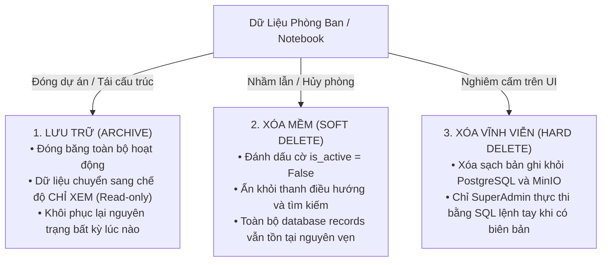

| Tiêu Chí So Sánh         | 1. Lưu Trữ (Archive)                           | 2. Xóa Mềm (Soft Delete)                 | 3. Xóa Vĩnh Viễn (Hard Delete)                 |
| :----------------------- | :--------------------------------------------- | :--------------------------------------- | :--------------------------------------------- |
| **Mục đích sử dụng**     | Đóng dự án hoàn thành, bảo tồn lịch sử tra cứu | Ẩn phòng ban tạo nhầm hoặc giải thể      | Dọn rác dữ liệu thử nghiệm trong giai đoạn dev |
| **Trạng thái dữ liệu**   | Chuyển sang chế độ **Chỉ đọc (Read-only)**     | Đánh dấu ẩn (`is_active=False`)          | Xóa sạch khỏi ổ đĩa vật lý                     |
| **Quyền truy cập**       | Thành viên vẫn có thể tra cứu và tìm kiếm      | Bị ẩn hoàn toàn trên giao diện làm việc  | Dữ liệu mất vĩnh viễn, không thể phục hồi      |
| **Thao tác khôi phục**   | 1 nhấp chuột trên giao diện Quản trị           | Quản trị viên kích hoạt lại qua Admin UI | Không thể (chỉ khôi phục từ bản sao lưu DB)    |
| **Thẩm quyền thực hiện** | Quản trị viên phòng ban / Đơn vị               | Quản trị viên đơn vị (Workspace Admin)   | Chỉ SuperAdmin qua console máy chủ             |

<a id="c3-sec-4-2"></a>

### 4.2. Quy trình đóng băng an toàn một Phòng ban (Archive Notebook)

Khi một phòng ban hoàn thành nhiệm vụ theo mùa vụ hoặc có sự sáp nhập tổ chức, Quản trị viên thực hiện quy trình đóng băng theo 4 bước sau:


#### Hướng dẫn chi tiết:

1. **Rà soát công việc tồn đọng:** Truy cập vào Notebook cần lưu trữ, kiểm tra bộ lọc để chắc chắn không còn công việc nào đang dang dở. Nếu còn việc chưa xong, chuyển giao (transfer) sang cho phòng ban tiếp nhận mới.
2. **Truy cập Vùng nguy hiểm (Danger Zone):** Vào **Cài đặt phòng ban (Project Settings)** $\rightarrow$ cuộn chuột xuống mục cuối cùng **Vùng nguy hiểm**.
3. **Thực hiện Lưu trữ:**
   - Nhấp vào nút **Lưu trữ phòng ban (Archive Project)**.
   - Hộp thoại cảnh báo xuất hiện yêu cầu Quản trị viên nhập chính xác **Tên định danh (Key)** của phòng ban để xác nhận hành động có chủ đích.
   - Bấm nút **Xác nhận lưu trữ**.
4. **Kết quả đóng băng:** Ngay lập tức, phòng ban sẽ được đưa vào danh mục lưu trữ. Biểu tượng ổ khóa sẽ xuất hiện bên cạnh tên phòng ban. Mọi thành viên chỉ có quyền tra cứu nội dung, toàn bộ các nút _Tạo công việc_, _Chỉnh sửa trạng thái_ hoặc _Xóa_ đều bị vô hiệu hóa.

<a id="c3-sec-4-3"></a>

### 4.3. Quy trình khôi phục Phòng ban từ kho lưu trữ (Restore Notebook)

Khi cần kích hoạt lại một phòng ban đã lưu trữ:

1. Vào **Cài đặt đơn vị (Workspace Settings)** $\rightarrow$ chọn mục **Phòng ban / Dự án (Projects)**.
2. Chuyển sang thẻ con **Đã lưu trữ (Archived)**.
3. Tìm phòng ban cần khôi phục trong danh sách.
4. Bấm vào nút biểu tượng **Khôi phục (Restore)** bên cạnh tên phòng ban.
5. Xác nhận yêu cầu. Phòng ban sẽ lập tức xuất hiện trở lại trên thanh điều hướng làm việc của các thành viên với toàn bộ dữ liệu, danh sách công việc và bình luận được phục hồi nguyên trạng $100\%$.

> [!CAUTION]
> **Cảnh báo về việc xóa phòng ban:**  
> Hệ thống cung cấp nút xóa phòng ban trong Vùng nguy hiểm, nhưng hành động này được bảo vệ bởi cơ chế kiểm tra toàn vẹn dữ liệu (Foreign Key Constraints). Nếu phòng ban đã phát sinh các công việc và nhật ký hoạt động, hệ thống sẽ từ chối xóa để bảo toàn dữ liệu kiểm toán tài chính. Quản trị viên luôn được khuyến nghị sử dụng tính năng **Lưu trữ (Archive)** thay vì xóa.

---

<div style="page-break-after: always;"></div>

<a id="chuong-4"></a>

# Chương 4: Quy Trình Xử Lý và Điều Hành Công Việc

> **Tài liệu Hướng dẫn Vận hành BWP Notebook (User Guide)**  
> **Phiên bản:** 2.0 (Bản phát hành Doanh nghiệp)  
> **Đơn vị phát triển:** BWP Engineering Team  
> **Trọng tâm Nghiệp vụ:** Vòng đời Công việc, Phân bổ Đa nhân sự, Định vị Mặt bằng & Đa chế độ hiển thị

---

<a id="c4-sec-1"></a>

## 1. Vòng Đời Công Việc Toàn Diện (Work Item Lifecycle)

Trong BWP Notebook, **Công việc (Work Item / Task)** là đơn vị tác nghiệp hạt nhân. Mỗi công việc phản ánh một yêu cầu sửa chữa kỹ thuật, một nhiệm vụ bảo dưỡng buồng phòng, một chứng từ kế toán cần xử lý, hoặc một chỉ đạo điều hành từ Ban Giám đốc.

Quy trình xử lý một công việc từ lúc phát sinh đến khi đóng vết kiểm toán trải qua 6 giai đoạn chặt chẽ:

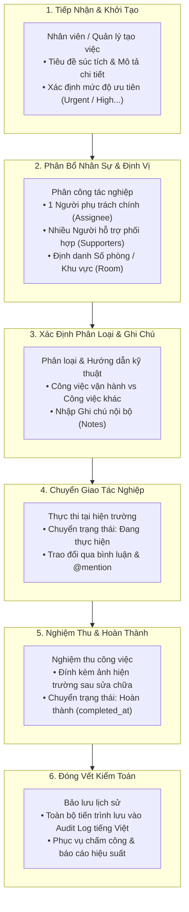

<a id="c4-sec-1-1"></a>

### 1.1. Chi tiết các trường thông tin nghiệp vụ cốt lõi

Khi mở hộp thoại **Tạo công việc mới (Create Work Item)**, người dùng sẽ điền thông tin vào các trường dữ liệu chuẩn hóa sau:

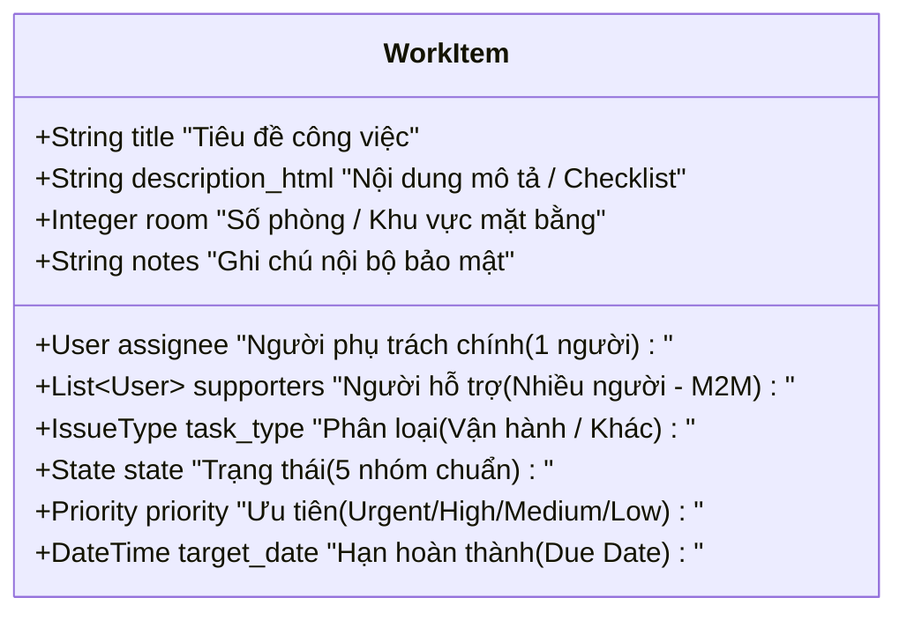

1. **Tiêu đề công việc (Title - Bắt buộc):**
   - Đặt tên ngắn gọn, nêu rõ đối tượng và sự cố phát sinh.
   - _Ví dụ chuẩn:_ `Phòng 402 - Máy lạnh rỉ nước dàn lạnh`, `Tầng hầm B1 - Đèn chiếu sáng lối thoát hiểm bị chập`, `Phòng Kế toán - Lập ủy nhiệm chi tiền điện tháng 8`.
2. **Nội dung mô tả (Description):**
   - Trình soạn thảo văn bản giàu (Rich-text editor) hỗ trợ định dạng danh sách công việc (Checklist), in đậm các thông số kỹ thuật, bảng biểu và dán trực tiếp ảnh chụp hiện trường từ clipboard (`Ctrl + V`).
3. **Người phụ trách chính (Assignee - Đơn nhất):**
   - Đúng **01 nhân sự** chịu trách nhiệm chính về chất lượng và tiến độ hoàn thành công việc. Nhân sự này sẽ nhận thông báo khi có bất kỳ thay đổi nào liên quan.
4. **Người hỗ trợ (Supporters - Đa nhân sự M2M):**
   - **Tính năng tùy biến độc quyền:** Trong thực tế vận hành tòa nhà hay khách sạn, một sự cố lớn (như vỡ đường ống nước ngầm hoặc bảo trì thang máy) đòi hỏi sự phối hợp cùng lúc của nhiều kỹ sư và thợ phụ.
   - Trường **Supporters** cho phép gán danh sách nhiều nhân sự cùng tham gia hỗ trợ. Tất cả người hỗ trợ đều nhận được thông báo, có quyền cập nhật hiện trường và được ghi nhận công lao vào nhật ký kiểm toán.
5. **Số phòng / Khu vực (Room):**
   - Trường số nguyên định danh vị trí mặt bằng phát sinh sự cố (ví dụ: `101`, `305`, `1208`).
   - Cho phép tìm kiếm và lọc tức thì tất cả các công việc liên quan đến một căn phòng cụ thể, phục vụ tra cứu lịch sử hỏng hóc của phòng trước khi bàn giao cho khách lưu trú.
6. **Ghi chú nội bộ (Notes):**
   - Dành cho các trao đổi nghiệp vụ nhạy cảm, dặn dò ca trực hoặc ghi chú kỹ thuật giữa các nhân sự xử lý (ví dụ: _Cần mang theo thang chữ A 3m; Khách trong phòng đang nghỉ, chỉ gõ cửa sau 14h00_).
7. **Mức độ ưu tiên (Priority):**
   - **Khẩn cấp (Urgent - Cờ đỏ):** Sự cố nghiêm trọng đe dọa an toàn (cháy nổ, ngập nước, mất điện toàn khu vực). Phải xử lý ngay trong vòng 15-30 phút.
   - **Cao (High - Cờ cam):** Sự cố ảnh hưởng trực tiếp đến trải nghiệm của khách hàng (hỏng điều hòa mùa hè, tắc bồn cầu). Xử lý trong vòng 1-2 giờ.
   - **Trung bình (Medium - Cờ vàng):** Các sự cố nhỏ (đèn bàn hỏng, cửa sổ rít). Xử lý trong ngày.
   - **Thấp (Low - Cờ xám):** Sơn sửa thẩm mỹ, kiểm tra định kỳ không gấp.
   - **Không ưu tiên (None):** Các ý tưởng cải tiến hoặc công việc tồn đọng chờ lịch.
8. **Thời hạn hoàn thành (Due Date):**
   - Thiết lập mốc hạn chót phải hoàn thành. Hệ thống sẽ tự động đổi màu cảnh báo đỏ trên bảng điều khiển khi công việc bị quá hạn (Overdue).

---

<a id="c4-sec-2"></a>

## 2. Phân Loại Công Việc Nghiệp Vụ & Ràng Buộc Phân Quyền Backend

BWP Notebook thiết lập cơ chế phân loại công việc thành 2 nhóm chuyên biệt, được kiểm soát chặt chẽ bằng nghiệp vụ backend (Django REST Framework) nhằm đảm bảo tính chuẩn xác của dữ liệu và tôn trọng thứ bậc điều hành:

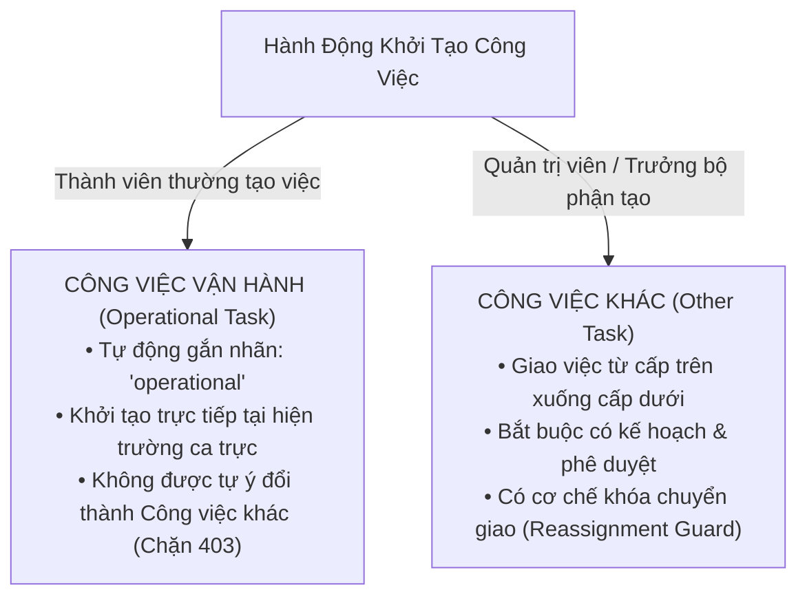

<a id="c4-sec-2-1"></a>

### 2.1. Công việc vận hành (Operational Task - `TASK_TYPE_OPERATIONAL`)

- **Bản chất nghiệp vụ:** Là các công việc phát sinh thường nhật, tức thời trong ca trực của nhân viên vận hành, kỹ thuật viên buồng phòng hoặc bảo vệ (ví dụ: sửa vòi sen, thay bóng đèn, dọn phòng phát sinh).
- **Cơ chế tự động hóa:** Khi một **Thành viên (Member)** bấm tạo việc, hệ thống backend tự động phân loại công việc đó là `operational`.
- **Ràng buộc an toàn:** Thành viên thông thường **không có quyền** tự ý chuyển phân loại công việc từ _Công việc vận hành_ sang _Công việc khác_. Mọi nỗ lực gửi payload can thiệp qua API sẽ bị backend từ chối với mã lỗi `HTTP 403 Forbidden`.

<a id="c4-sec-2-2"></a>

### 2.2. Công việc khác (Other Task - `TASK_TYPE_OTHER`)

- **Bản chất nghiệp vụ:** Là các nhiệm vụ theo kế hoạch tháng/quý, công việc dự án, chỉ đạo đột xuất từ Ban Giám đốc, hoặc các đầu việc hành chính kế toán (ví dụ: kiểm kê kho định kỳ, báo cáo tài chính năm, nâng cấp trạm biến áp).
- **Thẩm quyền khởi tạo:** Chỉ **Quản trị viên đơn vị (Workspace Admin)** hoặc **Trưởng bộ phận (Project Lead)** mới có thẩm quyền khởi tạo công việc loại này hoặc chuyển đổi một công việc vận hành thành công việc kế hoạch.

<a id="c4-sec-2-3"></a>

### 2.3. Quy tắc bảo vệ phân bổ lại (Reassignment Guard)

Để ngăn chặn tình trạng đùn đẩy trách nhiệm hoặc tự ý chuyển giao các nhiệm vụ quan trọng do cấp trên giao phó:

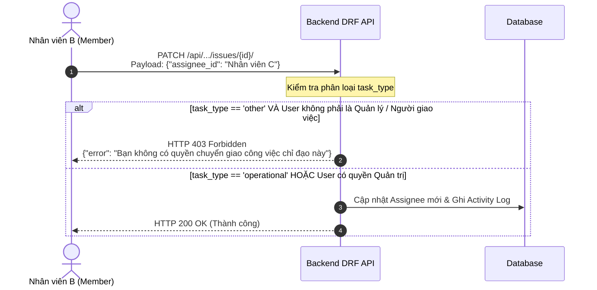

> [!IMPORTANT]
> **Ràng buộc nghiệp vụ tầng Backend:**  
> Hệ thống kiểm soát tính toàn vẹn ngay tại tầng API của Django (`IssueViewSet`), không dựa đơn thuần vào việc ẩn/hiện nút bấm trên trình duyệt. Mọi hành vi cố tình vượt quyền đều được ghi lại trong nhật ký hệ thống kèm địa chỉ IP và mã người dùng.

<a id="c4-sec-2-4"></a>

### 2.4. Bảng đối chiếu chi tiết hai loại công việc

| Tiêu Chí So Sánh                 | Công Việc Vận Hành (`operational`)               | Công Việc Khác (`other`)                         |
| :------------------------------- | :----------------------------------------------- | :----------------------------------------------- |
| **Nguồn gốc phát sinh**          | Sự cố đột xuất tại phòng, ca trực thường nhật    | Chỉ thị cấp trên, kế hoạch bảo dưỡng định kỳ     |
| **Thẩm quyền tạo việc**          | Toàn bộ Thành viên (Member, Admin, SuperAdmin)   | Chỉ Quản trị viên (Admin) và Trưởng bộ phận      |
| **Thẩm quyền đổi loại việc**     | Chỉ Quản trị viên mới được nâng cấp sang `other` | Quản trị viên và Trưởng bộ phận                  |
| **Quyền chuyển giao (Reassign)** | Tự do điều phối hỗ trợ trong ca trực             | Bị khóa bảo vệ; chỉ người giao việc mới được đổi |
| **Yêu cầu nghiệm thu**           | Kỹ thuật viên xác nhận sau khi chạy thử          | Trưởng phòng hoặc Quản trị viên ký duyệt         |

---

<a id="c4-sec-3"></a>

## 3. Các Chế Độ Hiển Thị Trực Quan (Multi-View System)

BWP Notebook cung cấp **4 chế độ hiển thị chuyên biệt**, đáp ứng toàn diện thói quen làm việc từ cán bộ quản lý văn phòng đến kỹ sư hiện trường:

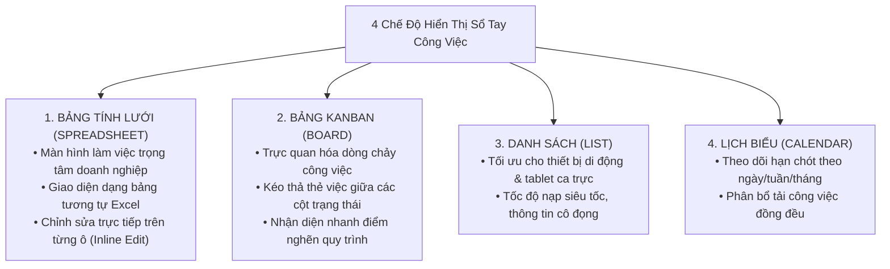

<a id="c4-sec-3-1"></a>

### 3.1. Chế độ Bảng tính lưới (Spreadsheet / Table View) - Màn hình Trọng tâm

Kế thừa thói quen sử dụng bảng tính của đa số người dùng văn phòng và bộ phận vận hành tại Việt Nam, giao diện Bảng tính là giao diện mặc định và được tối ưu hóa sâu nhất:

#### Ưu thế vượt trội:

- **Bao quát toàn cảnh trên một màn hình:** Hiển thị trực quan cùng lúc toàn bộ các trường dữ liệu nghiệp vụ: Mã việc, Tên việc, Phân loại, Trạng thái, Người phụ trách chính, Danh sách người hỗ trợ, Số phòng/Khu vực, Mức độ ưu tiên, Ngày hết hạn và Ngày tạo.
- **Chỉnh sửa nhanh trực tiếp tại ô (Inline Quick Editing):** Người dùng không cần phải nhấp chuột mở từng thẻ công việc rồi tìm nút Lưu. Thay vào đó, bạn chỉ cần nhấp đúp hoặc nhấp chuột vào ô cần sửa:
  - Nhấp vào ô **Trạng thái**: Menu chọn nhanh xổ xuống để chuyển ngay sang _Đang thực hiện_ hoặc _Hoàn thành_.
  - Nhấp vào ô **Người phụ trách**: Chọn ngay nhân sự nhận việc từ danh sách nhân viên phòng ban.
  - Nhấp vào ô **Số phòng**: Gõ trực tiếp số phòng (ví dụ: `504`) và nhấn `Enter`.
  - Mọi thao tác đều được hệ thống tự động lưu trữ tức thời qua API nền.

#### Phân nhóm và Bộ lọc dữ liệu linh hoạt (Group By & Filters):

- **Nhóm theo Trạng thái (Group by State):** Gom các công việc thành từng nhóm (Chưa bắt đầu, Chờ xử lý, Đang thực hiện, Hoàn thành).
- **Nhóm theo Số phòng (Group by Room):** Cực kỳ hữu ích cho nhân viên bảo trì khi kiểm tra toàn bộ danh mục hư hỏng của một tầng hoặc một phòng cụ thể.
- **Nhóm theo Người phụ trách (Group by Assignee):** Giúp Trưởng phòng đánh giá ngay khối lượng công việc đang phân bổ cho từng nhân viên trong ca trực.
- **Lọc nhanh (Quick Filters):**
  - Nút **"Việc của tôi (My Issues)"**: 1 nhấp chuột để lọc toàn bộ công việc mình phụ trách hoặc tham gia hỗ trợ.
  - Bộ lọc theo mức độ ưu tiên khẩn cấp (`Urgent`).

<a id="c4-sec-3-2"></a>

### 3.2. Chế độ Bảng Kanban (Board View)

- Trực quan hóa toàn bộ tiến trình công việc dưới dạng các cột trạng thái di chuyển từ trái sang phải.
- **Thao tác kéo thả (Drag & Drop):** Khi hoàn thành công việc, kỹ thuật viên chỉ cần kéo thẻ việc từ cột _Đang thực hiện_ thả sang cột _Hoàn thành_.
- **Nhận diện thẻ quá hạn:** Các công việc sắp đến hạn hoặc đã quá hạn sẽ tự động hiển thị mốc thời gian màu đỏ kèm biểu tượng đồng hồ cảnh báo.

<a id="c4-sec-3-3"></a>

### 3.3. Chế độ Danh sách (List View)

- Thiết kế tinh giản, loại bỏ các thành phần đồ họa nặng nề, tối ưu dung lượng tải trang.
- Rất phù hợp khi kỹ sư mang theo máy tính bảng hoặc điện thoại di động thông minh di chuyển kiểm tra tại hiện trường tòa nhà.
- Cho phép chọn hàng loạt (Bulk Selection) để thay đổi người phụ trách hoặc đóng việc cùng lúc nhiều công việc.

<a id="c4-sec-3-4"></a>

### 3.4. Chế độ Lịch biểu (Calendar View)

- Hiển thị các công việc được gắn mốc ngày hết hạn (`target_date`) trên khung lưới lịch tháng và tuần.
- Giúp Trưởng bộ phận tránh dồn quá nhiều lịch bảo trì định kỳ vào một ngày làm việc cao điểm, giảm thiểu rủi ro quá tải cho đội ngũ kỹ thuật.

---

<a id="c4-sec-4"></a>

## 4. Cập Nhật Tiến Độ, Bình Luận & Quản Lý Tệp Đính Kèm

<a id="c4-sec-4-1"></a>

### 4.1. Luồng trao đổi và bình luận thời gian thực (Real-time Collaboration)

BWP Notebook tích hợp dịch vụ WebSocket thời gian thực (`plane-live`), cho phép các thành viên trao đổi thông tin liên tục ngay trong thẻ công việc mà không cần tải lại trang:

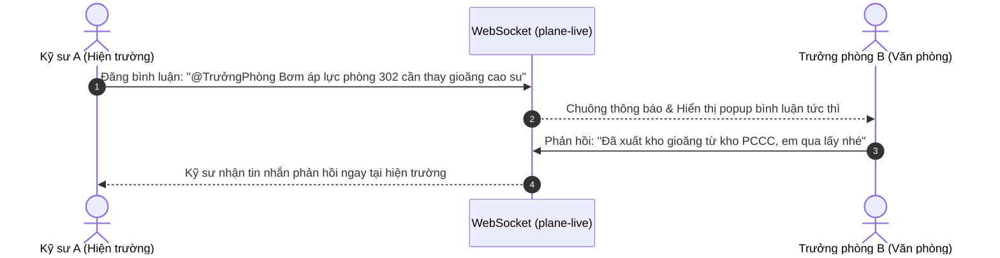

#### Các tính năng hỗ trợ tác nghiệp:

- **Nhắc tên trực tiếp (`@mention`):** Gõ ký tự `@` kèm tên nhân sự để gửi thông báo ưu tiên trực tiếp vào chuông thông báo và email của người đó.
- **Biểu tượng cảm xúc (Reactions):** Thả biểu tượng ngón tay cái 👍 hoặc dấu tích xanh ✅ trên bình luận để xác nhận đã tiếp nhận thông tin chỉ đạo mà không làm loãng dòng trao đổi.
- **Chỉnh sửa & Xóa bình luận:** Tác giả có quyền chỉnh sửa nội dung trong vòng 15 phút đầu hoặc xóa bình luận của chính mình.

<a id="c4-sec-4-2"></a>

### 4.2. Tải lên tệp đính kèm và ảnh chụp hiện trường

Hình ảnh thực tế là bằng chứng khách quan nhất để nghiệm thu chất lượng công việc bảo dưỡng kỹ thuật:

1. **Chụp ảnh trước và sau khi xử lý:**
   - Kỹ thuật viên chụp ảnh hiện trường lúc hỏng hóc (ví dụ: bồn cầu rò nước) và tải lên thẻ việc.
   - Sau khi sửa xong, chụp ảnh thiết bị hoạt động bình thường làm bằng chứng nghiệm thu bàn giao.
2. **Thao tác tải lên cực kỳ đơn giản:**
   - Kéo thả tệp tin trực tiếp từ máy tính vào khung bình luận hoặc vùng tệp đính kèm.
   - Nhấn `Ctrl + V` trên bàn phím để dán trực tiếp ảnh chụp màn hình vừa chụp.
3. **An toàn lưu trữ:**
   - Mọi tệp tin được mã hóa và lưu trữ tại volume `bwp_plane_uploads` của MinIO S3.
   - Hệ thống tự động tạo hình ảnh thu nhỏ (Thumbnail) giúp tải trang mượt mà ngay cả khi đường truyền mạng chập chờn.

<a id="c4-sec-4-3"></a>

### 4.3. Thiết lập mối liên kết công việc (Issue Relations & Sub-tasks)

Để quản lý các công việc phức tạp gồm nhiều công đoạn phối hợp:

- **Công việc con (Sub-issues):** Chia nhỏ một công việc lớn thành các đầu mục con giao cho từng thợ phụ trách (ví dụ: Công việc lớn _Bảo dưỡng tổng thể hệ thống Chiller_, các việc con: _Vệ sinh bình ngưng_, _Thay dầu máy nén_, _Kiểm tra tủ điện điều khiển_).
- **Mối quan hệ phụ thuộc (Dependencies):**
  - **Bị chặn bởi (Blocked by):** Đánh dấu công việc A phải chờ công việc B xử lý xong mới làm được (ví dụ: _Sơn tường phòng 401_ bị chặn bởi _Chống thấm hộp kỹ thuật_).
  - **Chặn công việc khác (Blocking):** Ngăn chặn việc bắt đầu các công đoạn tiếp theo khi khâu hiện tại chưa hoàn tất.

---

<div style="page-break-after: always;"></div>

<a id="chuong-5"></a>

# Chương 5: Nhật Ký Hoạt Động, Kiểm Toán và Quản Trị Hệ Thống

> **Tài liệu Hướng dẫn Vận hành BWP Notebook (User Guide)**  
> **Phiên bản:** 2.0 (Bản phát hành Doanh nghiệp)  
> **Đơn vị phát triển:** BWP Engineering Team  
> **Mục tiêu Quản trị:** Kiểm toán Hoạt động (Audit Trail), An toàn Dữ liệu (Backup/Restore) & Xử lý Sự cố (Troubleshooting)

---

<a id="c5-sec-1"></a>

## 1. Theo Dõi & Kiểm Toán Qua Nhật Ký Hoạt Động (Activity & Audit Log)

<a id="c5-sec-1-1"></a>

### 1.1. Tầm quan trọng của Dấu vết Kiểm toán Số (Digital Audit Trail)

Trong môi trường quản trị doanh nghiệp chuyên nghiệp, tính minh bạch và khả năng truy vết trách nhiệm cá nhân là yêu cầu cốt lõi. Mọi thay đổi dữ liệu trên hệ thống BWP Notebook — từ việc gán người phụ trách, thêm bớt người hỗ trợ, cập nhật số phòng cho đến chuyển trạng thái công việc — đều được ghi nhận tự động vào **Nhật ký Hoạt động (Activity Log)** theo thời gian thực.


#### Ý nghĩa nghiệp vụ:

1. **Minh bạch hóa tiến độ:** Lãnh đạo biết chính xác ai là người đã tiếp nhận công việc, thời điểm kỹ thuật viên bắt đầu xử lý và ai đã nghiệm thu hoàn thành.
2. **Không thể chối bỏ trách nhiệm:** Mọi thao tác đều gắn liền với định danh tài khoản (`actor_id`) và mốc thời gian tuyệt đối (`created_at`), ngăn chặn hiện tượng đổ lỗi hoặc tự ý thay đổi dữ liệu mà không có căn cứ.
3. **Phục vụ đánh giá KPI & Khen thưởng:** Dữ liệu nhật ký là bằng chứng chính xác để thống kê số lượng công việc mỗi nhân sự đã xử lý hoặc hỗ trợ trong tháng.

<a id="c5-sec-1-2"></a>

### 1.2. Danh mục các bản ghi hoạt động được Việt hóa 100%

Đội ngũ kỹ sư BWP (dẫn dắt bởi BWP Engineering Team) đã tùy biến toàn bộ tầng xử lý tác vụ nền (`apps/api/plane/bgtasks/issue_activities_task.py`) để các bản ghi hoạt động hiển thị hoàn toàn bằng tiếng Việt chuẩn mực:

| Trường Dữ Liệu Thay Đổi            | Đoạn Ghi Nhận Kiểm Toán Mẫu (Activity Stream Format)                     | Ý Nghĩa Thực Tế                                                   |
| :--------------------------------- | :----------------------------------------------------------------------- | :---------------------------------------------------------------- |
| **Người hỗ trợ (`supporters`)**    | `Nguyễn Văn A đã thêm Trần Văn B vào danh sách Người hỗ trợ`             | Bổ sung thêm kỹ sư phụ trách xử lý cùng tại hiện trường.          |
| **Gỡ người hỗ trợ (`supporters`)** | `Nguyễn Văn A đã xóa Lê Văn C khỏi danh sách Người hỗ trợ`               | Nhân sự rút khỏi công việc sau khi hoàn tất phần việc chuyên môn. |
| **Số phòng (`room`)**              | `Trần Văn B đã cập nhật Số phòng từ "302" thành "405"`                   | Điều chỉnh địa điểm phát sinh sự cố sau khi khảo sát thực tế.     |
| **Ghi chú nội bộ (`notes`)**       | `Lê Văn C đã cập nhật Ghi chú nội bộ`                                    | Ghi thêm thông số kỹ thuật hoặc dặn dò bảo mật ca trực.           |
| **Phân loại việc (`type`)**        | `Quản trị viên đã chuyển loại công việc sang "Công việc khác"`           | Nâng cấp công việc phát sinh thành nhiệm vụ theo kế hoạch.        |
| **Trạng thái (`state`)**           | `Nguyễn Văn A đã chuyển trạng thái từ "Chờ xử lý" sang "Đang thực hiện"` | Kỹ thuật viên bắt đầu bấm giờ tác nghiệp tại phòng.               |
| **Người phụ trách (`assignee`)**   | `Trưởng bộ phận đã chuyển giao người phụ trách cho Nguyễn Văn A`         | Bàn giao trách nhiệm chính cho nhân sự mới.                       |
| **Mức ưu tiên (`priority`)**       | `Nguyễn Văn A đã nâng mức ưu tiên từ "Trung bình" lên "Khẩn cấp"`        | Sự cố có dấu hiệu lan rộng, cần can thiệp khẩn cấp.               |
| **Hạn hoàn thành (`target_date`)** | `Trần Văn B đã gia hạn hoàn thành đến ngày 15/09/2026`                   | Cập nhật lại thời hạn xử lý sự cố phức tạp.                       |

<a id="c5-sec-1-3"></a>

### 1.3. Giao diện tra cứu và kiểm tra lịch sử

Người dùng và cán bộ quản lý có thể tra cứu lịch sử qua 2 cấp độ màn hình:

1. **Kiểm toán trong từng Công việc (Work Item Activity Tab):**
   - Mở chi tiết bất kỳ công việc nào $\rightarrow$ bấm vào tab **Lịch sử (Activity)** ở khung bên phải.
   - Toàn bộ dòng thời gian từ lúc tạo việc, các lần đổi trạng thái, bình luận kèm thời gian chi tiết (ví dụ: _10 phút trước_, _Hôm qua lúc 14:32_) đều hiện ra mạch lạc.
2. **Dòng hoạt động toàn Đơn vị (Workspace Activity Stream):**
   - Quản trị viên vào **Cài đặt đơn vị (Workspace Settings)** $\rightarrow$ **Nhật ký hoạt động (Audit Logs)**.
   - Màn hình này cung cấp bộ lọc kiểm toán toàn diện: Lọc theo nhân sự thực hiện, lọc theo phòng ban, lọc theo khoảng ngày, hỗ trợ xuất báo cáo kiểm tra khi cần thiết.

---

<a id="c5-sec-2"></a>

## 2. Quy Trình Sao Lưu & Phục Hồi Cơ Sở Dữ Liệu (Backup & Disaster Recovery)

Để phòng ngừa các sự cố phần cứng, lỗi người dùng hoặc thiên tai, việc thực hiện sao lưu định kỳ là nhiệm vụ bắt buộc của Quản trị viên hệ thống (DevOps). BWP Notebook áp dụng chiến lược **sao lưu 3-2-1** chuẩn doanh nghiệp: **3** bản sao dữ liệu, trên **2** loại phương tiện lưu trữ khác nhau, với **1** bản được lưu trữ ngoại vi (Offsite/Cloud).

```mermaid
flowchart TD
    subgraph LiveStack ["Hệ Thống Đang Vận Hành (192.168.3.168)"]
        LiveDB[("PostgreSQL 15<br>(bwp_notebook_plane_db)")]
        LiveMinIO[("MinIO S3 Storage<br>(bwp_plane_uploads)")]
    end

    subgraph BackupJob ["Tiến Trình Sao Lưu Tự Động (02:00 AM)"]
        Script["bwp_daily_backup.sh<br>(pg_dump -Fc + tar gzip)"]
    end

    subgraph StorageDest ["Lưu Trữ An Toàn"]
        LocalBackup["/var/backups/bwp-notebook/<br>(Lưu trữ nội bộ 30 ngày)"]
        OffsiteBackup["Máy Chủ Lưu Trữ Ngoại Vi / NAS<br>(Rsync qua SSH)"]
    end

    LiveDB --> Script
    LiveMinIO --> Script
    Script --> LocalBackup
    LocalBackup --> OffsiteBackup
```

<a id="c5-sec-2-1"></a>

### 2.1. Lệnh sao lưu cơ sở dữ liệu PostgreSQL thủ công

Cơ sở dữ liệu BWP Notebook hoạt động trong container Docker `bwp_notebook_plane_db`. Để tạo một bản sao lưu toàn vẹn ngay lập tức:

#### Bước 1: Tạo thư mục chứa bản sao lưu trên máy chủ Debian:

```bash
sudo mkdir -p /var/backups/bwp-notebook/db
sudo mkdir -p /var/backups/bwp-notebook/media
sudo chmod 700 /var/backups/bwp-notebook
```

#### Bước 2: Chạy lệnh xuất bản sao lưu PostgreSQL (pg_dump):

```bash
# Định dạng tùy biến nén cao (-Fc), bảo toàn toàn bộ schema, roles và dữ liệu
docker exec -t bwp_notebook_plane_db pg_dump \
  -U bwp_plane_user \
  -d bwp_plane \
  -Fc \
  -f /var/lib/postgresql/data/backup_bwp_$(date +%Y%m%d_%H%M%S).dump

# Sao chép tệp sao lưu từ volume container ra ổ đĩa máy chủ
sudo cp /var/lib/docker/volumes/nora-notebook_bwp_plane_pgdata/_data/backup_bwp_*.dump /var/backups/bwp-notebook/db/
```

#### Bước 3: Sao lưu thư mục hình ảnh và tệp đính kèm MinIO:

```bash
sudo tar -czvf /var/backups/bwp-notebook/media/uploads_$(date +%Y%m%d_%H%M%S).tar.gz \
  /var/lib/docker/volumes/nora-notebook_bwp_plane_uploads/_data
```

<a id="c5-sec-2-2"></a>

### 2.2. Thiết lập Cron Job tự động sao lưu hàng ngày

Để hệ thống tự động sao lưu vào lúc **02:00 sáng mỗi ngày** và tự động xóa các bản lưu cũ quá 30 ngày:

1. **Tạo kịch bản sao lưu:** Lưu file tại `/opt/bwp-notebook/scripts/bwp_daily_backup.sh`:

```bash
#!/usr/bin/env bash
# ==============================================================================
# BWP Notebook Automated Daily Backup Script
# Code & Architecture by BWP Engineering Team
# ==============================================================================
set -euo pipefail

BACKUP_DIR="/var/backups/bwp-notebook"
TIMESTAMP=$(date +"%Y%m%d_%H%M%S")
DB_CONTAINER="bwp_notebook_plane_db"
DB_USER="bwp_plane_user"
DB_NAME="bwp_plane"

mkdir -p "${BACKUP_DIR}/db" "${BACKUP_DIR}/media"

echo "[$(date)] Bắt đầu tiến trình sao lưu BWP Notebook..."

# 1. Sao lưu Cơ sở dữ liệu PostgreSQL
docker exec -t "${DB_CONTAINER}" pg_dump -U "${DB_USER}" -d "${DB_NAME}" -Fc \
  -f "/var/lib/postgresql/data/daily_${TIMESTAMP}.dump"

cp "/var/lib/docker/volumes/nora-notebook_bwp_plane_pgdata/_data/daily_${TIMESTAMP}.dump" \
   "${BACKUP_DIR}/db/bwp_db_${TIMESTAMP}.dump"

rm -f "/var/lib/docker/volumes/nora-notebook_bwp_plane_pgdata/_data/daily_${TIMESTAMP}.dump"

# 2. Sao lưu Tệp đính kèm MinIO S3
tar -czf "${BACKUP_DIR}/media/bwp_uploads_${TIMESTAMP}.tar.gz" \
  -C "/var/lib/docker/volumes/nora-notebook_bwp_plane_uploads" _data

# 3. Dọn dẹp các bản sao lưu cũ hơn 30 ngày
find "${BACKUP_DIR}/db" -type f -name "*.dump" -mtime +30 -delete
find "${BACKUP_DIR}/media" -type f -name "*.tar.gz" -mtime +30 -delete

echo "[$(date)] Sao lưu hoàn tất thành công!"
```

2. **Cấp quyền thực thi cho kịch bản:**

```bash
sudo chmod +x /opt/bwp-notebook/scripts/bwp_daily_backup.sh
```

3. **Thêm vào Cron Tab của hệ thống:**

```bash
sudo crontab -e
```

Thêm dòng sau vào cuối tệp:

```cron
0 2 * * * /opt/bwp-notebook/scripts/bwp_daily_backup.sh >> /var/log/bwp_backup.log 2>&1
```

<a id="c5-sec-2-3"></a>

### 2.3. Quy trình khôi phục dữ liệu khẩn cấp khi gặp sự cố (Disaster Recovery)

Khi xảy ra sự cố hỏng hóc phần cứng hoặc thao tác nhầm lẫn nghiêm trọng, Quản trị viên tiến hành khôi phục theo quy trình 5 bước:

```mermaid
sequenceDiagram
    autonumber
    actor Admin as Quản Trị Viên DevOps
    participant Docker as Docker Compose Engine
    participant DB as Container plane-db
    participant File as Tệp Dump Sao Lưu

    Admin->>Docker: Dừng các container ghi (api, worker, beat, live)
    Docker-->>Admin: Xác nhận dừng hoàn tất
    Admin->>DB: Đưa tệp .dump vào volume container
    Admin->>DB: pg_restore --clean --if-exists -U bwp_plane_user -d bwp_plane
    DB-->>Admin: Khôi phục cấu trúc và dữ liệu thành công
    Admin->>Docker: docker compose -f docker-compose.prod.yml restart
    Docker-->>Admin: Toàn bộ hệ thống hoạt động bình thường
```

#### Các lệnh thực thi chi tiết:

1. **Bước 1: Tạm dừng các dịch vụ ghi dữ liệu để tránh xung đột:**
   ```bash
   cd /opt/nora-notebook
   docker compose -f docker-compose.prod.yml stop api worker beat-worker live
   ```
2. **Bước 2: Sao chép tệp sao lưu vào volume của PostgreSQL:**
   ```bash
   # Giả sử cần khôi phục bản lưu bwp_db_20260913_020000.dump
   sudo cp /var/backups/bwp-notebook/db/bwp_db_20260913_020000.dump \
     /var/lib/docker/volumes/nora-notebook_bwp_plane_pgdata/_data/restore_target.dump
   ```
3. **Bước 3: Thực hiện lệnh phục hồi với pg_restore:**
   ```bash
   docker exec -t bwp_notebook_plane_db pg_restore \
     -U bwp_plane_user \
     -d bwp_plane \
     --clean \
     --if-exists \
     --no-owner \
     --no-privileges \
     /var/lib/postgresql/data/restore_target.dump
   ```
4. **Bước 4: Khôi phục tệp đính kèm MinIO (nếu cần):**
   ```bash
   sudo tar -xzf /var/backups/bwp-notebook/media/bwp_uploads_20260913_020000.tar.gz \
     -C /var/lib/docker/volumes/nora-notebook_bwp_plane_uploads
   ```
5. **Bước 5: Khởi động lại toàn bộ các dịch vụ hệ thống:**
   ```bash
   docker compose -f docker-compose.prod.yml restart
   ```
6. **Bước 6: Xác nhận hoạt động:**
   Truy cập `http://192.168.3.168:18080`, đăng nhập và kiểm tra tính toàn vẹn của danh sách công việc và lịch sử hoạt động.

---

<a id="c5-sec-3"></a>

## 3. Danh Mục Câu Hỏi Thường Gặp (FAQs)

Dưới đây là tổng hợp 8 câu hỏi phổ biến nhất từ người dùng và cán bộ quản trị trong quá trình vận hành BWP Notebook:

<a id="faq-1"></a>

### FAQ 1: Tôi quên mật khẩu đăng nhập thì khôi phục như thế nào?

- **Cách 1 (Nếu đã cấu hình SMTP gửi thư):** Tại màn hình Đăng nhập, bấm vào liên kết **"Quên mật khẩu?"**, nhập email công vụ của bạn. Một email chứa mã liên kết đặt lại mật khẩu an toàn sẽ được gửi về hòm thư trong vòng 1-2 phút.
- **Cách 2 (Quản trị viên hỗ trợ):** Nếu hệ thống chạy mạng LAN nội bộ chưa cấu hình máy chủ thư, Quản trị viên đơn vị (Admin) có thể vào mục **Cài đặt đơn vị** $\rightarrow$ **Thành viên** $\rightarrow$ chọn tài khoản của bạn và bấm nút **"Gửi liên kết đặt lại mật khẩu"** hoặc tạo mật khẩu tạm thời cho bạn.

<a id="faq-2"></a>

### FAQ 2: Tại sao tôi không thể đổi loại công việc sang "Công việc khác"?

- **Giải đáp:** Đây là **Quy tắc phân quyền nghiệp vụ (Business Rule)** được thiết kế bởi BWP Engineering Team. Thành viên thông thường (Member) chỉ được phép tạo và xử lý các _Công việc vận hành (Operational tasks)_ phát sinh trong ca trực. Chỉ Quản trị viên (Admin) hoặc Trưởng bộ phận mới có thẩm quyền chuyển đổi công việc thành _Công việc khác (Other tasks)_ để phục vụ kế hoạch chỉ đạo tập trung.

<a id="faq-3"></a>

### FAQ 3: Một công việc có thể gán bao nhiêu Người hỗ trợ (Supporters)?

- **Giải đáp:** Hệ thống **không giới hạn** số lượng người hỗ trợ. Bạn có thể thêm 1, 3 hoặc 10 nhân sự cùng tham gia hỗ trợ một công việc lớn (ví dụ: đợt tổng vệ sinh tòa nhà hoặc bảo dưỡng hệ thống PCCC toàn khu).

<a id="faq-4"></a>

### FAQ 4: Các tính năng Cycles (Chu kỳ), Modules (Dự án con), Pages (Tài liệu) của Plane trước đây ở đâu?

- **Giải đáp:** Nhằm phục vụ tối ưu cho mô hình sổ tay công việc thực tiễn của doanh nghiệp Việt Nam, loại bỏ sự cồng kềnh phức tạp của các phần mềm phát triển phần mềm công nghệ, BWP Notebook đã **chủ động ẩn các menu này khỏi giao diện** bằng cơ chế cấu hình tinh gọn. Toàn bộ trọng tâm được dồn vào Sổ tay công việc và màn hình Bảng tính lưới (Spreadsheet view).

<a id="faq-5"></a>

### FAQ 5: Dữ liệu công việc của phòng tôi có bị nhân viên phòng khác nhìn thấy không?

- **Giải đáp:** Hoàn toàn **không**, với điều kiện Quản trị viên đã thiết lập chế độ hiển thị của phòng ban là **Riêng tư / Bảo mật (Secret / Private)**. Khi đó, chỉ những nhân sự có tên trong danh sách thành viên của phòng mới có thể truy cập nội dung sổ tay.

<a id="faq-6"></a>

### FAQ 6: Hạn mức tệp đính kèm là bao nhiêu và tải lên được những định dạng nào?

- **Giải đáp:** Hạn ngạch mặc định cho mỗi tệp tin đính kèm là **$50\text{MB}$**. Hệ thống hỗ trợ đa dạng định dạng: Tài liệu văn phòng (Word, Excel, PDF), hình ảnh hiện trường (JPG, PNG, WEBP) và tệp nén (ZIP, RAR).

<a id="faq-7"></a>

### FAQ 7: Giao diện của tôi bất ngờ chuyển sang tiếng Anh hoặc hiển thị mã khóa dịch, khắc phục ra sao?

- **Giải đáp:** Nhấp vào ảnh đại diện cá nhân ở góc dưới bên trái $\rightarrow$ chọn **Cài đặt cá nhân (Profile Settings)** $\rightarrow$ mục **Tùy chọn (Preferences)** $\rightarrow$ tại ô **Ngôn ngữ (Language)** chọn lại **Tiếng Việt (vi-VN)** $\rightarrow$ bấm **Lưu**. Đồng thời, hãy nhấn phím `Ctrl + F5` trên trình duyệt để xóa sạch bộ nhớ cache cũ.

<a id="faq-8"></a>

### FAQ 8: Khi một nhân sự nghỉ việc hoặc chuyển bộ phận, công việc của họ xử lý thế nào?

- **Giải đáp:** Quản trị viên tuyệt đối **không được xóa vĩnh viễn** tài khoản đó. Hãy thực hiện quy trình bàn giao 3 bước (đã nêu trong Chương 2): Lọc các công việc mà nhân sự đó phụ trách chính để giao lại cho người mới $\rightarrow$ Xóa nhân sự khỏi danh sách phòng ban $\rightarrow$ Chuyển trạng thái tài khoản sang **Vô hiệu hóa (Deactivate)**.

---

<a id="c5-sec-4"></a>

## 4. Hướng Dẫn Xử Lý Sự Cố Kỹ Thuật (Troubleshooting Guide)

<a id="c5-sec-4-1"></a>

### 4.1. Bảng tra cứu sự cố & phản ứng nhanh

| Triệu Chứng Sự Cố                                     | Nguyên Nhân Tiềm Ẩn                            | Biện Pháp Xử Lý Tức Thời                                            |
| :---------------------------------------------------- | :--------------------------------------------- | :------------------------------------------------------------------ |
| **Không truy cập được cổng `18080`**                  | Service Docker bị dừng hoặc Firewall chặn cổng | Khởi động lại stack compose, kiểm tra lệnh `sudo ufw status`.       |
| **Lỗi `502 Bad Gateway`**                             | Backend `api` đang khởi động hoặc cạn kiệt RAM | Đợi 30-60 giây để `migrator` hoàn tất, kiểm tra log `api`.          |
| **Không nhận được email thông báo**                   | Sai thông số SMTP hoặc `plane-mq` bị nghẽn     | Kiểm tra tệp cấu hình `.env`, khởi động lại `plane-mq` và `worker`. |
| **Lỗi cơ sở dữ liệu `Remaining connection slots...`** | Số lượng kết nối đồng thời vượt ngưỡng         | Tham số `max_connections=200` cần được kích hoạt trên `plane-db`.   |
| **Ổ đĩa máy chủ báo đầy $100\%$ (`No space left`)**   | Docker images cũ và tệp log tích tụ            | Chạy lệnh dọn rác `docker system prune -f` và dọn log.              |

<a id="c5-sec-4-2"></a>

### 4.2. Hướng dẫn xử lý chi tiết từng sự cố

#### Sự cố 1: Không thể truy cập địa chỉ `http://192.168.3.168:18080` (ERR_CONNECTION_REFUSED)

1. Kiểm tra trạng thái hoạt động của các container:
   ```bash
   cd /opt/nora-notebook
   docker compose -f docker-compose.prod.yml ps
   ```
2. Nếu container `proxy` hoặc `web` ở trạng thái `Exited`, kiểm tra lý do crash:
   ```bash
   docker compose -f docker-compose.prod.yml logs proxy web
   ```
3. Kiểm tra xem tường lửa Debian (UFW) có đang chặn cổng `18080` hay không:
   ```bash
   sudo ufw status
   # Nếu UFW đang active mà chưa mở cổng 18080:
   sudo ufw allow 18080/tcp
   sudo ufw reload
   ```

#### Sự cố 2: Trình duyệt báo lỗi "502 Bad Gateway"

Lỗi 502 xảy ra khi Nginx Proxy không thể chuyển tiếp request đến Gunicorn backend (`api:8000`):

1. Xem log thời gian thực của container backend:
   ```bash
   docker compose -f docker-compose.prod.yml logs --tail=100 -f api
   ```
2. Nếu backend báo lỗi kết nối cơ sở dữ liệu (`OperationalError: could not connect to server`), kiểm tra xem container `plane-db` đã hoàn tất quá trình khởi động chưa:
   ```bash
   docker exec -it bwp_notebook_plane_db pg_isready -U bwp_plane_user -d bwp_plane
   ```
3. Nếu container `api` liên tục khởi động lại (Restart loop), nguyên nhân thường do máy chủ thiếu hụt bộ nhớ RAM. Kiểm tra tài nguyên bằng `free -h` và tăng dung lượng Swapfile trên Debian.

#### Sự cố 3: Máy chủ báo đầy ổ đĩa (Disk Space Exhaustion)

Sau một thời gian vận hành dài, Docker có thể tích lũy các hình ảnh container thừa và các tệp nhật ký lớn:

1. Kiểm tra dung lượng ổ đĩa tổng thể:
   ```bash
   df -h /
   ```
2. Kiểm tra dung lượng chiếm dụng bởi Docker:
   ```bash
   docker system df
   ```
3. Thực hiện dọn dẹp an toàn các tệp hình ảnh tạm thời và mạng không sử dụng (không làm ảnh hưởng đến dữ liệu volume):
   ```bash
   docker system prune -f
   ```
4. Cắt tỉa (truncate) các tệp log Docker quá lớn:
   ```bash
   sudo sh -c "truncate -s 0 /var/lib/docker/containers/*/*-json.log"
   ```

<a id="c5-sec-4-3"></a>

### 4.3. Bộ lệnh chẩn đoán nhanh một chạm (One-liner Health Check)

Dành cho Quản trị viên DevOps để kiểm tra toàn diện sức khỏe hệ thống BWP Notebook chỉ trong một câu lệnh duy nhất:

```bash
echo "=== KIỂM TRA SỨC KHỎE HỆ THỐNG BWP NOTEBOOK ===" && \
echo "1. Trạng thái Container:" && docker compose -f docker-compose.prod.yml ps --format "table {{.Name}}\t{{.Status}}\t{{.Ports}}" && \
echo -e "\n2. Kiểm tra Kết nối PostgreSQL:" && docker exec -t bwp_notebook_plane_db pg_isready -U bwp_plane_user -d bwp_plane && \
echo -e "\n3. Kiểm tra Bộ nhớ Đệm Valkey/Redis:" && docker exec -t bwp_notebook_plane_redis valkey-cli ping && \
echo -e "\n4. Dung lượng Bộ nhớ RAM & Ổ đĩa:" && free -h && df -h /
```

---

<div style="page-break-after: always;"></div>

<a id="phu-luc"></a>

## Phụ Lục & Thông Tin Hỗ Trợ Kỹ Thuật

### 1. Thông Tin Kiến Trúc & Đầu Mối Kỹ Thuật

- **Đơn vị phát triển & Tùy biến:** BWP Engineering Team
- **Kiến trúc trưởng & Lead Developer:** BWP Team
- **Kênh hỗ trợ nội bộ:** Phòng Kỹ thuật & Hạ tầng CNTT BWP
- **Địa chỉ máy chủ nội bộ:** `http://192.168.3.168:18080` (Mạng LAN nội bộ)
- **Tài liệu nguồn mở nền tảng:** [Plane Documentation](https://docs.plane.so/)

### 2. Bảng Tóm Tắt Phím Tắt Tiện Ích (Keyboard Shortcuts)

| Phím Tắt               | Chức Năng Nhanh Trong BWP Notebook                                          |
| :--------------------- | :-------------------------------------------------------------------------- |
| `C`                    | Mở nhanh hộp thoại tạo công việc mới (Create Work Item)                     |
| `Ctrl + K` / `Cmd + K` | Mở thanh tìm kiếm tổng thể Command K (Tìm phòng ban, công việc, thành viên) |
| `Escape`               | Đóng cửa sổ modal hoặc hủy chọn ô                                           |
| `Ctrl + V`             | Dán trực tiếp ảnh chụp màn hình vào mô tả hoặc bình luận                    |
| `Enter`                | Lưu giá trị ô đang chỉnh sửa trên Bảng tính (Spreadsheet view)              |
| `Tab` / `Shift + Tab`  | Di chuyển giữa các ô dữ liệu trên Bảng tính                                 |

---

_Tài liệu lưu hành nội bộ - Bản quyền kiến trúc & triển khai thuộc về BWP Engineering Team._
