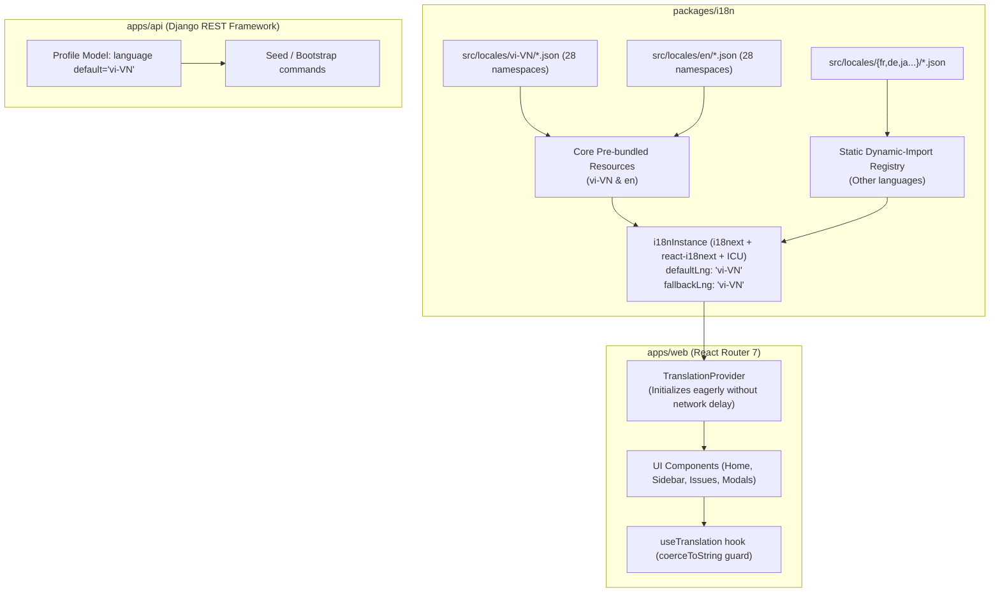

# Tài liệu Thiết kế Kỹ thuật (Technical Design Spec)

## Dự án: Việt hóa Toàn diện Hệ thống & Bộ Tài liệu Hướng dẫn Sử dụng (BWP-Notebook-v2)

- **Ngày lập**: 2026-09-13
- **Tác giả tùy biến**: Code & Architecture by **IT Leon** (BWP Engineering Team)
- **Nền tảng**: Plane Community Edition (CE) `v1.4.2`
- **Mã nguồn**: `packages/i18n`, `apps/web`, `apps/api`, `docs/user-guide/`
- **Trạng thái**: Đã phê duyệt (Approved) qua Brainstorming

---

## 1. Tổng quan & Động lực Kỹ thuật

### 1.1. Hiện trạng & Lỗi đóng gói i18n

Khi triển khai môi trường production (`docker-compose.prod.yml`) trên máy chủ Debian `192.168.3.168`, toàn bộ giao diện người dùng hiển thị các mã khóa dịch thô (translation keys) như `home.title`, `home.empty.quickstart_guide`, `project_settings.member`, `create_workspace`, v.v. thay vì các chuỗi tiếng Việt hoặc tiếng Anh.

**Nguyên nhân kỹ thuật đã kiểm chứng**:

1. `packages/i18n/src/core/instance.ts` sử dụng nạp động theo chuỗi biến: `resourcesToBackend((language, namespace) => import("../locales/${language}/${namespace}.json"))`.
2. Thư mục `packages/i18n/locales` ban đầu là một Git symlink text file (`src/locales`, 11 bytes), không phải thư mục vật lý trên môi trường Windows/Docker.
3. Khi Vite chạy quy trình build cho `apps/web` (React Router 7), Vite không thể phân tích tĩnh chuỗi import động xuyên package boundary này và tự động biên dịch hàm nạp thành một từ điển rỗng `Bi(Object.assign({}))`.
4. Khi chạy trên trình duyệt client, hàm nạp ném ngoại lệ `Error: Unknown variable dynamic import: ../locales/vi-VN/common.json`, khiến `i18nInstance` không nạp được bất kỳ tệp ngôn ngữ nào và rơi vào cơ chế dự phòng trả về nguyên mã khóa (raw translation key).

### 1.2. Mục tiêu kỹ thuật

1. **Sửa dứt điểm cơ chế nạp i18n**: Loại bỏ hoàn toàn lỗi `Unknown variable dynamic import` bằng cơ chế tĩnh (Static Registry & Core Pre-bundling) trong `@plane/i18n`.
2. **Tiếng Việt là ngôn ngữ mặc định**: Tự động hiển thị tiếng Việt (`vi-VN`) ngay từ lần đầu truy cập và cho mọi tài khoản mới, đồng thời duy trì khả năng chuyển đổi linh hoạt sang tiếng Anh trong cài đặt cá nhân.
3. **Chuẩn hóa thuật ngữ nghiệp vụ**: Đồng bộ 28 namespace JSON theo quy ước nghiệp vụ doanh nghiệp (Công ty/Đơn vị, Phòng ban/Notebook, Công việc, v.v.).
4. **Bộ tài liệu Hướng dẫn sử dụng chuẩn hóa**: Xây dựng bộ tài liệu vận hành chi tiết trong `docs/user-guide/` và sổ tay tổng hợp `USER_GUIDE_VI.md` sẵn sàng in/PDF.

---

## 2. Kiến trúc Giải pháp Kỹ thuật



---

## 3. Chi tiết Cấu phần & Thay đổi Mã nguồn

### 3.1. Gói `@plane/i18n`

#### 3.1.1. Biên dịch tĩnh tài nguyên cốt lõi (`packages/i18n/src/locales/resources.ts`)

Tạo module gộp sẵn 28 namespace của `vi-VN` và `en` dạng ES modules tĩnh:

- `vi-VN`: accessibility, auth, automation, common, cycle, editor, empty-state, home, inbox, integration, module, navigation, notification, page, power-k, project, project-settings, settings, stickies, template, tour, update, wiki, work-item, work-item-type, workflow, workspace, workspace-settings.
- `en`: 28 namespaces tương ứng.

#### 3.1.2. Sổ đăng ký nạp động tĩnh (`packages/i18n/src/locales/registry.ts`)

Đối với các ngôn ngữ còn lại (Pháp, Đức, Nhật, Hàn, v.v.), thay vì dùng biểu thức chuỗi nạp động, định nghĩa bảng ánh xạ rõ ràng:

```typescript
export const dynamicLocaleLoaders: Record<string, Record<string, () => Promise<any>>> = {
  fr: {
    common: () => import("./fr/common.json"),
    // ...
  },
  // ...
};
```

Vite và `tsdown` nhận diện chính xác các đường dẫn tĩnh này và tạo thành các chunks riêng biệt, không còn lỗi biến động.

#### 3.1.3. Cấu hình Khởi tạo i18n (`packages/i18n/src/core/instance.ts`)

- Khởi tạo trực tiếp tài nguyên `vi-VN` và `en` qua thuộc tính `resources`:

  ```typescript
  import { coreResources } from "../locales/resources";
  import { dynamicLocaleLoaders } from "../locales/registry";

  export const i18nInstance = i18n.createInstance();

  i18nInstance
    .use(ICU)
    .use(initReactI18next)
    .use(
      resourcesToBackend(async (language: string, namespace: string) => {
        if (coreResources[language]?.[namespace]) {
          return coreResources[language][namespace];
        }
        const loader = dynamicLocaleLoaders[language]?.[namespace];
        if (loader) {
          const mod = await loader();
          return mod.default || mod;
        }
        return {};
      })
    );
  ```

- Cấu hình mặc định:
  - `lng: initialLng` (với `FALLBACK_LANGUAGE = "vi-VN"`)
  - `fallbackLng: "vi-VN"`
  - `supportedLngs: SUPPORTED_LANGUAGES.map((l) => l.value)`

#### 3.1.4. Dọn dẹp Symlink hỏng

Xóa bỏ tệp `packages/i18n/locales` (file symlink dạng văn bản 11 byte) để tránh nhầm lẫn cho công cụ build trên Windows và Linux.

---

### 3.2. Chuẩn hóa Thuật ngữ Nghiệp vụ (`packages/i18n/src/locales/vi-VN/`)

Cập nhật các chuỗi dịch trong `packages/i18n/src/locales/vi-VN/` để khớp 100% với tài liệu nghiệp vụ `brief-plane-combined.txt`:

| File Namespace   | Khóa dịch đại diện                     | Nội dung cập nhật           |
| ---------------- | -------------------------------------- | --------------------------- |
| `workspace.json` | `workspace.title`                      | "Công ty / Đơn vị"          |
| `workspace.json` | `create_workspace`                     | "Tạo đơn vị mới"            |
| `project.json`   | `project.title`                        | "Phòng ban / Notebook"      |
| `project.json`   | `create_project`                       | "Tạo phòng ban"             |
| `work-item.json` | `issue.title`                          | "Công việc"                 |
| `work-item.json` | `issue.create`                         | "Tạo công việc"             |
| `work-item.json` | `issue.assignee`                       | "Người phụ trách"           |
| `work-item.json` | `issue.supporters`                     | "Người hỗ trợ"              |
| `work-item.json` | `issue.room`                           | "Số phòng / Khu vực"        |
| `work-item.json` | `issue.notes`                          | "Ghi chú nội bộ"            |
| `home.json`      | `home.empty.quickstart_guide`          | "Hướng dẫn khởi đầu nhanh"  |
| `home.json`      | `home.empty.create_project.title`      | "Tạo phòng ban / Notebook"  |
| `home.json`      | `home.empty.invite_team.title`         | "Mời nhân sự vào hệ thống"  |
| `home.json`      | `home.empty.configure_workspace.title` | "Cấu hình đơn vị / công ty" |
| `home.json`      | `home.empty.personalize_account.title` | "Cá nhân hóa tài khoản"     |

---

### 3.3. Tầng Dịch vụ Backend (`apps/api`)

1. **Cập nhật Model Profile (`apps/api/plane/db/models/user.py`)**:
   ```python
   language = models.CharField(max_length=255, default="vi-VN")
   ```
2. **Quản trị người dùng & Bootstrap**:
   - Khi tạo người dùng mới hoặc SuperAdmin, giá trị ngôn ngữ mặc định lưu trữ trong database là `"vi-VN"`.
   - API trả về thông tin profile có trường `"language": "vi-VN"`.

---

### 3.4. Cấu trúc Tài liệu Hướng dẫn Sử dụng (`docs/user-guide/` & `USER_GUIDE_VI.md`)

Bộ tài liệu được biên soạn bằng tiếng Việt với văn phong chuyên nghiệp, định dạng chuẩn GitHub Flavored Markdown kèm các bảng ma trận quyền, sơ đồ trực quan và hộp cảnh báo:

1. **`docs/user-guide/01-TONG-QUAN-VA-KHOI-DONG.md`**:
   - Tổng quan BWP Notebook (Sổ tay quản lý công việc nội bộ).
   - Danh mục dịch vụ Docker: `plane-db` (Postgres 15), `plane-redis` (Valkey 7.2), `plane-mq` (RabbitMQ 3.13), `plane-minio` (S3 Storage), `api`, `worker`, `beat-worker`, `web` (Nginx + React Router).
   - Các bước khởi động (`docker compose -f docker-compose.prod.yml up -d`).
   - Khởi tạo tài khoản SuperAdmin ban đầu và quy trình đổi mật khẩu bắt buộc.

2. **`docs/user-guide/02-TAI-KHOAN-VA-PHAN-QUYEN-RBAC.md`**:
   - Phân cấp vai trò: **SuperAdmin**, **Quản trị viên đơn vị (Admin)**, **Thành viên (Member)**, **Cộng tác viên (Guest)**.
   - Bảng ma trận RBAC: Đối chiếu chi tiết quyền thực thi trên Tài khoản, Đơn vị, Phòng ban, Công việc, Nhật ký hệ thống.
   - Nguyên tắc bảo mật phòng ban: Thành viên chỉ xem dữ liệu trong Notebook mình tham gia; SuperAdmin có quyền kiểm soát tập trung.
   - Quy trình mời nhân sự qua email và phân quyền an toàn.

3. **`docs/user-guide/03-QUAN-LY-CONG-TY-VA-NOTEBOOK.md`**:
   - Quản trị Công ty / Đơn vị: Cấu hình thông tin tổ chức, logo, múi giờ hệ thống.
   - Quản lý Phòng ban / Notebook: Tạo phòng ban mới, thêm nhân sự, cấu hình quyền hạn riêng.
   - Thiết lập quy trình làm việc (Workflow States) và chính sách lưu trữ / đóng băng (Archive/Soft delete).

4. **`docs/user-guide/04-QUY-TRINH-XU-LY-CONG-VIEC.md`**:
   - Vòng đời công việc: Khởi tạo $\rightarrow$ Gán người phụ trách $\rightarrow$ Gán người hỗ trợ $\rightarrow$ Gán số phòng/khu vực $\rightarrow$ Cập nhật tiến độ.
   - Phân loại công việc: Công việc vận hành vs Công việc khác.
   - Các chế độ hiển thị: Danh sách (List), Bảng (Kanban), Bảng tính lưới (Spreadsheet / Excel-like), Lịch (Calendar).
   - Trao đổi, đính kèm tệp tin và liên kết công việc liên quan.

5. **`docs/user-guide/05-NHAT-KY-HOAT-DONG-VA-QUAN-TRI.md`**:
   - Theo dõi Lịch sử hoạt động (Activity & Audit Log): Ghi nhận thời gian thực mọi thao tác nhạy cảm bằng tiếng Việt.
   - Hướng dẫn sao lưu và phục hồi dữ liệu định kỳ (Database Backup/Restore).
   - Danh mục câu hỏi thường gặp (FAQs) & Hướng dẫn xử lý sự cố.

6. **`USER_GUIDE_VI.md` (Root Handbook)**:
   - Bản tổng hợp hoàn chỉnh 5 chương, có mục lục liên kết động và format tối ưu cho việc in ấn hoặc xuất tài liệu PDF nội bộ.

---

## 4. Kế hoạch Kiểm tra & Xác minh (Verification Plan)

### 4.1. Kiểm thử Tự động & Biên dịch

1. **Kiểm tra biên dịch gói `@plane/i18n`**:
   ```bash
   pnpm --filter=@plane/i18n build
   ```
   Đảm bảo không phát sinh cảnh báo TypeScript hoặc lỗi tsdown.
2. **Kiểm tra biên dịch ứng dụng web**:
   ```bash
   pnpm --filter=web build
   ```
   Kiểm tra tệp `apps/web/build/client/assets/` để xác nhận các chuỗi tiếng Việt đã được đóng gói thành công.
3. **Chạy linter & format**:
   ```bash
   pnpm check:lint
   pnpm check:types
   ```

### 4.2. Kiểm thử Thủ công trên Giao diện

1. Khởi chạy máy chủ frontend (`pnpm dev` hoặc chạy web preview).
2. Kiểm tra màn hình Đăng nhập và Dashboard:
   - Các tiêu đề không còn hiển thị mã khóa thô (`home.title`, `home.empty.quickstart_guide`...).
   - Hiển thị chuẩn tiếng Việt: "Hướng dẫn khởi đầu nhanh", "Tạo phòng ban / Notebook", "Mời nhân sự vào hệ thống", v.v.
3. Kiểm tra chuyển đổi ngôn ngữ:
   - Vào **Cài đặt cá nhân** $\rightarrow$ **Tùy chọn** $\rightarrow$ Chọn **English** $\rightarrow$ Giao diện chuyển mượt mà sang tiếng Anh.
   - Chọn lại **Tiếng Việt** $\rightarrow$ Giao diện quay lại tiếng Việt chuẩn xác.
4. Kiểm duyệt nội dung toàn bộ 5 tệp trong `docs/user-guide/` và `USER_GUIDE_VI.md`.
