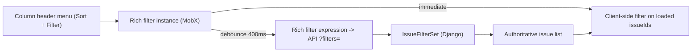

# Spreadsheet Column Filters — Design

- **Date:** 2026-10-05
- **Status:** Approved in brainstorming, pending spec review
- **Path:** Architectural

## 1. Goal

On the work item spreadsheet layout, let users filter directly from each column header menu:

| Column                      | Filter behavior                                                  |
| --------------------------- | ---------------------------------------------------------------- |
| Trạng thái (State)          | Multi-select checkboxes, OR within column                        |
| Ưu tiên (Priority)          | Multi-select checkboxes, OR within column                        |
| Người phụ trách (Assignees) | Multi-select members, OR within column                           |
| Người hỗ trợ (Supporters)   | Multi-select members, OR within column                           |
| Thời gian tạo (Created on)  | Date range From–To, with quick presets                           |
| Số phòng (Room)             | Text input, partial numeric match (`17` → `17`, `170`, `1733`)   |
| Loại công việc (Work type)  | Multi-select of 2 values: "Công việc vận hành", "Công việc khác" |

Filters across different columns combine with AND.

### Non-goals (v1)

- Workspace-level spreadsheet (`isWorkspaceLevel`) — not in scope.
- "Không có người phụ trách / hỗ trợ" (empty member) option.
- Saving filters as named views (existing Views feature already covers this).

## 2. Architecture & Data Flow



### Single source of truth

Column filters read and write the **existing rich filter system** (`TWorkItemFilterExpression`, `IWorkItemFilterInstance` from `packages/shared-state/src/store/work-item-filters`). No parallel store. Consequences:

- Filters persist via `rich_filters` user properties (survive reload).
- The existing header "Filters" toggle and column menus always stay in sync.

### Hybrid behavior

1. On change, a pure function `matchesColumnFilters(issue, conditions)` filters the already-loaded issues immediately.
2. The expression update is debounced (400ms) before calling `updateFilterExpression` (which triggers the server fetch with `"mutation"` loader). When the server response arrives, it replaces the client list. A thin loading bar at the top of the table indicates the pending server request.
3. Room input: keystrokes update only the client-side filter; the server call fires after typing stops.

### Column → filter key mapping

| Column (`IIssueDisplayProperties`) | Filter property | Operator                       | Backend                    |
| ---------------------------------- | --------------- | ------------------------------ | -------------------------- |
| `state`                            | `state_id`      | `in`                           | existing                   |
| `priority`                         | `priority`      | `in`                           | existing                   |
| `assignee`                         | `assignee_id`   | `in`                           | existing                   |
| `created_on`                       | `created_at`    | `range`                        | existing (whole-day range) |
| `supporter`                        | `supporter_id`  | `in`                           | **new**                    |
| `room`                             | `room`          | `contains`                     | **new**                    |
| `issue_type`                       | `work_type`     | `in` (`operational` / `other`) | **new**                    |

Work type classification (must match `spreadsheet/columns/type-column.tsx`):

- **other**: `type.external_id == "other"` OR `type.name == "Công việc khác"`.
- **operational**: everything else, **including `type IS NULL`**.

### Scope

Applies to every spreadsheet rendered via `BaseSpreadsheetRoot` (Project, Cycle, Module, Project View).

## 3. UI Components

### Header menu

`spreadsheet/columns/header-column.tsx` currently uses `CustomMenu` with `closeOnSelect`. Replace it with a popover that stays open while toggling checkboxes. Layout:

```
┌─────────────────────────────┐
│ ↓ A → Z                      │  ← Sort (unchanged behavior)
│ ↑ Z → A                      │
│ ⌫ Bỏ sắp xếp                 │
├─────────────────────────────┤
│ LỌC                Xóa lọc   │
│ [🔍 Tìm...]                  │
│ ☑ Đang thực hiện             │  ← body varies by column
│ ☐ Hoàn thành                 │
└─────────────────────────────┘
```

Columns without a filter mapping keep the sort-only menu.

### New components — `apps/web/core/components/issues/issue-layouts/spreadsheet/column-filters/`

| Component                  | Used by                     | Behavior                                                                                                                                        |
| -------------------------- | --------------------------- | ----------------------------------------------------------------------------------------------------------------------------------------------- |
| `ColumnFilterSection`      | all                         | Wrapper: "Lọc" title, active count, "Xóa lọc" button                                                                                            |
| `ColumnFilterCheckboxList` | state, priority, issue_type | Checkbox list with icon; search box shown only when ≥ 6 options                                                                                 |
| `ColumnFilterMemberList`   | assignee, supporter         | Avatar + name, search, sourced from project members                                                                                             |
| `ColumnFilterDateRange`    | created_on                  | Presets _Hôm nay / 7 ngày gần nhất / 30 ngày gần nhất_ (apply immediately); _Từ ngày / Đến ngày_ inputs + **Áp dụng** (disabled when from > to) |
| `ColumnFilterRoomInput`    | room                        | `inputmode="numeric"`, digits only, ✕ clear button                                                                                              |

### Hook — `useSpreadsheetColumnFilter(property)`

Wraps `useWorkItemFilters().getFilter(entityType, entityId)` and the column → filter key mapping. Returns `{ value, setValue, clear, isActive, activeCount }`. UI components never touch expressions directly.

### Active indicator

When `isActive`: header label uses `text-accent-primary`, chevron replaced by a `Filter` icon with a small dot badge, tooltip such as "Đang lọc: 2 trạng thái".

### Default columns

Enable `room` and `issue_type` by default in spreadsheet display properties. Users can still hide them via "Hiển thị".

### Empty state

`SpreadsheetView` currently returns nothing when `issueIds` is empty, which hides the header and makes it impossible to clear filters there. Change: when filters are active and no rows match, still render the header, plus a row "Không có công việc khớp bộ lọc" with a **Xóa tất cả bộ lọc** button.

### Copy

Hardcoded Vietnamese strings, consistent with the existing BWP columns (`supporter-column.tsx`, `room-column.tsx`).

## 4. Backend

### `apps/api/plane/utils/filters/filterset.py` — `IssueFilterSet`

| Filter                             | Implementation                                                                                                                                                                                                                |
| ---------------------------------- | ----------------------------------------------------------------------------------------------------------------------------------------------------------------------------------------------------------------------------- |
| `supporter_id`, `supporter_id__in` | Methods returning `Q(issue_supporter__supporter_id[__in]=value, issue_supporter__deleted_at__isnull=True)` — same pattern as `filter_assignee_id_in` (`IssueSupporter.issue` has `related_name="issue_supporter"`).           |
| `room__contains`                   | `CharFilter` + method. If the value is not all digits → return `Q()` (no-op, never 500). Otherwise filter on `Cast("room", CharField())` containing the value (via a subquery on `pk__in` so the method still returns a `Q`). |
| `work_type`, `work_type__in`       | Values restricted to `operational` / `other`. `other` = `Q(type__external_id="other") \| Q(type__name="Công việc khác")`; `operational` = `~other_q \| Q(type__isnull=True)`.                                                 |

### List response

Add `supporter_ids` (ArrayAgg over active supporters, same pattern as `assignee_ids`) to the values list in `apps/api/plane/app/views/issue/base.py` so client-side filtering on supporters is accurate.

No migrations required.

### Frontend constants/types

- Add `supporter_id`, `room`, `work_type` to `WORK_ITEM_FILTER_PROPERTY_KEYS` (`packages/types/src/view-props.ts`).
- Add matching operator configuration in `packages/constants/src/issue/filter.ts` so the expression serializes and `ComplexFilterBackend` accepts the keys.

## 5. Error Handling & Edge Cases

- **Out-of-order responses:** each server fetch carries an incrementing request id; stale responses are ignored.
- **Server failure:** keep client-filtered result, show toast "Không tải được kết quả lọc đầy đủ — đang hiển thị dữ liệu đã tải", `console.error` the error.
- **Missing client data:** if an issue lacks the field needed for a client-side check (e.g. `supporter_ids` or `type_detail` undefined), the client filter **keeps** the row; the server result decides.
- **Dates:** interpreted in the user's profile timezone, consistent with the existing `created_at__range` behavior.
- **Invalid room input:** non-digits are stripped in the UI; backend treats non-digit values as no-op.

## 6. Testing

### Backend (pytest, Docker — see `apps/api/tests/RUNNING_TESTS.md`)

New `apps/api/plane/tests/unit/utils/test_issue_filterset_bwp.py`:

- `supporter_id__in` matches; soft-deleted supporter excluded.
- `room__contains`: partial match, exact match, non-digit value no-op, null room excluded.
- `work_type`: `other` by external_id, `other` by name, `operational` including `type IS NULL`.
- Combined filters (AND across keys).
- List response includes `supporter_ids`.

### Frontend

- Add **vitest** to `packages/utils` (no frontend test framework exists today).
- Unit tests for `matchesColumnFilters`: each column type, OR within column, AND across columns, missing-data passthrough, room partial match, date range boundaries (inclusive whole days).
- UI verified manually on `pnpm dev`; `pnpm check` must pass.

## 7. Implementation Order

1. Backend filterset + pytest.
2. `supporter_ids` in list response.
3. Types and filter constants.
4. `matchesColumnFilters` in `packages/utils` + vitest.
5. `useSpreadsheetColumnFilter` hook + column filter components.
6. Header menu popover, active indicator, empty state.
7. Default-on `room` / `issue_type` columns.

## 8. Implementation Notes (added during planning)

Findings from the codebase that refine sections 2–5:

- **No `contains` operator.** The rich filter system only supports `exact`, `in` and `range`. The room filter therefore uses the property **`room_search`** with operator `exact`. The value is the digit search term, and the backend filter (`room_search` / `room_search__exact`) performs the substring match on `CAST(room AS text)`.
- **Work type key** is `work_type` with operator `in` (`work_type`, `work_type__exact`, `work_type__in`), values `operational` / `other`.
- **`supporter_ids` is already returned** by the main list endpoint (`IssueViewSet.list` via `issue_on_results`). Only `IssueListEndpoint` needs it added.
- **Header filters row:** `supporter_id` and `work_type` get rich filter configs and appear in "Add filter". `room_search` gets a config that is not shown in "Add filter" (no text input exists there). It is edited only from the column menu, and the header row displays it as "Số phòng: chứa 17".
- **Stale / failed responses:** instead of request ids and a toast, the client predicate is always re-applied on top of whatever the store holds. Rows from an outdated or failed fetch that do not match are therefore never shown. Fetch errors are already logged by the issue store.
- **Empty state:** when the server returns zero rows, the existing layout empty state (with "clear filters") is shown. The new in-table "Không có công việc khớp bộ lọc" row covers the client-side-only zero case.
- **Default columns:** `issue_type` is already default-on. `supporter` and `room` are made default-on.
- **Implementation plan:** `docs/superpowers/plans/2026-10-05-spreadsheet-column-filters.md`.
