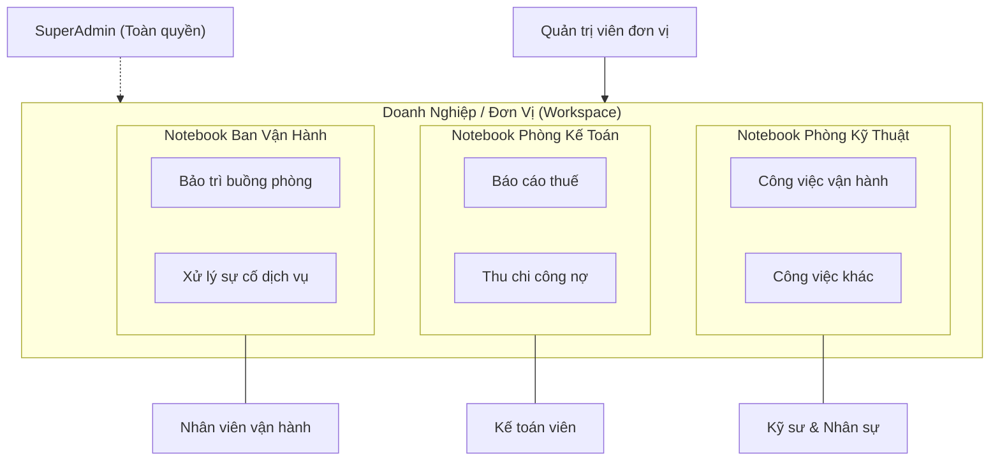
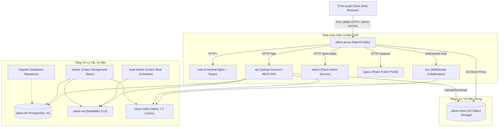
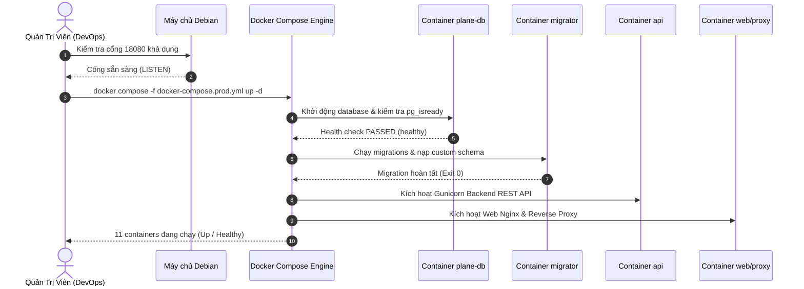

# BWP Notebook - Sổ Tay Công Việc Doanh Nghiệp

## Chương 1: Tổng Quan và Khởi Động Hệ Thống

> **Tài liệu Hướng dẫn Vận hành BWP Notebook (User Guide)**  
> **Phiên bản:** 2.0 (Bản phát hành Doanh nghiệp)  
> **Tác quyền & Kiến trúc:** Code & Architecture by IT Leon (BWP Engineering Team)  
> **Môi trường mục tiêu:** Debian GNU/Linux 11/12 (Máy chủ nội bộ `192.168.3.168`)

---

## 1. Giới thiệu BWP Notebook

### 1.1. Mục tiêu và sứ mệnh

**BWP Notebook** là giải pháp phần mềm quản lý công việc và điều hành nội bộ chuyên sâu, được thiết kế để giải quyết bài toán phân mảnh thông tin, thiếu nhất quán trong giao nhận việc và chậm trễ tiến độ tại các doanh nghiệp có cơ cấu tổ chức đa phòng ban.

Được kế thừa và phát triển từ nền tảng mã nguồn mở vững chắc **Plane CE (v1.4.2)**, BWP Notebook đã được đội ngũ kỹ sư BWP (dẫn dắt bởi **IT Leon**) tùy biến toàn diện cả ở tầng lõi backend (Django REST Framework) lẫn giao diện người dùng frontend (React Router SPA). Hệ thống chuyển đổi toàn bộ thuật ngữ phần mềm quản lý dự án công nghệ sang mô hình sổ tay công việc thực tiễn, thân thiện và gần gũi với môi trường vận hành doanh nghiệp Việt Nam.



### 1.2. Triết lý thiết kế cốt lõi

1. **Quản lý theo mô hình phân cấp thực tiễn:**
   - **Đơn vị / Công ty (Workspace):** Không gian dữ liệu cấp cao nhất đại diện cho toàn bộ tổ chức hoặc pháp nhân doanh nghiệp.
   - **Phòng ban / Notebook (Project):** Mỗi phòng ban sở hữu một sổ tay công việc riêng biệt, hoạt động độc lập và bảo mật cao.
   - **Công việc (Work Item / Task):** Đơn vị hạt nhân của quy trình xử lý, hỗ trợ gán một người phụ trách chính, nhiều người hỗ trợ, phân loại công việc và định danh số phòng/khu vực.
2. **Giao diện bảng lưới dạng Excel (Spreadsheet-first):**
   - Loại bỏ sự cồng kềnh của các bảng Kanban phức tạp đối với người dùng văn phòng thông thường.
   - Hiển thị đầy đủ thông tin: Tên công việc, Người phụ trách, Người hỗ trợ, Trạng thái, Phòng, Ghi chú trực tiếp trên một màn hình bảng.
3. **Chuẩn hóa ngôn ngữ và văn hóa doanh nghiệp:**
   - Việt hóa 100% giao diện với bộ thuật ngữ chuẩn xác, dễ hiểu.
   - Đơn giản hóa quy trình chuyển giao trạng thái công việc qua 4 bước: **Chưa bắt đầu**, **Chờ xử lý**, **Đang thực hiện**, **Hoàn thành**.

---

## 2. Kiến trúc Hạ tầng & Các Service Docker

Hệ thống BWP Notebook được đóng gói hoàn chỉnh bằng Docker Compose, hoạt động trên một mạng ảo nội bộ cô lập (`bwp_notebook_net`). Cấu trúc hệ thống bao gồm 11 dịch vụ phối hợp nhịp nhàng:



### 2.1. Chi tiết các dịch vụ thành phần

| Tên Dịch Vụ Docker | Image Gốc                           | Vai Trò & Chức Năng Nghiệp Vụ                                                                                                                                          | Cổng Mạng & Volume                                                            |
| :----------------- | :---------------------------------- | :--------------------------------------------------------------------------------------------------------------------------------------------------------------------- | :---------------------------------------------------------------------------- |
| `plane-db`         | `postgres:15.7-alpine`              | Cơ sở dữ liệu quan hệ lưu trữ toàn bộ người dùng, quyền, phòng ban, công việc, bình luận và nhật ký kiểm toán. Tối ưu `max_connections=200`.                           | Cổng nội bộ `5432`<br>Volume: `bwp_plane_pgdata`                              |
| `plane-redis`      | `valkey/valkey:7.2.11-alpine`       | Hệ thống lưu trữ in-memory hiệu năng cao (fork tương thích hoàn toàn Redis). Đảm nhiệm lưu session, caching, và giới hạn tần suất gọi API (Rate limiting `60/minute`). | Cổng nội bộ `6379`<br>Volume: `bwp_plane_redisdata`                           |
| `plane-mq`         | `rabbitmq:3.13.6-management-alpine` | Message Broker điều phối các hàng đợi tác vụ bất đồng bộ qua giao thức AMQP. Sử dụng vhost `bwp_plane`.                                                                | Cổng nội bộ `5672`<br>Volume: `bwp_plane_rabbitmq_data`                       |
| `plane-minio`      | `quay.io/minio/minio:latest`        | Máy chủ lưu trữ đối tượng tương thích S3 (Object Storage). Lưu trữ hình ảnh đính kèm, tệp tài liệu, ảnh đại diện vào bucket `bwp-notebook-uploads`.                    | Cổng nội bộ `9000` (API) / `9090` (Console)<br>Volume: `bwp_plane_uploads`    |
| `migrator`         | `makeplane/plane-backend:v1.4.2`    | Tác vụ chạy một lần (`restart: "no"`) để tự động kiểm tra database, nạp migration mở rộng (như `0123_issue_supporters_room_notes.py`) và tạo task types ban đầu.       | Chạy trước khi `api` kích hoạt.                                               |
| `api`              | `makeplane/plane-backend:v1.4.2`    | Ứng dụng Backend Django REST Framework chạy dưới Gunicorn, xử lý toàn bộ logic nghiệp vụ, xác thực JWT, RBAC authorization và ghi audit logs.                          | Cổng nội bộ `8000`<br>Volume: `bwp_plane_logs_api`                            |
| `worker`           | `makeplane/plane-backend:v1.4.2`    | Celery Worker nhận nhiệm vụ từ RabbitMQ để xử lý các tác vụ nền tiêu tốn tài nguyên: gửi email thông báo, tính toán chỉ số, ghi lịch sử hoạt động.                     | Volume: `bwp_plane_logs_worker`                                               |
| `beat-worker`      | `makeplane/plane-backend:v1.4.2`    | Celery Beat định thời điều phối các tác vụ định kỳ: dọn dẹp token hết hạn, đồng bộ chu kỳ công việc.                                                                   | Volume: `bwp_plane_logs_beat_worker`                                          |
| `web`              | `makeplane/plane-frontend:v1.4.2`   | Máy chủ Nginx phục vụ gói mã nguồn React Router SPA tùy biến (`custom_frontend/build/client`), tích hợp sẵn gói dịch tiếng Việt chuẩn hóa.                             | Nạp đè HTML tĩnh vào `/usr/share/nginx/html`                                  |
| `admin`            | `makeplane/plane-admin:v1.4.2`      | Dịch vụ quản trị instance, quản lý bản quyền cục bộ và cấu hình toàn hệ thống.                                                                                         | Cổng nội bộ phục vụ bảng điều khiển quản trị.                                 |
| `space`            | `makeplane/plane-space:v1.4.2`      | Cổng thông tin công khai hoặc tài liệu chia sẻ bên ngoài nếu được cấp quyền xuất bản.                                                                                  | Cổng nội bộ phục vụ Space.                                                    |
| `live`             | `makeplane/plane-live:v1.4.2`       | Dịch vụ WebSocket xử lý tương tác thời gian thực: cộng tác trực tiếp khi nhiều nhân sự cùng mở một trang tài liệu hoặc công việc.                                      | Cổng nội bộ kết nối với `plane-redis`.                                        |
| `proxy`            | `makeplane/plane-proxy:v1.4.2`      | Điểm tiếp nhận lưu lượng duy nhất từ bên ngoài, điều hướng các request đến các container tương ứng, bảo vệ an ninh mạng nội bộ.                                        | Cổng máy chủ: `18080` (HTTP) / `18443` (HTTPS)<br>Volume: `bwp_plane_proxy_*` |

---

## 3. Cấu hình Môi trường & File Biến Môi Trường (`.env`)

Để hệ thống hoạt động chính xác trên máy chủ Debian mà không xung đột với các dịch vụ mạng có sẵn, toàn bộ cấu hình được quản lý tập trung qua file môi trường.

### 3.1. Tránh xung đột cổng mạng (Port Collision Avoidance)

Trên các máy chủ nội bộ (ví dụ Debian IP `192.168.3.168`), các cổng mạng tiêu chuẩn như `80`, `443`, `3000`, `8080`, `5432`, `6379` thường đã được sử dụng bởi các hệ thống phần mềm khác hoặc web server của hạ tầng mạng.

> [!IMPORTANT]
> **Quy ước cổng mạng BWP Notebook:**
>
> - Cổng Web chính (HTTP): **`18080`** (Ánh xạ từ máy chủ vào cổng 80 của container `proxy`).
> - Cổng Web bảo mật (HTTPS): **`18443`** (Ánh xạ vào cổng 443 của container `proxy`).
> - Mọi service cơ sở dữ liệu (`plane-db`), cache (`plane-redis`), message queue (`plane-mq`), object storage (`plane-minio`) đều **hoạt động hoàn toàn bên trong Docker Network `bwp_notebook_net`**, không mở cổng (expose) trực tiếp ra mạng LAN của máy chủ nhằm đảm bảo an toàn tuyệt đối.

### 3.2. Mẫu cấu hình chuẩn (`.env`)

Tạo file `.env` tại thư mục gốc của dự án (`c:\Code\nora-notebook\.env` hoặc `/opt/nora-notebook/.env` trên máy chủ Debian) bằng cách sao chép từ file mẫu `variables.prod.env.example`:

```bash
cp variables.prod.env.example .env
```

Nội dung chi tiết của tệp cấu hình:

```ini
# ==============================================================================
# BWP-Notebook-v2 Environment Configuration
# Architecture by IT Leon (BWP Engineering Team)
# Target Server: Debian 192.168.3.168 (Port 18080)
# Base Platform: Plane CE v1.4.2
# ==============================================================================

# 1. Phiên bản nền tảng và Tên miền truy cập
APP_RELEASE=v1.4.2
APP_DOMAIN=192.168.3.168:18080
WEB_URL=http://192.168.3.168:18080

# 2. Cổng mạng lắng nghe dịch vụ ngoài
LISTEN_HTTP_PORT=18080
LISTEN_HTTPS_PORT=18443

# 3. Khóa bảo mật hệ thống (Bắt buộc sinh chuỗi ngẫu nhiên mạnh)
SECRET_KEY=bwp-notebook-secret-key-super-secure-2026-leon
LIVE_SERVER_SECRET_KEY=bwp-live-secret-key-2026-leon

# 4. Cấu hình Cơ sở dữ liệu PostgreSQL (Mạng nội bộ bwp_notebook_net)
POSTGRES_USER=bwp_plane_user
POSTGRES_PASSWORD=bwp_secret_pw_2026
POSTGRES_DB=bwp_plane

# 5. Cấu hình RabbitMQ Message Broker
RABBITMQ_USER=bwp_mq
RABBITMQ_PASSWORD=bwp_mq_password_2026

# 6. Cấu hình Lưu trữ Tệp Đối tượng (MinIO S3)
AWS_ACCESS_KEY_ID=bwp_minio_access
AWS_SECRET_ACCESS_KEY=bwp_minio_secret_key_2026
AWS_S3_BUCKET_NAME=bwp-notebook-uploads
```

> [!WARNING]
> Khi triển khai trên môi trường sản xuất thực tế, quản trị viên **phải thay đổi** các giá trị mật khẩu mặc định (`SECRET_KEY`, `POSTGRES_PASSWORD`, `RABBITMQ_PASSWORD`, `AWS_SECRET_ACCESS_KEY`) thành các chuỗi mật mã ngẫu nhiên có độ dài tối thiểu 32 ký tự.

---

## 4. Quy trình Khởi chạy trên Máy chủ Debian

### 4.1. Yêu cầu tiên quyết về máy chủ

- **Hệ điều hành:** Debian GNU/Linux 11 (Bullseye) hoặc 12 (Bookworm) 64-bit.
- **Tài nguyên tối thiểu:**
  - CPU: 2 Cores (Khuyến nghị 4 Cores).
  - RAM: 4 GB (Khuyến nghị 8 GB để vận hành mượt mà cùng lúc PostgreSQL, Redis, MinIO và Elasticsearch/Valkey).
  - Ổ cứng: Tối thiểu 30 GB dung lượng trống chuẩn SSD.
- **Phần mềm bắt buộc:**
  - Docker Engine phiên bản `>= 24.0.0`.
  - Docker Compose plugin phiên bản `>= 2.20.0`.

### 4.2. Các bước khởi chạy chi tiết



#### Bước 1: Kiểm tra cổng mạng khả dụng

Trước khi kích hoạt container, kiểm tra xem cổng `18080` có bị chiếm dụng bởi tiến trình nào khác trên Debian hay không:

```bash
sudo ss -tulpn | grep 18080
```

Nếu lệnh không trả về kết quả nào, cổng `18080` đang hoàn toàn khả dụng.

#### Bước 2: Tải image và khởi động cụm container

Thực thi lệnh Docker Compose với cấu hình sản xuất `docker-compose.prod.yml`:

```bash
docker compose -f docker-compose.prod.yml up -d
```

Quá trình này sẽ kéo các Docker image cần thiết từ registry, tạo Docker Network `bwp_notebook_net`, khởi tạo các ổ lưu trữ dữ liệu (persistent volumes) và khởi chạy 11 container theo đúng thứ tự phụ thuộc (`depends_on`).

#### Bước 3: Kiểm tra trạng thái các container

Xác nhận tất cả các container đã khởi động thành công và chuyển sang trạng thái hoạt động bình thường:

```bash
docker compose -f docker-compose.prod.yml ps
```

Kết quả mong đợi:

- `bwp_notebook_plane_db`: `Up (healthy)`
- `bwp_notebook_plane_redis`: `Up`
- `bwp_notebook_plane_mq`: `Up`
- `bwp_notebook_plane_minio`: `Up`
- `bwp_notebook_plane_migrator`: `Exited (0)` _(Container này kết thúc sau khi hoàn thành migration)_
- `bwp_notebook_plane_api`: `Up`
- `bwp_notebook_plane_worker`: `Up`
- `bwp_notebook_plane_beat_worker`: `Up`
- `bwp_notebook_plane_web`: `Up`
- `bwp_notebook_plane_proxy`: `Up (0.0.0.0:18080->80/tcp)`

#### Bước 4: Theo dõi nhật ký khởi động (Logs)

Nếu cần kiểm tra tiến trình áp dụng cơ sở dữ liệu và khởi động backend API:

```bash
# Kiểm tra nhật ký migration
docker compose -f docker-compose.prod.yml logs migrator

# Theo dõi trực tiếp log của backend API
docker compose -f docker-compose.prod.yml logs -f api
```

---

## 5. Khởi Tạo Tài Khoản SuperAdmin & Đổi Mật Khẩu Lần Đầu

### 5.1. Vai trò của tài khoản SuperAdmin

Tài khoản **SuperAdmin** là cấp quản trị tối cao của toàn bộ máy chủ BWP Notebook (tương ứng vai trò `InstanceAdmin` với Role cấp độ `20`). SuperAdmin có thẩm quyền:

- Truy cập bảng điều khiển hệ thống **God Mode** tại địa chỉ: `http://192.168.3.168:18080/god-mode`.
- Quản trị tất cả các Đơn vị / Công ty (Workspaces) tạo trên hệ thống.
- Xem toàn bộ dữ liệu kiểm toán bảo mật và giám sát dung lượng lưu trữ.
- Khôi phục quyền truy cập cho các tài khoản quản trị viên đơn vị khi gặp sự cố.

### 5.2. Khởi tạo tài khoản SuperAdmin ban đầu

Tài khoản quản trị viên tối cao mặc định của hệ thống được chỉ định theo định danh email:

- **Email quản trị viên:** `norahieunguyen@gmail.com`

Để khởi tạo hoặc cấp quyền SuperAdmin cho tài khoản này trực tiếp từ máy chủ, thực hiện lệnh quản trị sau thông qua container `api`:

```bash
# 1. Cấp quyền Instance Admin (SuperAdmin) cho email
docker compose -f docker-compose.prod.yml exec api python manage.py create_instance_admin norahieunguyen@gmail.com

# 2. Khởi tạo các loại công việc chuẩn hóa (Công việc vận hành, Công việc khác) và trạng thái tiếng Việt
docker compose -f docker-compose.prod.yml exec api python manage.py seed_task_types
```

### 5.3. Quy trình Đặt lại & Đổi Mật khẩu Lần Đầu Bắt Buộc

Khi tài khoản được tạo tự động hoặc khởi tạo lần đầu từ hệ thống, cờ `is_password_autoset` trong database được đặt là `True`. Hệ thống áp dụng chính sách bảo mật bắt buộc người dùng phải đổi mật khẩu để bảo vệ an toàn thông tin:

1. **Thiết lập mật khẩu an toàn ban đầu qua CLI:**
   Quản trị viên hạ tầng có thể kích hoạt lệnh đổi mật khẩu an toàn với tính năng kiểm tra độ phức tạp bằng thuật toán `zxcvbn`:

   ```bash
   docker compose -f docker-compose.prod.yml exec api python manage.py reset_password norahieunguyen@gmail.com
   ```

   - Nhập mật khẩu mới và xác nhận mật khẩu.
   - Hệ thống sẽ tự động chấm điểm độ phức tạp (yêu cầu điểm `score >= 3`).
   - Sau khi hoàn thành, cờ `is_password_autoset` được gỡ bỏ (`False`).

2. **Quy trình đổi mật khẩu trên giao diện Web:**
   - Truy cập trang đăng nhập tại: `http://192.168.3.168:18080`.
   - Đăng nhập bằng email `norahieunguyen@gmail.com` và mật khẩu vừa tạo.
   - Nhấp vào ảnh đại diện cá nhân ở góc dưới bên trái $\rightarrow$ chọn **Cài đặt cá nhân (Profile Settings)**.
   - Chọn tab **Bảo mật (Security)** $\rightarrow$ **Đổi mật khẩu (Change Password)**.
   - Nhập mật khẩu hiện tại, nhập mật khẩu mới và bấm **Lưu thay đổi**.

> [!TIP]
> **Tiêu chuẩn mật khẩu doanh nghiệp an toàn:**
>
> - Độ dài tối thiểu 10 ký tự.
> - Kết hợp chữ hoa (`A-Z`), chữ thường (`a-z`), chữ số (`0-9`) và ít nhất một ký tự đặc biệt (`!@#$%^&*`).
> - Không sử dụng thông tin dễ đoán như ngày sinh, số điện thoại hay tên đơn vị.

---

## 6. Xử Lý Sự Cố Khởi Động Thường Gặp (Troubleshooting)

### 6.1. Lỗi xung đột cổng `18080` (Port is already allocated)

- **Hiện tượng:** Lệnh `docker compose up` báo lỗi: `Bind for 0.0.0.0:18080 failed: port is already allocated`.
- **Nguyên nhân:** Có một tiến trình web server khác đang chiếm cổng `18080`.
- **Cách xử lý:**
  1. Kiểm tra tiến trình đang chiếm cổng: `sudo lsof -i :18080` hoặc `sudo netstat -tlpn | grep 18080`.
  2. Dừng tiến trình xung đột, hoặc mở file `.env` chỉnh sửa `LISTEN_HTTP_PORT=18081` rồi khởi động lại container `proxy`:
     ```bash
     docker compose -f docker-compose.prod.yml up -d --force-recreate proxy
     ```

### 6.2. Container `migrator` báo lỗi kết nối database

- **Hiện tượng:** Log `migrator` hiển thị `django.db.utils.OperationalError: could not connect to server: Connection refused`.
- **Nguyên nhân:** PostgreSQL khởi động chậm hơn dự kiến hoặc cấu hình credentials trong `.env` chưa đồng bộ giữa `POSTGRES_*` và `DATABASE_URL`.
- **Cách xử lý:**
  1. Đảm bảo container `plane-db` đã đạt trạng thái `healthy`:
     ```bash
     docker compose -f docker-compose.prod.yml ps plane-db
     ```
  2. Khởi chạy lại container migrator sau khi database sẵn sàng:
     ```bash
     docker compose -f docker-compose.prod.yml restart migrator
     ```

### 6.3. Khởi động lại toàn bộ hệ thống sạch sẽ

Trong trường hợp cần khởi động lại toàn bộ các dịch vụ để áp dụng cấu hình mới:

```bash
# Dừng cụm dịch vụ an toàn (không mất dữ liệu vì dữ liệu nằm trong volume)
docker compose -f docker-compose.prod.yml down

# Khởi động lại toàn bộ
docker compose -f docker-compose.prod.yml up -d
```
