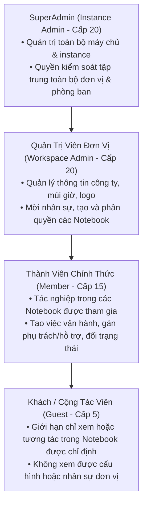
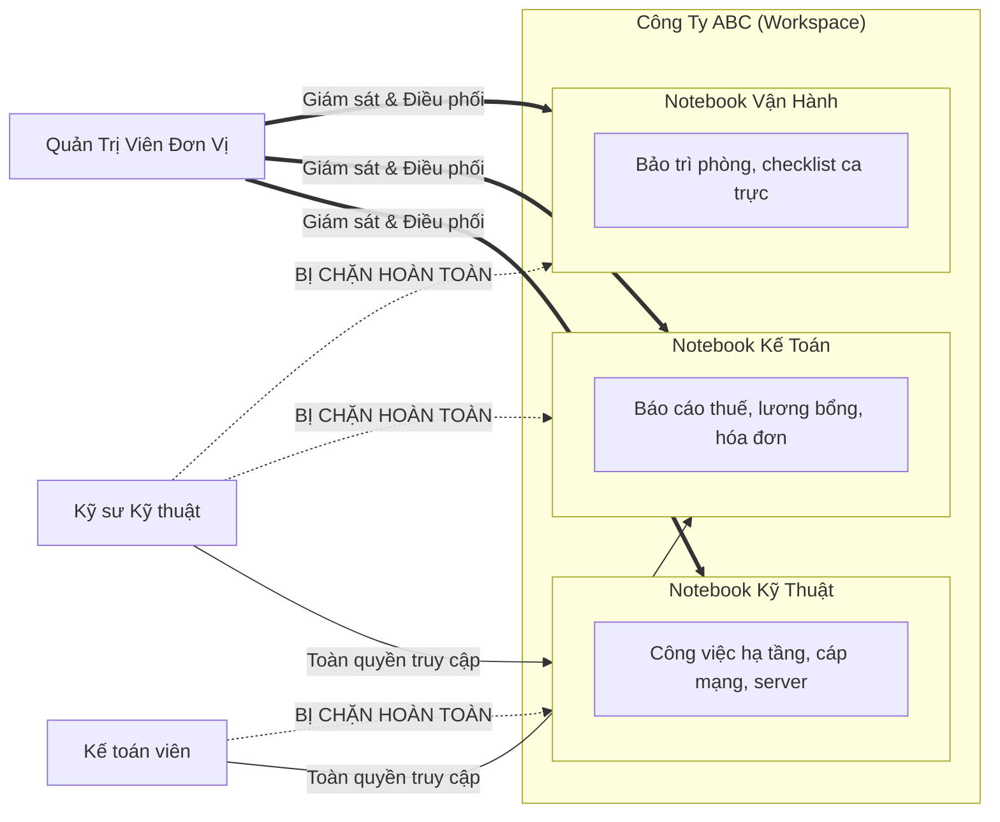
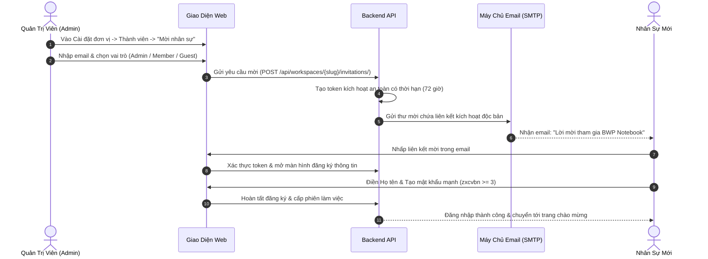
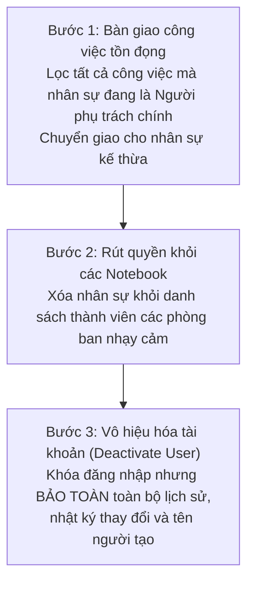

# BWP Notebook - Sổ Tay Công Việc Doanh Nghiệp

## Chương 2: Quản Lý Tài Khoản và Phân Quyền RBAC

> **Tài liệu Hướng dẫn Vận hành BWP Notebook (User Guide)**  
> **Phiên bản:** 2.0 (Bản phát hành Doanh nghiệp)  
> **Tác quyền & Kiến trúc:** Code & Architecture by IT Leon (BWP Engineering Team)  
> **Cơ chế Phân quyền:** Role-Based Access Control (RBAC) & Cô lập Phòng ban (Department Partitioning)

---

## 1. Phân Cấp 4 Vai Trò Người Dùng

Trong BWP Notebook, mọi hành vi truy cập dữ liệu và thực thi nghiệp vụ đều được kiểm soát nghiêm ngặt thông qua mô hình phân quyền dựa trên vai trò (**Role-Based Access Control - RBAC**). Hệ thống định nghĩa 4 cấp vai trò phân cấp từ cao xuống thấp:



### 1.1. SuperAdmin (Quản trị viên Cấp cao / Toàn hệ thống)

- **Định danh kỹ thuật:** `InstanceAdmin` với thuộc tính `role = 20`.
- **Phạm vi quyền hạn:** Toàn bộ hệ thống máy chủ, không bị giới hạn bởi bất kỳ ranh giới Đơn vị (Workspace) hay Phòng ban (Notebook/Project) nào.
- **Quyền hạn đặc thù:**
  - Truy cập bảng điều khiển quản trị toàn cục **God Mode** (`/god-mode`).
  - Quản lý, khởi tạo, kích hoạt hoặc đóng băng bất kỳ Đơn vị (Công ty) nào trên máy chủ.
  - Xem toàn bộ dữ liệu kiểm toán hệ thống (System Audit Logs) để phục vụ công tác thanh tra bảo mật.
  - Cấp quyền quản trị viên cho các tài khoản mới hoặc khôi phục quyền truy cập khi đơn vị gặp sự cố.

### 1.2. Quản trị viên đơn vị (Workspace Admin)

- **Định danh kỹ thuật:** `WorkspaceMember` với thuộc tính `role = 20`.
- **Phạm vi quyền hạn:** Toàn bộ không gian làm việc của Công ty / Đơn vị được phân công quản lý.
- **Quyền hạn đặc thù:**
  - Cấu hình thông tin tổ chức: Tên công ty, logo nhận diện, địa chỉ URL rút gọn (slug), múi giờ và lịch làm việc.
  - Quản lý danh bạ nhân sự: Mời nhân sự mới qua email, phân bổ vai trò ban đầu, thu hồi quyền truy cập hoặc vô hiệu hóa tài khoản rời tổ chức.
  - Quản trị danh mục Notebook: Khởi tạo các phòng ban mới (Kỹ thuật, Kế toán, Vận hành, v.v.), gán trưởng bộ phận và quản lý danh sách thành viên tham gia từng phòng.
  - Đóng băng hoặc lưu trữ (Archive) các Notebook không còn hoạt động.

### 1.3. Thành viên (Member)

- **Định danh kỹ thuật:** `WorkspaceMember` (`role = 15`) và `ProjectMember` (`role = 15`).
- **Phạm vi quyền hạn:** Hoạt động tác nghiệp hàng ngày bên trong các Phòng ban / Notebook mà mình được thêm vào danh sách thành viên.
- **Quyền hạn đặc thù:**
  - Xem danh sách và chi tiết toàn bộ công việc trong các Notebook được quyền truy cập.
  - Tạo mới **Công việc vận hành (Operational Task)** phát sinh hằng ngày.
  - Tiếp nhận và xử lý **Công việc khác (Other Task)** do cấp trên giao.
  - Gán người phụ trách chính (Assignee), bổ sung danh sách người hỗ trợ (Supporters).
  - Cập nhật thông tin số phòng/khu vực (Room), ghi chú nội bộ (Notes), tiến độ và chuyển đổi trạng thái công việc.
  - Tham gia trao đổi, bình luận và đính kèm hồ sơ chứng từ liên quan.

### 1.4. Khách (Guest / Cộng tác viên)

- **Định danh kỹ thuật:** `WorkspaceMember` (`role = 5`) và `ProjectMember` (`role = 5`).
- **Phạm vi quyền hạn:** Bị cô lập cao độ, chỉ có quyền truy cập vào duy nhất một hoặc một số Notebook cụ thể được chỉ định bằng văn bản mời.
- **Đặc điểm giới hạn:**
  - Không thể xem danh sách nhân sự hay cấu hình chung của Công ty.
  - Không thể tạo mới phòng ban hay tự ý mời người khác vào hệ thống.
  - Quyền hạn trên công việc bị thu hẹp: Chỉ xem các công việc được giao hoặc bình luận góp ý mà không thể tự ý xóa hoặc thay đổi cấu hình workflow.

---

## 2. Bảng Ma Trận Phân Quyền Chi Tiết (RBAC Matrix)

Dưới đây là ma trận đối chiếu quyền thực thi chi tiết trên **5 nhóm tài nguyên nghiệp vụ** của BWP Notebook:

| Nhóm Tài Nguyên                         | Thao Tác / Quyền Nghiệp Vụ                 | SuperAdmin | Quản Trị Viên (Admin) |     Thành Viên (Member)     |    Khách (Guest)    |
| :-------------------------------------- | :----------------------------------------- | :--------: | :-------------------: | :-------------------------: | :-----------------: |
| **1. Tài Khoản & Người Dùng**           | Xem danh sách người dùng toàn máy chủ      |     Có     |         Không         |            Không            |        Không        |
|                                         | Xem danh bạ nhân sự trong đơn vị           |     Có     |          Có           |             Có              | Chỉ xem trong phòng |
|                                         | Mời / Tạo tài khoản nhân sự mới            |     Có     |          Có           |            Không            |        Không        |
|                                         | Chỉnh sửa thông tin / hồ sơ cá nhân        |     Có     |          Có           |             Có              |         Có          |
|                                         | Chỉnh sửa thông tin nhân sự khác           |     Có     |          Có           |            Không            |        Không        |
|                                         | Khóa / Vô hiệu hóa tài khoản               |     Có     |          Có           |            Không            |        Không        |
|                                         | Gán vai trò SuperAdmin                     |     Có     |         Không         |            Không            |        Không        |
|                                         | Gán / Đổi vai trò Admin / Member / Guest   |     Có     |          Có           |            Không            |        Không        |
| **2. Đơn Vị / Công Ty (Workspace)**     | Xem thông tin cấu hình công ty             |     Có     |          Có           |             Có              |      Giới hạn       |
|                                         | Thay đổi tên công ty, logo, múi giờ        |     Có     |          Có           |            Không            |        Không        |
|                                         | Quản lý tích hợp webhooks & dịch vụ ngoài  |     Có     |          Có           |            Không            |        Không        |
|                                         | Quản lý thành viên đơn vị                  |     Có     |          Có           |            Không            |        Không        |
|                                         | Lưu trữ (Archive) / Xóa đơn vị             |     Có     |         Không         |            Không            |        Không        |
| **3. Phòng Ban / Notebook (Project)**   | Xem phòng ban được mời tham gia            |     Có     |          Có           |             Có              |         Có          |
|                                         | Xem tất cả phòng ban trong công ty         |     Có     |          Có           |            Không            |        Không        |
|                                         | Tạo mới Phòng ban / Notebook               |     Có     |          Có           |            Không            |        Không        |
|                                         | Thay đổi tên, mô tả, nhận diện Notebook    |     Có     |          Có           |            Không            |        Không        |
|                                         | Cấu hình quy trình trạng thái (Workflow)   |     Có     |          Có           |            Không            |        Không        |
|                                         | Quản lý thành viên trong từng Notebook     |     Có     |          Có           |            Không            |        Không        |
|                                         | Lưu trữ / Khôi phục phòng ban (Archive)    |     Có     |          Có           |            Không            |        Không        |
|                                         | Xóa vĩnh viễn phòng ban                    |     Có     |   Có (Cần xác nhận)   |            Không            |        Không        |
| **4. Công Việc (Task / Work Item)**     | Xem danh sách & chi tiết việc trong phòng  |     Có     |          Có           |             Có              |  Có (Nếu được mời)  |
|                                         | Tạo "Công việc vận hành" (Operational)     |     Có     |          Có           |             Có              |         Có          |
|                                         | Tạo / Giao "Công việc khác" (Other)        |     Có     |          Có           | Có (Nếu có quyền giao việc) |        Không        |
|                                         | Đổi loại công việc (Vận hành <-> Khác)     |     Có     |          Có           |    Không (Chặn backend)     |        Không        |
|                                         | Gán / Đổi người phụ trách chính (Assignee) |     Có     |          Có           |             Có              |      Giới hạn       |
|                                         | Gán người hỗ trợ (Supporters)              |     Có     |          Có           |             Có              |         Có          |
|                                         | Cập nhật số phòng / khu vực (Room)         |     Có     |          Có           |             Có              |         Có          |
|                                         | Thêm / Sửa ghi chú nội bộ (Notes)          |     Có     |          Có           |             Có              |         Có          |
|                                         | Đổi trạng thái xử lý công việc             |     Có     |          Có           |             Có              |      Giới hạn       |
|                                         | Bình luận, trao đổi, đính kèm tài liệu     |     Có     |          Có           |             Có              |         Có          |
|                                         | Lưu trữ / Xóa công việc                    |     Có     |          Có           |      Chỉ việc mình tạo      |        Không        |
| **5. Nhật Ký & Kiểm Toán (Audit Logs)** | Xem lịch sử thao tác của chính mình        |     Có     |          Có           |             Có              |         Có          |
|                                         | Xem nhật ký hoạt động của phòng ban        |     Có     |          Có           |             Có              |        Không        |
|                                         | Xem toàn bộ nhật ký hệ thống (System Log)  |     Có     |         Không         |            Không            |        Không        |
|                                         | Xuất báo cáo hoạt động / kiểm toán         |     Có     |          Có           |            Không            |        Không        |

> [!NOTE]
> **Ký hiệu:**
>
> - **Có**: Được phép thực hiện đầy đủ.
> - **Không**: Bị nghiêm cấm và bị chặn ngay từ backend API.
> - **Giới hạn**: Chỉ được phép thao tác trên các bản ghi do chính mình tạo hoặc được chỉ định đích danh.

---

## 3. Nguyên Tắc Cô Lập Dữ Liệu Theo Phòng Ban (Department Isolation)

Một trong những tiêu chuẩn an toàn thông tin cốt lõi nhất của BWP Notebook là **cô lập dữ liệu theo ranh giới phòng ban** (Departmental Silo). Mỗi phòng ban được xem như một chiếc "sổ tay đóng kín", ngăn chặn hoàn toàn nguy cơ rò rỉ dữ liệu nhạy cảm giữa các bộ phận trong cùng doanh nghiệp.



### 3.1. Các nguyên tắc an toàn bất khả xâm phạm

1. **Nguyên tắc "Cần biết mới thấy" (Need-to-Know Basis):**
   - Nhân sự thuộc phòng Kỹ thuật **tuyệt đối không thể nhìn thấy** danh sách công việc, ghi chú nội bộ, tệp đính kèm hay bình luận thuộc phòng Kế toán hoặc Nhân sự, trừ khi quản trị viên chủ động thêm nhân sự đó vào danh sách thành viên của phòng tương ứng.
2. **Kiểm tra thẩm quyền 2 lớp (Two-tier Enforcement):**
   - **Tầng Giao diện (Frontend Guard):** Thanh điều hướng và danh sách phòng ban chỉ hiển thị những Notebook mà tài khoản hiện tại đang là thành viên. Các nút thao tác nhạy cảm (Xóa phòng, Đổi cấu hình) tự động bị ẩn hoặc vô hiệu hóa.
   - **Tầng Dịch vụ Lõi (Backend Enforcement):** Mọi truy vấn API đến backend Django đều đi qua middleware kiểm tra quyền (`ProjectMemberBasePermission`) và lọc trực tiếp tại câu lệnh cơ sở dữ liệu:
     ```python
     # Logic cốt lõi chặn truy cập trái phép ở tầng cơ sở dữ liệu
     queryset = Issue.objects.filter(
         project__members=request.user,
         workspace__members=request.user
     )
     ```
   - Điều này đảm bảo rằng người dùng cố tình can thiệp mã JavaScript hay gọi trực tiếp REST API bằng Postman/cURL đều sẽ nhận về mã lỗi `403 Forbidden` hoặc `404 Not Found`.

> [!IMPORTANT]
> **Quyền kiểm soát tập trung của SuperAdmin & Admin:**
>
> - Quản trị viên đơn vị (Admin) có quyền xem và cấu hình toàn bộ các phòng ban trong công ty của mình để giải quyết ách tắc vận hành.
> - SuperAdmin có quyền kiểm soát xuyên suốt trên toàn máy chủ nhằm phục vụ mục đích sao lưu, bảo trì kỹ thuật và thanh tra hệ thống.

---

## 4. Quy Trình Mời Nhân Sự & Quản Lý Phiên Đăng Nhập An Toàn

### 4.1. Quy trình mời nhân sự mới vào hệ thống



#### Các bước thao tác của Quản trị viên:

1. Đăng nhập vào hệ thống với tài khoản Admin.
2. Tại thanh bên trái, chọn **Cài đặt đơn vị (Workspace Settings)** $\rightarrow$ chọn mục **Thành viên (Members)**.
3. Bấm vào nút **Mời nhân sự (Invite Member)** ở góc trên bên phải.
4. Nhập địa chỉ email của nhân sự cần mời.
5. Tại trường **Vai trò**, chọn cấp độ phù hợp:
   - Chọn **Thành viên (Member)** cho nhân sự làm việc thông thường.
   - Chọn **Quản trị viên (Admin)** nếu người này là phó ban hoặc người hỗ trợ quản trị hệ thống.
   - Chọn **Khách (Guest)** nếu là cộng tác viên thời vụ hoặc đối tác ngoài.
6. Bấm **Gửi lời mời**.

#### Các bước tiếp nhận của Nhân sự mới:

1. Mở hộp thư điện tử cá nhân, tìm email có tiêu đề: _"Lời mời tham gia không gian làm việc BWP Notebook"_.
2. Nhấp vào nút **Chấp nhận lời mời (Accept Invitation)**.
3. Trên trang kích hoạt tài khoản:
   - Điền **Họ và tên đầy đủ**.
   - Thiết lập **Mật khẩu cá nhân**. Hệ thống tự động kiểm tra độ mạnh mật khẩu; mật khẩu phải đạt chuẩn an toàn doanh nghiệp (tối thiểu 8 ký tự, bao gồm chữ hoa, chữ thường, chữ số và ký hiệu đặc biệt).
4. Nhấn **Hoàn tất và Đăng nhập**. Hệ thống sẽ tự động đăng nhập và hiển thị giao diện tiếng Việt chuẩn hóa.

### 4.2. Phân bổ nhân sự vào từng Phòng ban / Notebook

Sau khi nhân sự đã gia nhập Công ty, Quản trị viên cần phân bổ nhân sự vào đúng các phòng ban nghiệp vụ:

1. Nhấp vào tên **Phòng ban / Notebook** cần cấu hình (ví dụ: _Notebook Kỹ Thuật_).
2. Chọn **Cài đặt phòng ban (Project Settings)** $\rightarrow$ mục **Thành viên (Members)**.
3. Bấm **Thêm thành viên (Add Member)**.
4. Chọn tên nhân sự từ danh sách danh bạ công ty, thiết lập vai trò trong phòng ban đó rồi nhấn **Lưu**.
5. Ngay lập tức, nhân sự sẽ nhìn thấy sổ tay này trên thanh điều hướng của mình và có thể bắt đầu tiếp nhận công việc.

### 4.3. Quản lý phiên đăng nhập an toàn (Session & Token Management)

Để ngăn chặn nguy cơ đánh cắp phiên và truy cập trái phép, BWP Notebook áp dụng cơ chế quản lý phiên tiêu chuẩn doanh nghiệp:

1. **Cơ chế xác thực kép Access Token & Refresh Token (JWT):**
   - **Access Token:** Có thời hạn ngắn (mặc định 60 phút), được đính kèm trong header `Authorization: Bearer <token>` cho mọi lệnh gọi API.
   - **Refresh Token:** Lưu trữ an toàn trong cookie `HttpOnly`, `SameSite=Lax`, dùng để cấp mới Access Token tự động khi người dùng vẫn đang làm việc.
2. **Cơ chế thu hồi phiên tức thời (Session Revocation):**
   - Khi Quản trị viên thay đổi vai trò hoặc khóa tài khoản của một nhân sự, backend sẽ ghi nhận sự kiện vào bộ nhớ đệm `plane-redis` (Valkey). Toàn bộ Access Token hiện có của tài khoản đó sẽ bị từ chối ngay lập tức mà không cần đợi token hết hạn.
3. **Chính sách Đăng xuất an toàn (Safe Logout):**
   - Khi người dùng bấm **Đăng xuất**, hệ thống sẽ xóa cookie phiên, hủy token trên trình duyệt và gửi tín hiệu vô hiệu hóa refresh token về máy chủ.

---

## 5. Quy Trình Thu Hồi Quyền & Bàn Giao Khi Nhân Sự Nghỉ Việc (Offboarding)

Khi có nhân sự luân chuyển công tác hoặc nghỉ việc, Quản trị viên phải thực hiện quy trình bàn giao 3 bước để đảm bảo dữ liệu công việc không bị gián đoạn và an toàn thông tin:



> [!WARNING]
> **Không thực hiện xóa vĩnh viễn (Hard Delete) tài khoản nhân sự:**  
> Hãy sử dụng tính năng **Khóa tài khoản (Deactivate Member)** thay vì xóa hoàn toàn khỏi cơ sở dữ liệu. Thao tác này giúp hệ thống giữ nguyên vẹn các bản ghi lịch sử, dấu vết kiểm toán và thông tin người tạo công việc trong quá khứ mà không cho phép tài khoản đó đăng nhập trở lại.
