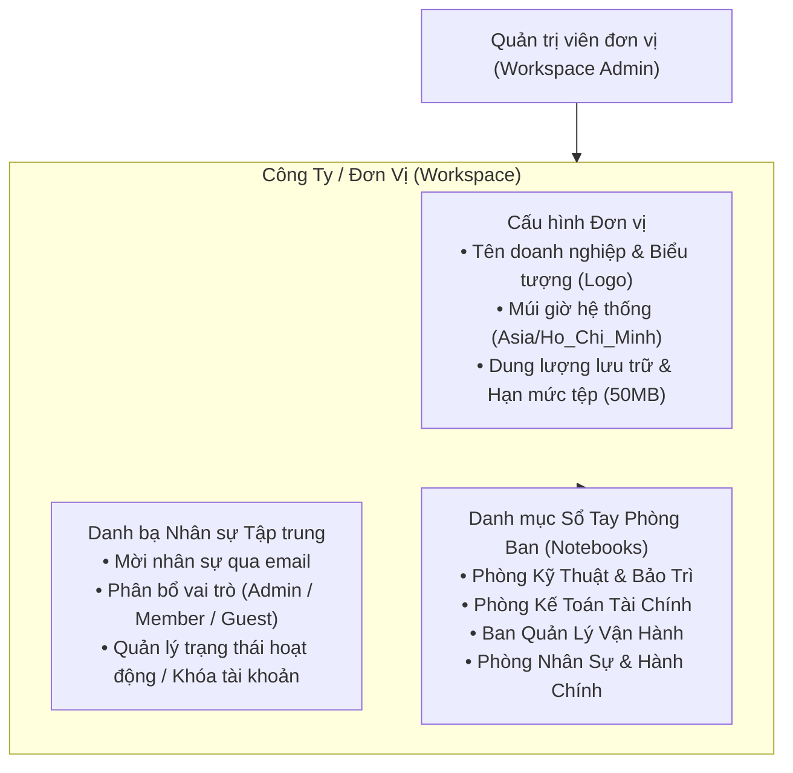
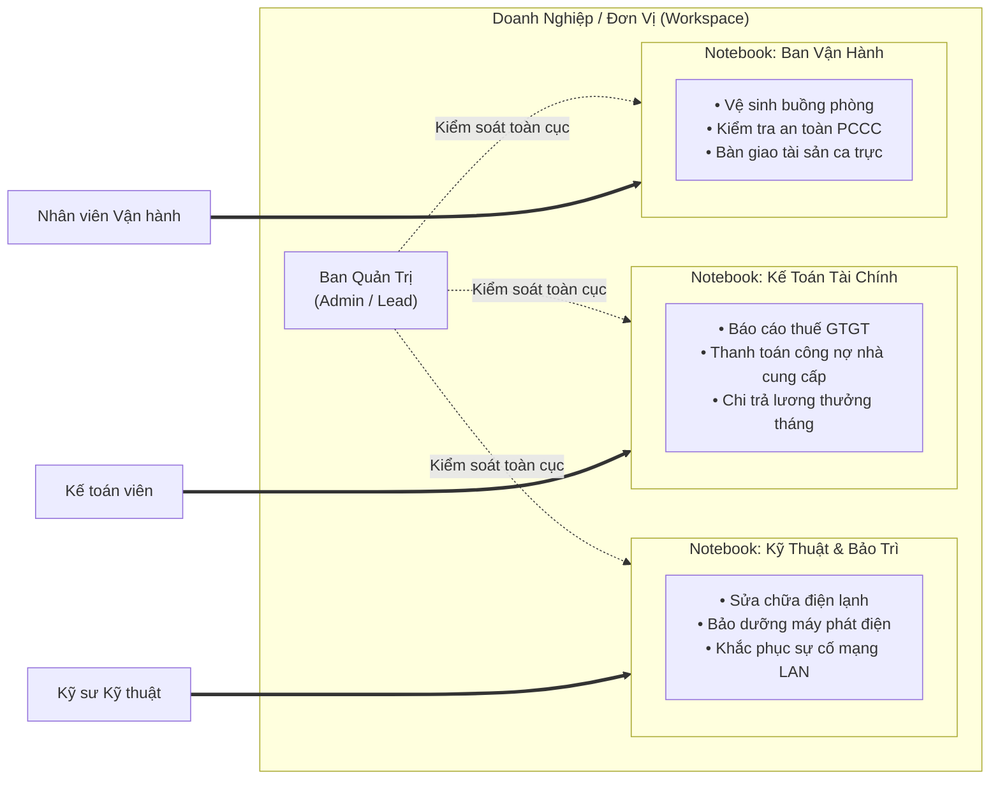
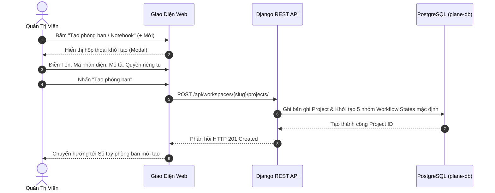
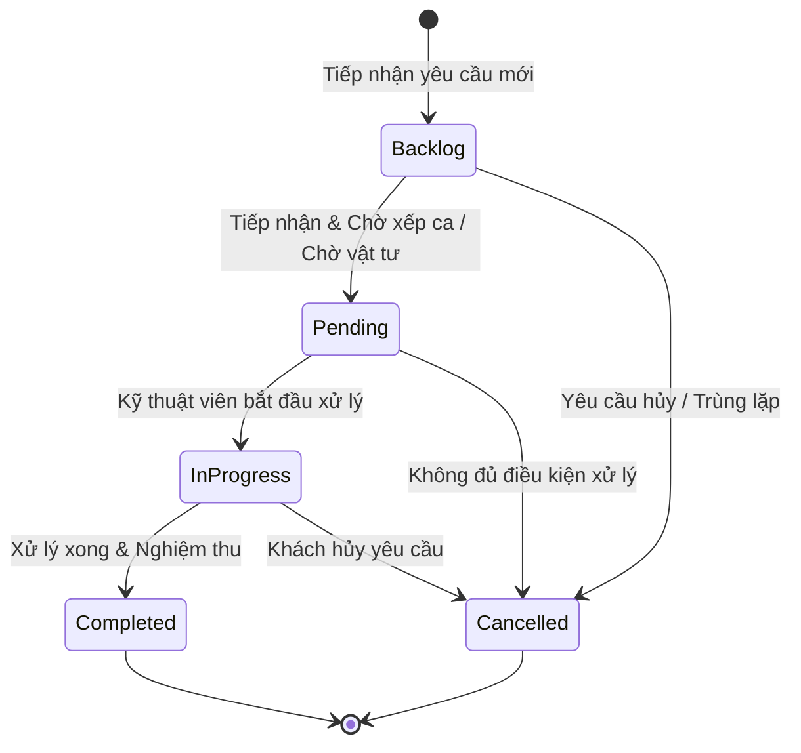
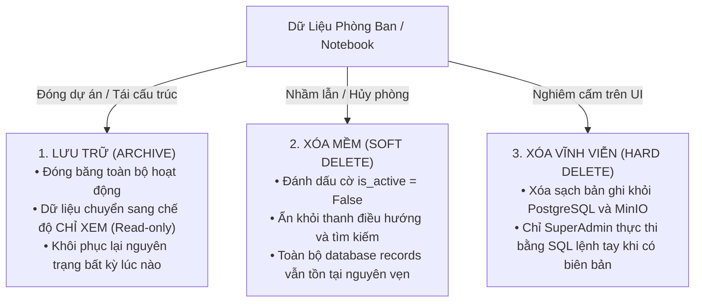

# BWP Notebook - Sổ Tay Công Việc Doanh Nghiệp

## Chương 3: Quản Lý Công Ty và Sổ Tay Phòng Ban (Notebook)

> **Tài liệu Hướng dẫn Vận hành BWP Notebook (User Guide)**  
> **Phiên bản:** 2.0 (Bản phát hành Doanh nghiệp)  
> **Tác quyền & Kiến trúc:** Code & Architecture by IT Leon (BWP Engineering Team)  
> **Mục tiêu Nghiệp vụ:** Quản trị Đơn vị (Workspace), Phân vùng Phòng ban (Notebook/Project) & Chuẩn hóa Workflow

---

## 1. Quản Trị Công Ty / Đơn Vị (Workspace Administration)

Trong cấu trúc dữ liệu phân tầng của BWP Notebook, **Công ty / Đơn vị (Workspace)** là thực thể cấp cao nhất, đại diện cho một pháp nhân doanh nghiệp, một tổng công ty hoặc một đơn vị tổ chức độc lập. Mọi phòng ban, nhân sự, luồng công việc và dữ liệu đính kèm đều trực thuộc phạm vi của một Đơn vị cụ thể.

### 1.1. Cấu hình thông tin nhận diện tổ chức

Để thiết lập hoặc điều chỉnh thông tin doanh nghiệp, Quản trị viên đơn vị thực hiện theo các bước sau:

1. Đăng nhập vào hệ thống với tài khoản có vai trò **Quản trị viên (Admin)** hoặc **SuperAdmin**.
2. Tại thanh điều hướng bên trái màn hình, nhấp vào biểu tượng bánh răng **Cài đặt đơn vị (Workspace Settings)** $\rightarrow$ chọn thẻ **Chung (General)**.
3. Cập nhật các trường thông tin cơ bản:
   - **Tên đơn vị (Workspace Name):** Nhập tên pháp nhân hoặc thương hiệu doanh nghiệp (ví dụ: _Công ty Cổ phần Quản lý Bất động sản BWP_, _Tập đoàn Khách sạn & Nghỉ dưỡng NORA_). Tên này sẽ xuất hiện trên thanh tiêu đề, đầu trang sổ tay và trong các email thông báo.
   - **Biểu tượng đơn vị (Logo):** Tải lên logo chính thức của doanh nghiệp (định dạng hỗ trợ: PNG, SVG, JPEG; dung lượng khuyến nghị $< 2\text{MB}$, tỷ lệ vuông $1:1$). Logo sẽ được lưu trữ tự động trên máy chủ đối tượng nội bộ `plane-minio` (S3).
   - **Định danh đường dẫn (Workspace Slug):** Chuỗi ký tự định danh ngắn gọn dùng để tạo đường dẫn URL truy cập (ví dụ: `bwp`, `nora-hotel`).
   - **Mô tả đơn vị (Description):** Tóm tắt chức năng nhiệm vụ, lĩnh vực hoạt động hoặc địa chỉ trụ sở chính của đơn vị.
4. Bấm **Lưu thay đổi (Save Changes)** để áp dụng ngay lập tức cho toàn bộ người dùng trong hệ thống.

> [!WARNING]
> **Lưu ý về việc thay đổi Định danh đường dẫn (Slug):**  
> Việc thay đổi Slug sẽ làm thay đổi toàn bộ cấu trúc đường dẫn URL truy cập của hệ thống (ví dụ từ `http://192.168.3.168:18080/bwp/` sang `http://192.168.3.168:18080/bwp-group/`). Mọi liên kết đã lưu trong bookmark trình duyệt hoặc gửi qua email trước đó sẽ cần được cập nhật lại. Quản trị viên chỉ nên cấu hình Slug một lần duy nhất khi khởi tạo đơn vị.

### 1.2. Thiết lập múi giờ, lịch làm việc và định dạng ngày tháng

Múi giờ chuẩn xác là yếu tố sống còn để hệ thống ghi nhận thời điểm phát sinh sự cố, mốc thời gian hoàn thành công việc và cảnh báo quá hạn chính xác đến từng phút:

- **Múi giờ hệ thống (Timezone):** Mặc định thiết lập là `Asia/Ho_Chi_Minh` ($\text{GMT}+7$). Mọi mốc thời gian hiển thị trên giao diện (Activity log, bình luận, ngày tạo việc) đều được tự động quy đổi theo múi giờ này.
- **Ngày bắt đầu tuần làm việc (Week Start Day):** Chọn **Thứ Hai (Monday)** phù hợp với quy chuẩn hành chính doanh nghiệp tại Việt Nam. Thiết lập này ảnh hưởng trực tiếp đến chế độ xem Lịch (Calendar View) và các bộ đếm chu kỳ báo cáo.
- **Định dạng hiển thị thời gian:** Chuẩn hóa theo định dạng ngày/tháng/năm của Việt Nam (`DD/MM/YYYY`, ví dụ: `13/09/2026`).

### 1.3. Quản lý dung lượng lưu trữ & Hạn ngạch tệp đính kèm

BWP Notebook tích hợp trực tiếp với dịch vụ máy chủ đối tượng S3 nội bộ (`plane-minio`) hoạt động bên trong mạng ảo cách ly `bwp_notebook_net`:

- **Hạn mức kích thước tệp tải lên (File Size Limit):** Mặc định hệ thống giới hạn tối đa **$50\text{MB}$** cho mỗi tệp tin đính kèm (`FILE_SIZE_LIMIT=52428800` bytes). Giới hạn này ngăn chặn người dùng vô tình tải lên các video hoặc tệp nén quá lớn gây nghẽn băng thông mạng nội bộ.
- **Phân loại tệp được chấp thuận:** Hỗ trợ mọi định dạng tệp văn phòng (DOCX, XLSX, PPTX, PDF), tệp hình ảnh hiện trường (JPEG, PNG, WEBP), và tệp nén kỹ thuật (ZIP, RAR).
- **Cơ chế lưu trữ bảo mật:** Toàn bộ tệp tin được mã hóa đường dẫn lưu trữ trong bucket `bwp-notebook-uploads`. Quyền tải về được bảo vệ nghiêm ngặt qua chữ ký URL tạm thời (Signed URLs) sinh ra bởi backend API Django, ngăn chặn truy cập trái phép từ bên ngoài mạng nội bộ.

---

## 2. Quản Lý Phòng Ban / Sổ Tay Công Việc (Notebook / Project)

### 2.1. Triết lý phân vùng dữ liệu theo Phòng ban (Department Partitioning)

Trong mô hình điều hành BWP Notebook, khái niệm **Dự án (Project)** của nền tảng Plane gốc được chuyển đổi ngữ nghĩa thành **Phòng ban / Sổ tay công việc (Notebook)**. Mỗi phòng ban chức năng trong doanh nghiệp là một không gian sổ tay riêng biệt, khép kín và có quy chế bảo mật độc lập:

#### Các nguyên tắc phân vùng cốt lõi:

1. **Cô lập thông tin tác nghiệp:** Nhân viên thuộc Phòng Kỹ thuật chỉ nhìn thấy và xử lý các đầu việc trong Notebook Kỹ thuật. Họ hoàn toàn không có quyền xem các sổ tay nhạy cảm như Kế toán tài chính hoặc Nhân sự tiền lương.
2. **Quyền kiểm soát tập trung:** SuperAdmin và Quản trị viên đơn vị (Workspace Admin) có thẩm quyền giám sát bao quát toàn bộ các Notebook để nắm bắt bức tranh vận hành tổng thể của công ty.
3. **Mã nhận diện độc lập (Project Identifier):** Mỗi Notebook sở hữu một mã định danh viết tắt riêng (ví dụ: `KT`, `KTTC`, `NS`, `VH`). Mọi công việc sinh ra trong phòng ban sẽ tự động gắn liền với tiền tố này (ví dụ: `KT-101`, `KTTC-45`), giúp nhận diện nguồn gốc công việc ngay lập tức.

### 2.2. Quy trình khởi tạo Phòng ban / Notebook mới

Để tạo một sổ tay phòng ban mới, Quản trị viên thực hiện theo quy trình 5 bước sau:

#### Hướng dẫn thao tác chi tiết:

1. **Bước 1: Mở giao diện tạo mới**
   - Tại thanh điều hướng bên trái, rê chuột vào tiêu đề mục **Phòng ban / Notebook** và bấm vào nút dấu cộng **(+)** hoặc chọn nút **Tạo phòng ban mới (Create Project)** trên màn hình Tổng quan.
2. **Bước 2: Thiết lập Tên và Mã nhận diện**
   - **Tên phòng ban (Project Name):** Đặt tên rõ ràng, chuẩn tiếng Việt (ví dụ: _Phòng Kỹ Thuật & Bảo Trì_, _Tổ Vận Hành Tòa Nhà_).
   - **Mã nhận diện (Project Identifier / Key):** Nhập chuỗi viết tắt từ 2 đến 6 ký tự in hoa không dấu (ví dụ: `KT`, `VH`, `KTTC`). Hệ thống sẽ tự động kiểm tra tính duy nhất trong đơn vị.
3. **Bước 3: Nhập mô tả chức năng & biểu tượng**
   - **Mô tả (Description):** Nêu rõ chức năng nhiệm vụ của phòng ban để các thành viên dễ nắm bắt.
   - **Biểu tượng (Icon / Emoji) & Màu sắc:** Chọn biểu tượng đại diện (ví dụ: biểu tượng cờ lê 🔧 cho Kỹ thuật, biểu tượng tòa nhà 🏢 cho Vận hành) và tông màu nhận diện để phân biệt nhanh trên thanh menu.
4. **Bước 4: Cấu hình Chế độ hiển thị & Quyền riêng tư (Network / Visibility)**
   - **Công khai nội bộ (Public to Workspace):** Mọi thành viên chính thức trong công ty đều có thể nhìn thấy phòng ban này và tự do tham gia xem thông tin nếu cần phối hợp liên phòng ban.
   - **Riêng tư / Bảo mật (Secret / Private):** **Khuyến nghị sử dụng** cho các phòng ban nhạy cảm (Kế toán, Ban Giám đốc, Nhân sự). Chỉ những nhân sự được Quản trị viên thêm đích danh vào danh sách thành viên mới có thể nhìn thấy và truy cập vào Notebook này.
5. **Bước 5: Hoàn tất khởi tạo**
   - Bấm nút **Tạo phòng ban**. Hệ thống sẽ tự động khởi tạo sổ tay cùng bộ trạng thái quy trình mặc định (_Chưa bắt đầu, Chờ xử lý, Đang thực hiện, Hoàn thành, Đã hủy_).

### 2.3. Quản lý nhân sự và phân quyền theo từng Notebook

Sau khi khởi tạo Notebook, Quản trị viên cần phân bổ đúng nhân sự vào phòng ban:

1. Truy cập vào Notebook vừa tạo $\rightarrow$ Chọn **Cài đặt phòng ban (Project Settings)** tại góc dưới bên trái thanh menu.
2. Chọn thẻ **Thành viên (Members)**.
3. Bấm nút **Thêm thành viên (Add Member)** ở góc trên bên phải.
4. Chọn nhân sự từ danh bạ công ty và chỉ định vai trò nội bộ trong phòng ban:
   - **Trưởng bộ phận / Quản lý (Project Admin / Lead - Cấp 20):** Có toàn quyền điều chỉnh cấu hình phòng ban, tùy chỉnh quy trình trạng thái, thêm/bớt nhân viên và giao các _Công việc khác (Other tasks)_.
   - **Nhân viên tác nghiệp (Project Member - Cấp 15):** Nhận việc, tự tạo _Công việc vận hành (Operational tasks)_, cập nhật tiến độ, số phòng và trao đổi bình luận.
   - **Cộng tác viên / Khách (Project Guest - Cấp 5):** Chỉ được xem hoặc bình luận trên các công việc được giao trực tiếp.
5. Bấm **Xác nhận**. Nhân sự sẽ thấy phòng ban này xuất hiện trên thanh điều hướng làm việc của họ ngay tức thì.

---

## 3. Cấu Hình Quy Trình Làm Việc (Workflow States Configuration)

Quy trình làm việc (Workflow) trong BWP Notebook định nghĩa hành trình tiến triển của một công việc từ lúc tiếp nhận sự cố cho đến khi nghiệm thu hoàn tất. Mỗi phòng ban có thể sở hữu một quy trình làm việc được đo ni đóng giày phù hợp với đặc thù nghiệp vụ riêng.

### 3.1. Kiến trúc 5 Nhóm Trạng Thái Chuẩn Hóa

Mọi trạng thái công việc trong hệ thống đều phải thuộc về một trong **5 nhóm trạng thái cốt lõi (State Groups)** sau:

| Nhóm Trạng Thái (Group) | Tên Trạng Thái Mặc Định | Mã Màu HEX | Ý Nghĩa Nghiệp Vụ & Hành Vi Hệ Thống                                                                                       |
| :---------------------- | :---------------------- | :--------: | :------------------------------------------------------------------------------------------------------------------------- |
| **1. Backlog**          | **Chưa bắt đầu**        | `#A3A3A3`  | Công việc mới ghi nhận từ khách hàng hoặc hệ thống, đang chờ phân loại, chờ gán nhân sự xử lý.                             |
| **2. Unstarted**        | **Chờ xử lý**           | `#F59E0B`  | Đã phân công nhân sự nhưng chưa thể triển khai ngay do đang chờ vật tư thay thế, chờ đến giờ hẹn hoặc chờ khách trả phòng. |
| **3. Started**          | **Đang thực hiện**      | `#3B82F6`  | Nhân sự hoặc kỹ thuật viên đang trực tiếp tác nghiệp tại phòng/hiện trường. Hệ thống bắt đầu tính thời gian xử lý.         |
| **4. Completed**        | **Hoàn thành**          | `#10B981`  | Sự cố đã được xử lý triệt để, đã nghiệm thu kỹ thuật. Hệ thống tự động ghi nhận thời điểm hoàn thành (`completed_at`).     |
| **5. Cancelled**        | **Đã hủy**              | `#EF4444`  | Công việc bị hủy do thông tin báo sai, công việc trùng lặp hoặc khách hàng hủy yêu cầu dịch vụ.                            |

### 3.2. Tùy chỉnh trạng thái công việc theo đặc thù phòng ban

Mỗi phòng ban có thể bổ sung các trạng thái con chi tiết để phản ánh chính xác từng bước xử lý thực tế:

#### Ví dụ tùy chỉnh cho Phòng Kỹ Thuật & Bảo Trì:

- Nhóm _Chờ xử lý (Unstarted)_: Bổ sung thêm trạng thái **Chờ xuất kho vật tư** (Màu cam đậm `#D97706`).
- Nhóm _Đang thực hiện (Started)_: Bổ sung thêm trạng thái **Đang kiểm tra chạy thử** (Màu tím `#8B5CF6`).

#### Ví dụ tùy chỉnh cho Phòng Kế Toán Tài Chính:

- Nhóm _Chờ xử lý (Unstarted)_: Bổ sung trạng thái **Chờ Kế toán trưởng ký duyệt** (Màu vàng chanh `#EAB308`).
- Nhóm _Đang thực hiện (Started)_: Bổ sung trạng thái **Đang lập ủy nhiệm chi** (Màu lam `#2563EB`).

#### Các bước thêm trạng thái mới:

1. Vào **Cài đặt phòng ban (Project Settings)** $\rightarrow$ chọn mục **Trạng thái công việc (States)**.
2. Bấm nút **Thêm trạng thái (Add State)**.
3. Nhập **Tên trạng thái** (ví dụ: _Chờ duyệt mua vật tư_).
4. Chọn **Nhóm trạng thái cha (State Group)** tương ứng (Backlog, Unstarted, Started, Completed, Cancelled).
5. Chọn màu sắc nhận diện trực quan từ bảng mã màu.
6. Kéo thả để sắp xếp thứ tự hiển thị ưu tiên trên bảng Kanban và bảng tính. Bấm **Lưu (Save)**.

### 3.3. Quy tắc chuyển đổi trạng thái và đóng vết hoàn tất

- **Tự động cập nhật mốc thời gian:** Khi một công việc được chuyển sang bất kỳ trạng thái nào thuộc nhóm **Completed**, backend tự động cập nhật trường thời gian hoàn tất (`completed_at = timezone.now()`). Nếu công việc bị kéo ngược lại trạng thái _Đang thực hiện_, trường này sẽ tự động được xóa rỗng để đảm bảo tính chính xác của báo cáo hiệu suất.
- **Ràng buộc hoàn tất việc con (Sub-issues guard):** Hệ thống sẽ đưa ra cảnh báo nhắc nhở nếu người dùng cố gắng chuyển một công việc cha sang trạng thái _Hoàn thành_ trong khi các công việc con trực thuộc vẫn đang ở trạng thái _Chưa bắt đầu_ hoặc _Đang thực hiện_.

---

## 4. Chính Sách Lưu Trữ & Đóng Băng An Toàn (Archive & Soft Delete)

Trong môi trường doanh nghiệp, dữ liệu lịch sử vận hành, chi phí bảo trì và nhật ký sửa chữa phòng ốc là tài sản vô giá phục vụ công tác thanh tra, kiểm toán và bảo hiểm. BWP Notebook tuân thủ nghiêm ngặt nguyên tắc **"Không xóa cứng dữ liệu (Zero Hard-Delete Policy)"**.

### 4.1. Phân biệt Lưu Trữ (Archive), Xóa Mềm (Soft Delete) và Xóa Vĩnh Viễn (Hard Delete)

| Tiêu Chí So Sánh         | 1. Lưu Trữ (Archive)                           | 2. Xóa Mềm (Soft Delete)                 | 3. Xóa Vĩnh Viễn (Hard Delete)                 |
| :----------------------- | :--------------------------------------------- | :--------------------------------------- | :--------------------------------------------- |
| **Mục đích sử dụng**     | Đóng dự án hoàn thành, bảo tồn lịch sử tra cứu | Ẩn phòng ban tạo nhầm hoặc giải thể      | Dọn rác dữ liệu thử nghiệm trong giai đoạn dev |
| **Trạng thái dữ liệu**   | Chuyển sang chế độ **Chỉ đọc (Read-only)**     | Đánh dấu ẩn (`is_active=False`)          | Xóa sạch khỏi ổ đĩa vật lý                     |
| **Quyền truy cập**       | Thành viên vẫn có thể tra cứu và tìm kiếm      | Bị ẩn hoàn toàn trên giao diện làm việc  | Dữ liệu mất vĩnh viễn, không thể phục hồi      |
| **Thao tác khôi phục**   | 1 nhấp chuột trên giao diện Quản trị           | Quản trị viên kích hoạt lại qua Admin UI | Không thể (chỉ khôi phục từ bản sao lưu DB)    |
| **Thẩm quyền thực hiện** | Quản trị viên phòng ban / Đơn vị               | Quản trị viên đơn vị (Workspace Admin)   | Chỉ SuperAdmin qua console máy chủ             |

### 4.2. Quy trình đóng băng an toàn một Phòng ban (Archive Notebook)

Khi một phòng ban hoàn thành nhiệm vụ theo mùa vụ hoặc có sự sáp nhập tổ chức, Quản trị viên thực hiện quy trình đóng băng theo 4 bước sau:

#### Hướng dẫn chi tiết:

1. **Rà soát công việc tồn đọng:** Truy cập vào Notebook cần lưu trữ, kiểm tra bộ lọc để chắc chắn không còn công việc nào đang dang dở. Nếu còn việc chưa xong, chuyển giao (transfer) sang cho phòng ban tiếp nhận mới.
2. **Truy cập Vùng nguy hiểm (Danger Zone):** Vào **Cài đặt phòng ban (Project Settings)** $\rightarrow$ cuộn chuột xuống mục cuối cùng **Vùng nguy hiểm**.
3. **Thực hiện Lưu trữ:**
   - Nhấp vào nút **Lưu trữ phòng ban (Archive Project)**.
   - Hộp thoại cảnh báo xuất hiện yêu cầu Quản trị viên nhập chính xác **Tên định danh (Key)** của phòng ban để xác nhận hành động có chủ đích.
   - Bấm nút **Xác nhận lưu trữ**.
4. **Kết quả đóng băng:** Ngay lập tức, phòng ban sẽ được đưa vào danh mục lưu trữ. Biểu tượng ổ khóa sẽ xuất hiện bên cạnh tên phòng ban. Mọi thành viên chỉ có quyền tra cứu nội dung, toàn bộ các nút _Tạo công việc_, _Chỉnh sửa trạng thái_ hoặc _Xóa_ đều bị vô hiệu hóa.

### 4.3. Quy trình khôi phục Phòng ban từ kho lưu trữ (Restore Notebook)

Khi cần kích hoạt lại một phòng ban đã lưu trữ:

1. Vào **Cài đặt đơn vị (Workspace Settings)** $\rightarrow$ chọn mục **Phòng ban / Dự án (Projects)**.
2. Chuyển sang thẻ con **Đã lưu trữ (Archived)**.
3. Tìm phòng ban cần khôi phục trong danh sách.
4. Bấm vào nút biểu tượng **Khôi phục (Restore)** bên cạnh tên phòng ban.
5. Xác nhận yêu cầu. Phòng ban sẽ lập tức xuất hiện trở lại trên thanh điều hướng làm việc của các thành viên với toàn bộ dữ liệu, danh sách công việc và bình luận được phục hồi nguyên trạng $100\%$.

> [!CAUTION]
> **Cảnh báo về việc xóa phòng ban:**  
> Hệ thống cung cấp nút xóa phòng ban trong Vùng nguy hiểm, nhưng hành động này được bảo vệ bởi cơ chế kiểm tra toàn vẹn dữ liệu (Foreign Key Constraints). Nếu phòng ban đã phát sinh các công việc và nhật ký hoạt động, hệ thống sẽ từ chối xóa để bảo toàn dữ liệu kiểm toán tài chính. Quản trị viên luôn được khuyến nghị sử dụng tính năng **Lưu trữ (Archive)** thay vì xóa.
