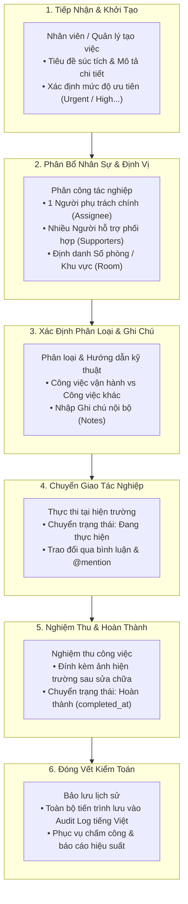
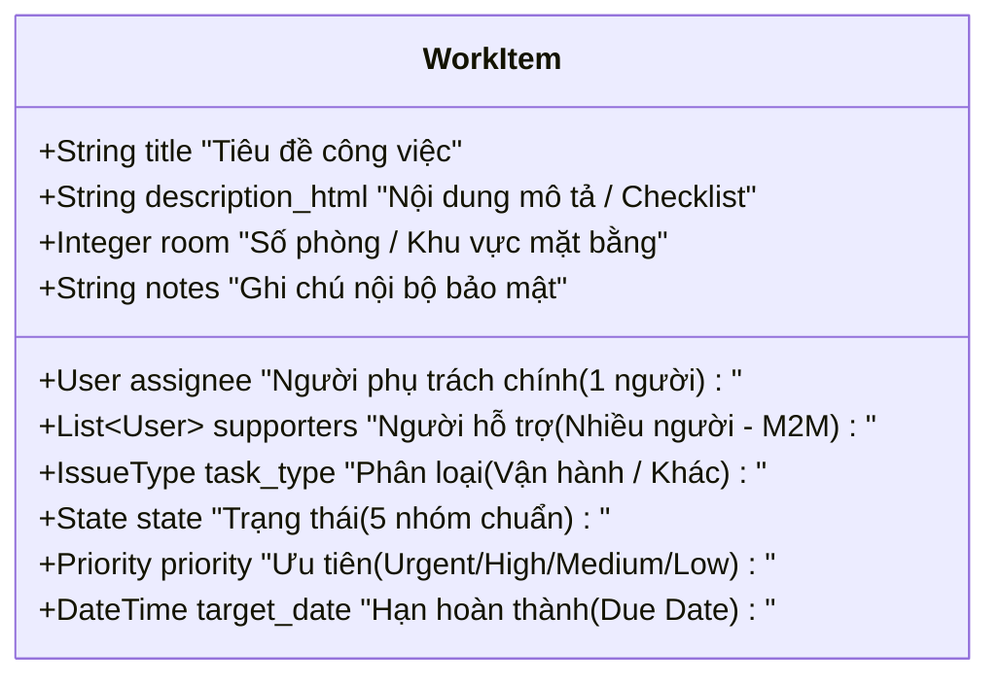
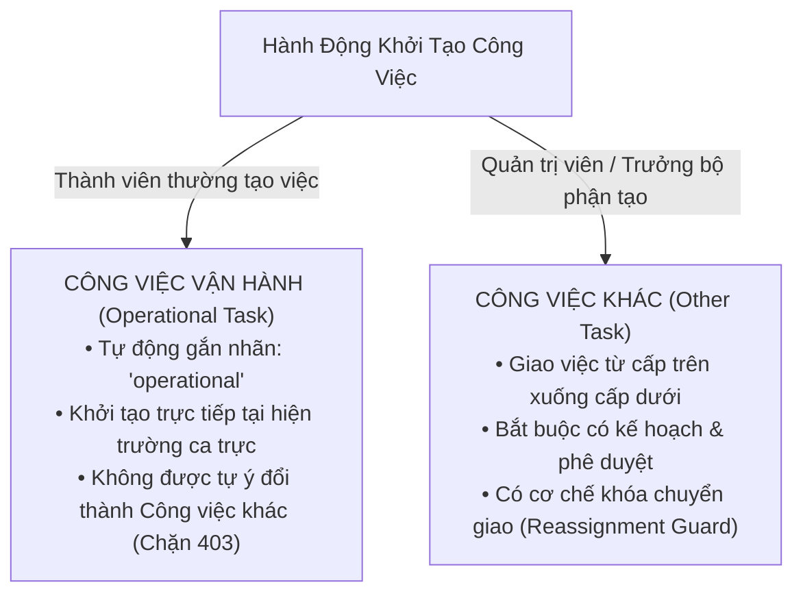
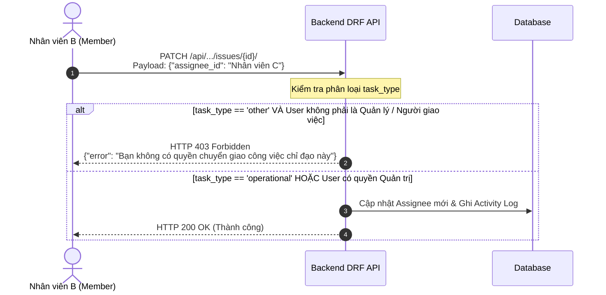
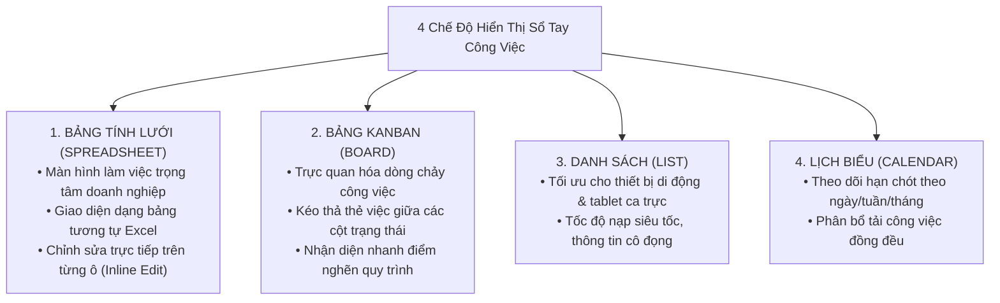
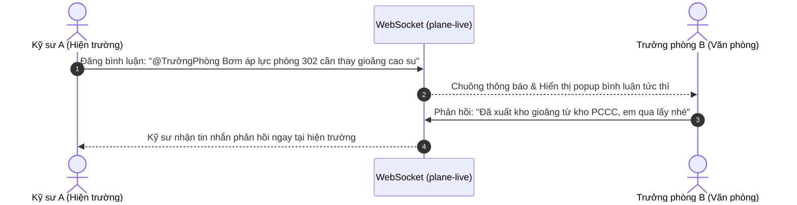

# BWP Notebook - Sổ Tay Công Việc Doanh Nghiệp

## Chương 4: Quy Trình Xử Lý và Điều Hành Công Việc

> **Tài liệu Hướng dẫn Vận hành BWP Notebook (User Guide)**  
> **Phiên bản:** 2.0 (Bản phát hành Doanh nghiệp)  
> **Đơn vị phát triển:** BWP Engineering Team  
> **Trọng tâm Nghiệp vụ:** Vòng đời Công việc, Phân bổ Đa nhân sự, Định vị Mặt bằng & Đa chế độ hiển thị

---

## 1. Vòng Đời Công Việc Toàn Diện (Work Item Lifecycle)

Trong BWP Notebook, **Công việc (Work Item / Task)** là đơn vị tác nghiệp hạt nhân. Mỗi công việc phản ánh một yêu cầu sửa chữa kỹ thuật, một nhiệm vụ bảo dưỡng buồng phòng, một chứng từ kế toán cần xử lý, hoặc một chỉ đạo điều hành từ Ban Giám đốc.

Quy trình xử lý một công việc từ lúc phát sinh đến khi đóng vết kiểm toán trải qua 6 giai đoạn chặt chẽ:

### 1.1. Chi tiết các trường thông tin nghiệp vụ cốt lõi

Khi mở hộp thoại **Tạo công việc mới (Create Work Item)**, người dùng sẽ điền thông tin vào các trường dữ liệu chuẩn hóa sau:

1. **Tiêu đề công việc (Title - Bắt buộc):**
   - Đặt tên ngắn gọn, nêu rõ đối tượng và sự cố phát sinh.
   - _Ví dụ chuẩn:_ `Phòng 402 - Máy lạnh rỉ nước dàn lạnh`, `Tầng hầm B1 - Đèn chiếu sáng lối thoát hiểm bị chập`, `Phòng Kế toán - Lập ủy nhiệm chi tiền điện tháng 8`.
2. **Nội dung mô tả (Description):**
   - Trình soạn thảo văn bản giàu (Rich-text editor) hỗ trợ định dạng danh sách công việc (Checklist), in đậm các thông số kỹ thuật, bảng biểu và dán trực tiếp ảnh chụp hiện trường từ clipboard (`Ctrl + V`).
3. **Người phụ trách chính (Assignee - Đơn nhất):**
   - Đúng **01 nhân sự** chịu trách nhiệm chính về chất lượng và tiến độ hoàn thành công việc. Nhân sự này sẽ nhận thông báo khi có bất kỳ thay đổi nào liên quan.
4. **Người hỗ trợ (Supporters - Đa nhân sự M2M):**
   - **Tính năng tùy biến độc quyền:** Trong thực tế vận hành tòa nhà hay khách sạn, một sự cố lớn (như vỡ đường ống nước ngầm hoặc bảo trì thang máy) đòi hỏi sự phối hợp cùng lúc của nhiều kỹ sư và thợ phụ.
   - Trường **Supporters** cho phép gán danh sách nhiều nhân sự cùng tham gia hỗ trợ. Tất cả người hỗ trợ đều nhận được thông báo, có quyền cập nhật hiện trường và được ghi nhận công lao vào nhật ký kiểm toán.
5. **Số phòng / Khu vực (Room):**
   - Trường số nguyên định danh vị trí mặt bằng phát sinh sự cố (ví dụ: `101`, `305`, `1208`).
   - Cho phép tìm kiếm và lọc tức thì tất cả các công việc liên quan đến một căn phòng cụ thể, phục vụ tra cứu lịch sử hỏng hóc của phòng trước khi bàn giao cho khách lưu trú.
6. **Ghi chú nội bộ (Notes):**
   - Dành cho các trao đổi nghiệp vụ nhạy cảm, dặn dò ca trực hoặc ghi chú kỹ thuật giữa các nhân sự xử lý (ví dụ: _Cần mang theo thang chữ A 3m; Khách trong phòng đang nghỉ, chỉ gõ cửa sau 14h00_).
7. **Mức độ ưu tiên (Priority):**
   - **Khẩn cấp (Urgent - Cờ đỏ):** Sự cố nghiêm trọng đe dọa an toàn (cháy nổ, ngập nước, mất điện toàn khu vực). Phải xử lý ngay trong vòng 15-30 phút.
   - **Cao (High - Cờ cam):** Sự cố ảnh hưởng trực tiếp đến trải nghiệm của khách hàng (hỏng điều hòa mùa hè, tắc bồn cầu). Xử lý trong vòng 1-2 giờ.
   - **Trung bình (Medium - Cờ vàng):** Các sự cố nhỏ (đèn bàn hỏng, cửa sổ rít). Xử lý trong ngày.
   - **Thấp (Low - Cờ xám):** Sơn sửa thẩm mỹ, kiểm tra định kỳ không gấp.
   - **Không ưu tiên (None):** Các ý tưởng cải tiến hoặc công việc tồn đọng chờ lịch.
8. **Thời hạn hoàn thành (Due Date):**
   - Thiết lập mốc hạn chót phải hoàn thành. Hệ thống sẽ tự động đổi màu cảnh báo đỏ trên bảng điều khiển khi công việc bị quá hạn (Overdue).

---

## 2. Phân Loại Công Việc Nghiệp Vụ & Ràng Buộc Phân Quyền Backend

BWP Notebook thiết lập cơ chế phân loại công việc thành 2 nhóm chuyên biệt, được kiểm soát chặt chẽ bằng nghiệp vụ backend (Django REST Framework) nhằm đảm bảo tính chuẩn xác của dữ liệu và tôn trọng thứ bậc điều hành:

### 2.1. Công việc vận hành (Operational Task - `TASK_TYPE_OPERATIONAL`)

- **Bản chất nghiệp vụ:** Là các công việc phát sinh thường nhật, tức thời trong ca trực của nhân viên vận hành, kỹ thuật viên buồng phòng hoặc bảo vệ (ví dụ: sửa vòi sen, thay bóng đèn, dọn phòng phát sinh).
- **Cơ chế tự động hóa:** Khi một **Thành viên (Member)** bấm tạo việc, hệ thống backend tự động phân loại công việc đó là `operational`.
- **Ràng buộc an toàn:** Thành viên thông thường **không có quyền** tự ý chuyển phân loại công việc từ _Công việc vận hành_ sang _Công việc khác_. Mọi nỗ lực gửi payload can thiệp qua API sẽ bị backend từ chối với mã lỗi `HTTP 403 Forbidden`.

### 2.2. Công việc khác (Other Task - `TASK_TYPE_OTHER`)

- **Bản chất nghiệp vụ:** Là các nhiệm vụ theo kế hoạch tháng/quý, công việc dự án, chỉ đạo đột xuất từ Ban Giám đốc, hoặc các đầu việc hành chính kế toán (ví dụ: kiểm kê kho định kỳ, báo cáo tài chính năm, nâng cấp trạm biến áp).
- **Thẩm quyền khởi tạo:** Chỉ **Quản trị viên đơn vị (Workspace Admin)** hoặc **Trưởng bộ phận (Project Lead)** mới có thẩm quyền khởi tạo công việc loại này hoặc chuyển đổi một công việc vận hành thành công việc kế hoạch.

### 2.3. Quy tắc bảo vệ phân bổ lại (Reassignment Guard)

Để ngăn chặn tình trạng đùn đẩy trách nhiệm hoặc tự ý chuyển giao các nhiệm vụ quan trọng do cấp trên giao phó:

> [!IMPORTANT]
> **Ràng buộc nghiệp vụ tầng Backend:**  
> Hệ thống kiểm soát tính toàn vẹn ngay tại tầng API của Django (`IssueViewSet`), không dựa đơn thuần vào việc ẩn/hiện nút bấm trên trình duyệt. Mọi hành vi cố tình vượt quyền đều được ghi lại trong nhật ký hệ thống kèm địa chỉ IP và mã người dùng.

### 2.4. Bảng đối chiếu chi tiết hai loại công việc

| Tiêu Chí So Sánh                 | Công Việc Vận Hành (`operational`)               | Công Việc Khác (`other`)                         |
| :------------------------------- | :----------------------------------------------- | :----------------------------------------------- |
| **Nguồn gốc phát sinh**          | Sự cố đột xuất tại phòng, ca trực thường nhật    | Chỉ thị cấp trên, kế hoạch bảo dưỡng định kỳ     |
| **Thẩm quyền tạo việc**          | Toàn bộ Thành viên (Member, Admin, SuperAdmin)   | Chỉ Quản trị viên (Admin) và Trưởng bộ phận      |
| **Thẩm quyền đổi loại việc**     | Chỉ Quản trị viên mới được nâng cấp sang `other` | Quản trị viên và Trưởng bộ phận                  |
| **Quyền chuyển giao (Reassign)** | Tự do điều phối hỗ trợ trong ca trực             | Bị khóa bảo vệ; chỉ người giao việc mới được đổi |
| **Yêu cầu nghiệm thu**           | Kỹ thuật viên xác nhận sau khi chạy thử          | Trưởng phòng hoặc Quản trị viên ký duyệt         |

---

## 3. Các Chế Độ Hiển Thị Trực Quan (Multi-View System)

BWP Notebook cung cấp **4 chế độ hiển thị chuyên biệt**, đáp ứng toàn diện thói quen làm việc từ cán bộ quản lý văn phòng đến kỹ sư hiện trường:

### 3.1. Chế độ Bảng tính lưới (Spreadsheet / Table View) - Màn hình Trọng tâm

Kế thừa thói quen sử dụng bảng tính của đa số người dùng văn phòng và bộ phận vận hành tại Việt Nam, giao diện Bảng tính là giao diện mặc định và được tối ưu hóa sâu nhất:

#### Ưu thế vượt trội:

- **Bao quát toàn cảnh trên một màn hình:** Hiển thị trực quan cùng lúc toàn bộ các trường dữ liệu nghiệp vụ: Mã việc, Tên việc, Phân loại, Trạng thái, Người phụ trách chính, Danh sách người hỗ trợ, Số phòng/Khu vực, Mức độ ưu tiên, Ngày hết hạn và Ngày tạo.
- **Chỉnh sửa nhanh trực tiếp tại ô (Inline Quick Editing):** Người dùng không cần phải nhấp chuột mở từng thẻ công việc rồi tìm nút Lưu. Thay vào đó, bạn chỉ cần nhấp đúp hoặc nhấp chuột vào ô cần sửa:
  - Nhấp vào ô **Trạng thái**: Menu chọn nhanh xổ xuống để chuyển ngay sang _Đang thực hiện_ hoặc _Hoàn thành_.
  - Nhấp vào ô **Người phụ trách**: Chọn ngay nhân sự nhận việc từ danh sách nhân viên phòng ban.
  - Nhấp vào ô **Số phòng**: Gõ trực tiếp số phòng (ví dụ: `504`) và nhấn `Enter`.
  - Mọi thao tác đều được hệ thống tự động lưu trữ tức thời qua API nền.

#### Phân nhóm và Bộ lọc dữ liệu linh hoạt (Group By & Filters):

- **Nhóm theo Trạng thái (Group by State):** Gom các công việc thành từng nhóm (Chưa bắt đầu, Chờ xử lý, Đang thực hiện, Hoàn thành).
- **Nhóm theo Số phòng (Group by Room):** Cực kỳ hữu ích cho nhân viên bảo trì khi kiểm tra toàn bộ danh mục hư hỏng của một tầng hoặc một phòng cụ thể.
- **Nhóm theo Người phụ trách (Group by Assignee):** Giúp Trưởng phòng đánh giá ngay khối lượng công việc đang phân bổ cho từng nhân viên trong ca trực.
- **Lọc nhanh (Quick Filters):**
  - Nút **"Việc của tôi (My Issues)"**: 1 nhấp chuột để lọc toàn bộ công việc mình phụ trách hoặc tham gia hỗ trợ.
  - Bộ lọc theo mức độ ưu tiên khẩn cấp (`Urgent`).

### 3.2. Chế độ Bảng Kanban (Board View)

- Trực quan hóa toàn bộ tiến trình công việc dưới dạng các cột trạng thái di chuyển từ trái sang phải.
- **Thao tác kéo thả (Drag & Drop):** Khi hoàn thành công việc, kỹ thuật viên chỉ cần kéo thẻ việc từ cột _Đang thực hiện_ thả sang cột _Hoàn thành_.
- **Nhận diện thẻ quá hạn:** Các công việc sắp đến hạn hoặc đã quá hạn sẽ tự động hiển thị mốc thời gian màu đỏ kèm biểu tượng đồng hồ cảnh báo.

### 3.3. Chế độ Danh sách (List View)

- Thiết kế tinh giản, loại bỏ các thành phần đồ họa nặng nề, tối ưu dung lượng tải trang.
- Rất phù hợp khi kỹ sư mang theo máy tính bảng hoặc điện thoại di động thông minh di chuyển kiểm tra tại hiện trường tòa nhà.
- Cho phép chọn hàng loạt (Bulk Selection) để thay đổi người phụ trách hoặc đóng việc cùng lúc nhiều công việc.

### 3.4. Chế độ Lịch biểu (Calendar View)

- Hiển thị các công việc được gắn mốc ngày hết hạn (`target_date`) trên khung lưới lịch tháng và tuần.
- Giúp Trưởng bộ phận tránh dồn quá nhiều lịch bảo trì định kỳ vào một ngày làm việc cao điểm, giảm thiểu rủi ro quá tải cho đội ngũ kỹ thuật.

---

## 4. Cập Nhật Tiến Độ, Bình Luận & Quản Lý Tệp Đính Kèm

### 4.1. Luồng trao đổi và bình luận thời gian thực (Real-time Collaboration)

BWP Notebook tích hợp dịch vụ WebSocket thời gian thực (`plane-live`), cho phép các thành viên trao đổi thông tin liên tục ngay trong thẻ công việc mà không cần tải lại trang:

#### Các tính năng hỗ trợ tác nghiệp:

- **Nhắc tên trực tiếp (`@mention`):** Gõ ký tự `@` kèm tên nhân sự để gửi thông báo ưu tiên trực tiếp vào chuông thông báo và email của người đó.
- **Biểu tượng cảm xúc (Reactions):** Thả biểu tượng ngón tay cái 👍 hoặc dấu tích xanh ✅ trên bình luận để xác nhận đã tiếp nhận thông tin chỉ đạo mà không làm loãng dòng trao đổi.
- **Chỉnh sửa & Xóa bình luận:** Tác giả có quyền chỉnh sửa nội dung trong vòng 15 phút đầu hoặc xóa bình luận của chính mình.

### 4.2. Tải lên tệp đính kèm và ảnh chụp hiện trường

Hình ảnh thực tế là bằng chứng khách quan nhất để nghiệm thu chất lượng công việc bảo dưỡng kỹ thuật:

1. **Chụp ảnh trước và sau khi xử lý:**
   - Kỹ thuật viên chụp ảnh hiện trường lúc hỏng hóc (ví dụ: bồn cầu rò nước) và tải lên thẻ việc.
   - Sau khi sửa xong, chụp ảnh thiết bị hoạt động bình thường làm bằng chứng nghiệm thu bàn giao.
2. **Thao tác tải lên cực kỳ đơn giản:**
   - Kéo thả tệp tin trực tiếp từ máy tính vào khung bình luận hoặc vùng tệp đính kèm.
   - Nhấn `Ctrl + V` trên bàn phím để dán trực tiếp ảnh chụp màn hình vừa chụp.
3. **An toàn lưu trữ:**
   - Mọi tệp tin được mã hóa và lưu trữ tại volume `bwp_plane_uploads` của MinIO S3.
   - Hệ thống tự động tạo hình ảnh thu nhỏ (Thumbnail) giúp tải trang mượt mà ngay cả khi đường truyền mạng chập chờn.

### 4.3. Thiết lập mối liên kết công việc (Issue Relations & Sub-tasks)

Để quản lý các công việc phức tạp gồm nhiều công đoạn phối hợp:

- **Công việc con (Sub-issues):** Chia nhỏ một công việc lớn thành các đầu mục con giao cho từng thợ phụ trách (ví dụ: Công việc lớn _Bảo dưỡng tổng thể hệ thống Chiller_, các việc con: _Vệ sinh bình ngưng_, _Thay dầu máy nén_, _Kiểm tra tủ điện điều khiển_).
- **Mối quan hệ phụ thuộc (Dependencies):**
  - **Bị chặn bởi (Blocked by):** Đánh dấu công việc A phải chờ công việc B xử lý xong mới làm được (ví dụ: _Sơn tường phòng 401_ bị chặn bởi _Chống thấm hộp kỹ thuật_).
  - **Chặn công việc khác (Blocking):** Ngăn chặn việc bắt đầu các công đoạn tiếp theo khi khâu hiện tại chưa hoàn tất.
