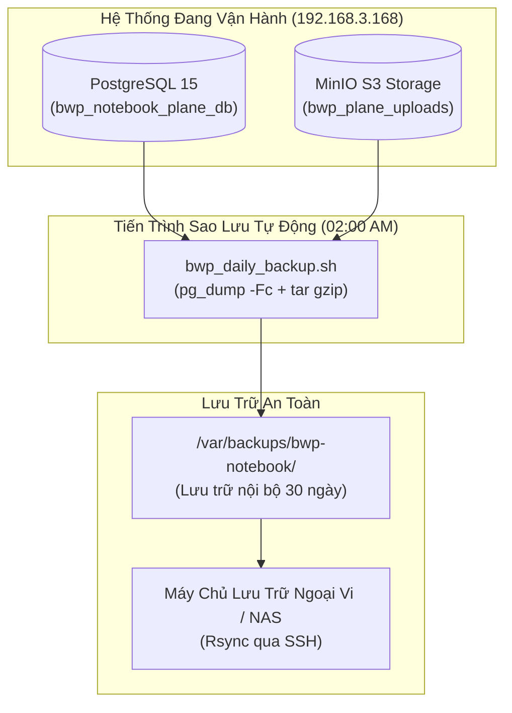
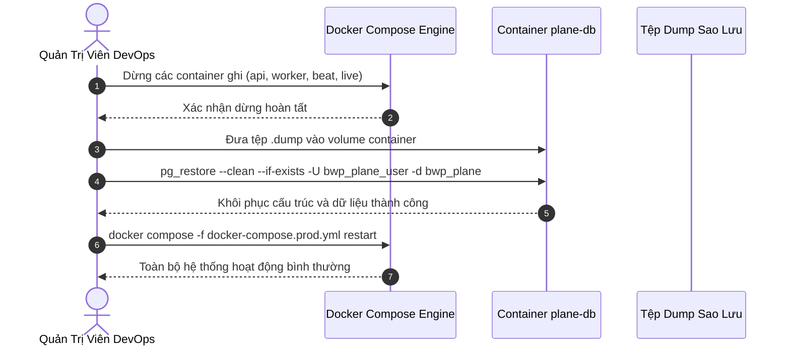

# BWP Notebook - Sổ Tay Công Việc Doanh Nghiệp

## Chương 5: Nhật Ký Hoạt Động, Kiểm Toán và Quản Trị Hệ Thống

> **Tài liệu Hướng dẫn Vận hành BWP Notebook (User Guide)**  
> **Phiên bản:** 2.0 (Bản phát hành Doanh nghiệp)  
> **Tác quyền & Kiến trúc:** Code & Architecture by IT Leon (BWP Engineering Team)  
> **Mục tiêu Quản trị:** Kiểm toán Hoạt động (Audit Trail), An toàn Dữ liệu (Backup/Restore) & Xử lý Sự cố (Troubleshooting)

---

## 1. Theo Dõi & Kiểm Toán Qua Nhật Ký Hoạt Động (Activity & Audit Log)

### 1.1. Tầm quan trọng của Dấu vết Kiểm toán Số (Digital Audit Trail)

Trong môi trường quản trị doanh nghiệp chuyên nghiệp, tính minh bạch và khả năng truy vết trách nhiệm cá nhân là yêu cầu cốt lõi. Mọi thay đổi dữ liệu trên hệ thống BWP Notebook — từ việc gán người phụ trách, thêm bớt người hỗ trợ, cập nhật số phòng cho đến chuyển trạng thái công việc — đều được ghi nhận tự động vào **Nhật ký Hoạt động (Activity Log)** theo thời gian thực.


#### Ý nghĩa nghiệp vụ:

1. **Minh bạch hóa tiến độ:** Lãnh đạo biết chính xác ai là người đã tiếp nhận công việc, thời điểm kỹ thuật viên bắt đầu xử lý và ai đã nghiệm thu hoàn thành.
2. **Không thể chối bỏ trách nhiệm:** Mọi thao tác đều gắn liền với định danh tài khoản (`actor_id`) và mốc thời gian tuyệt đối (`created_at`), ngăn chặn hiện tượng đổ lỗi hoặc tự ý thay đổi dữ liệu mà không có căn cứ.
3. **Phục vụ đánh giá KPI & Khen thưởng:** Dữ liệu nhật ký là bằng chứng chính xác để thống kê số lượng công việc mỗi nhân sự đã xử lý hoặc hỗ trợ trong tháng.

### 1.2. Danh mục các bản ghi hoạt động được Việt hóa 100%

Đội ngũ kỹ sư BWP (dẫn dắt bởi **IT Leon**) đã tùy biến toàn bộ tầng xử lý tác vụ nền (`apps/api/plane/bgtasks/issue_activities_task.py`) để các bản ghi hoạt động hiển thị hoàn toàn bằng tiếng Việt chuẩn mực:

| Trường Dữ Liệu Thay Đổi            | Đoạn Ghi Nhận Kiểm Toán Mẫu (Activity Stream Format)                     | Ý Nghĩa Thực Tế                                                   |
| :--------------------------------- | :----------------------------------------------------------------------- | :---------------------------------------------------------------- |
| **Người hỗ trợ (`supporters`)**    | `Nguyễn Văn A đã thêm Trần Văn B vào danh sách Người hỗ trợ`             | Bổ sung thêm kỹ sư phụ trách xử lý cùng tại hiện trường.          |
| **Gỡ người hỗ trợ (`supporters`)** | `Nguyễn Văn A đã xóa Lê Văn C khỏi danh sách Người hỗ trợ`               | Nhân sự rút khỏi công việc sau khi hoàn tất phần việc chuyên môn. |
| **Số phòng (`room`)**              | `Trần Văn B đã cập nhật Số phòng từ "302" thành "405"`                   | Điều chỉnh địa điểm phát sinh sự cố sau khi khảo sát thực tế.     |
| **Ghi chú nội bộ (`notes`)**       | `Lê Văn C đã cập nhật Ghi chú nội bộ`                                    | Ghi thêm thông số kỹ thuật hoặc dặn dò bảo mật ca trực.           |
| **Phân loại việc (`type`)**        | `Quản trị viên đã chuyển loại công việc sang "Công việc khác"`           | Nâng cấp công việc phát sinh thành nhiệm vụ theo kế hoạch.        |
| **Trạng thái (`state`)**           | `Nguyễn Văn A đã chuyển trạng thái từ "Chờ xử lý" sang "Đang thực hiện"` | Kỹ thuật viên bắt đầu bấm giờ tác nghiệp tại phòng.               |
| **Người phụ trách (`assignee`)**   | `Trưởng bộ phận đã chuyển giao người phụ trách cho Nguyễn Văn A`         | Bàn giao trách nhiệm chính cho nhân sự mới.                       |
| **Mức ưu tiên (`priority`)**       | `Nguyễn Văn A đã nâng mức ưu tiên từ "Trung bình" lên "Khẩn cấp"`        | Sự cố có dấu hiệu lan rộng, cần can thiệp khẩn cấp.               |
| **Hạn hoàn thành (`target_date`)** | `Trần Văn B đã gia hạn hoàn thành đến ngày 15/09/2026`                   | Cập nhật lại thời hạn xử lý sự cố phức tạp.                       |

### 1.3. Giao diện tra cứu và kiểm tra lịch sử

Người dùng và cán bộ quản lý có thể tra cứu lịch sử qua 2 cấp độ màn hình:

1. **Kiểm toán trong từng Công việc (Work Item Activity Tab):**
   - Mở chi tiết bất kỳ công việc nào $\rightarrow$ bấm vào tab **Lịch sử (Activity)** ở khung bên phải.
   - Toàn bộ dòng thời gian từ lúc tạo việc, các lần đổi trạng thái, bình luận kèm thời gian chi tiết (ví dụ: _10 phút trước_, _Hôm qua lúc 14:32_) đều hiện ra mạch lạc.
2. **Dòng hoạt động toàn Đơn vị (Workspace Activity Stream):**
   - Quản trị viên vào **Cài đặt đơn vị (Workspace Settings)** $\rightarrow$ **Nhật ký hoạt động (Audit Logs)**.
   - Màn hình này cung cấp bộ lọc kiểm toán toàn diện: Lọc theo nhân sự thực hiện, lọc theo phòng ban, lọc theo khoảng ngày, hỗ trợ xuất báo cáo kiểm tra khi cần thiết.

---

## 2. Quy Trình Sao Lưu & Phục Hồi Cơ Sở Dữ Liệu (Backup & Disaster Recovery)

Để phòng ngừa các sự cố phần cứng, lỗi người dùng hoặc thiên tai, việc thực hiện sao lưu định kỳ là nhiệm vụ bắt buộc của Quản trị viên hệ thống (DevOps). BWP Notebook áp dụng chiến lược **sao lưu 3-2-1** chuẩn doanh nghiệp: **3** bản sao dữ liệu, trên **2** loại phương tiện lưu trữ khác nhau, với **1** bản được lưu trữ ngoại vi (Offsite/Cloud).



### 2.1. Lệnh sao lưu cơ sở dữ liệu PostgreSQL thủ công

Cơ sở dữ liệu BWP Notebook hoạt động trong container Docker `bwp_notebook_plane_db`. Để tạo một bản sao lưu toàn vẹn ngay lập tức:

#### Bước 1: Tạo thư mục chứa bản sao lưu trên máy chủ Debian:

```bash
sudo mkdir -p /var/backups/bwp-notebook/db
sudo mkdir -p /var/backups/bwp-notebook/media
sudo chmod 700 /var/backups/bwp-notebook
```

#### Bước 2: Chạy lệnh xuất bản sao lưu PostgreSQL (pg_dump):

```bash
# Định dạng tùy biến nén cao (-Fc), bảo toàn toàn bộ schema, roles và dữ liệu
docker exec -t bwp_notebook_plane_db pg_dump \
  -U bwp_plane_user \
  -d bwp_plane \
  -Fc \
  -f /var/lib/postgresql/data/backup_bwp_$(date +%Y%m%d_%H%M%S).dump

# Sao chép tệp sao lưu từ volume container ra ổ đĩa máy chủ
sudo cp /var/lib/docker/volumes/nora-notebook_bwp_plane_pgdata/_data/backup_bwp_*.dump /var/backups/bwp-notebook/db/
```

#### Bước 3: Sao lưu thư mục hình ảnh và tệp đính kèm MinIO:

```bash
sudo tar -czvf /var/backups/bwp-notebook/media/uploads_$(date +%Y%m%d_%H%M%S).tar.gz \
  /var/lib/docker/volumes/nora-notebook_bwp_plane_uploads/_data
```

### 2.2. Thiết lập Cron Job tự động sao lưu hàng ngày

Để hệ thống tự động sao lưu vào lúc **02:00 sáng mỗi ngày** và tự động xóa các bản lưu cũ quá 30 ngày:

1. **Tạo kịch bản sao lưu:** Lưu file tại `/opt/bwp-notebook/scripts/bwp_daily_backup.sh`:

```bash
#!/usr/bin/env bash
# ==============================================================================
# BWP Notebook Automated Daily Backup Script
# Code & Architecture by IT Leon
# ==============================================================================
set -euo pipefail

BACKUP_DIR="/var/backups/bwp-notebook"
TIMESTAMP=$(date +"%Y%m%d_%H%M%S")
DB_CONTAINER="bwp_notebook_plane_db"
DB_USER="bwp_plane_user"
DB_NAME="bwp_plane"

mkdir -p "${BACKUP_DIR}/db" "${BACKUP_DIR}/media"

echo "[$(date)] Bắt đầu tiến trình sao lưu BWP Notebook..."

# 1. Sao lưu Cơ sở dữ liệu PostgreSQL
docker exec -t "${DB_CONTAINER}" pg_dump -U "${DB_USER}" -d "${DB_NAME}" -Fc \
  -f "/var/lib/postgresql/data/daily_${TIMESTAMP}.dump"

cp "/var/lib/docker/volumes/nora-notebook_bwp_plane_pgdata/_data/daily_${TIMESTAMP}.dump" \
   "${BACKUP_DIR}/db/bwp_db_${TIMESTAMP}.dump"

rm -f "/var/lib/docker/volumes/nora-notebook_bwp_plane_pgdata/_data/daily_${TIMESTAMP}.dump"

# 2. Sao lưu Tệp đính kèm MinIO S3
tar -czf "${BACKUP_DIR}/media/bwp_uploads_${TIMESTAMP}.tar.gz" \
  -C "/var/lib/docker/volumes/nora-notebook_bwp_plane_uploads" _data

# 3. Dọn dẹp các bản sao lưu cũ hơn 30 ngày
find "${BACKUP_DIR}/db" -type f -name "*.dump" -mtime +30 -delete
find "${BACKUP_DIR}/media" -type f -name "*.tar.gz" -mtime +30 -delete

echo "[$(date)] Sao lưu hoàn tất thành công!"
```

2. **Cấp quyền thực thi cho kịch bản:**

```bash
sudo chmod +x /opt/bwp-notebook/scripts/bwp_daily_backup.sh
```

3. **Thêm vào Cron Tab của hệ thống:**

```bash
sudo crontab -e
```

Thêm dòng sau vào cuối tệp:

```cron
0 2 * * * /opt/bwp-notebook/scripts/bwp_daily_backup.sh >> /var/log/bwp_backup.log 2>&1
```

### 2.3. Quy trình khôi phục dữ liệu khẩn cấp khi gặp sự cố (Disaster Recovery)

Khi xảy ra sự cố hỏng hóc phần cứng hoặc thao tác nhầm lẫn nghiêm trọng, Quản trị viên tiến hành khôi phục theo quy trình 5 bước:



#### Các lệnh thực thi chi tiết:

1. **Bước 1: Tạm dừng các dịch vụ ghi dữ liệu để tránh xung đột:**
   ```bash
   cd /opt/nora-notebook
   docker compose -f docker-compose.prod.yml stop api worker beat-worker live
   ```
2. **Bước 2: Sao chép tệp sao lưu vào volume của PostgreSQL:**
   ```bash
   # Giả sử cần khôi phục bản lưu bwp_db_20260913_020000.dump
   sudo cp /var/backups/bwp-notebook/db/bwp_db_20260913_020000.dump \
     /var/lib/docker/volumes/nora-notebook_bwp_plane_pgdata/_data/restore_target.dump
   ```
3. **Bước 3: Thực hiện lệnh phục hồi với pg_restore:**
   ```bash
   docker exec -t bwp_notebook_plane_db pg_restore \
     -U bwp_plane_user \
     -d bwp_plane \
     --clean \
     --if-exists \
     --no-owner \
     --no-privileges \
     /var/lib/postgresql/data/restore_target.dump
   ```
4. **Bước 4: Khôi phục tệp đính kèm MinIO (nếu cần):**
   ```bash
   sudo tar -xzf /var/backups/bwp-notebook/media/bwp_uploads_20260913_020000.tar.gz \
     -C /var/lib/docker/volumes/nora-notebook_bwp_plane_uploads
   ```
5. **Bước 5: Khởi động lại toàn bộ các dịch vụ hệ thống:**
   ```bash
   docker compose -f docker-compose.prod.yml restart
   ```
6. **Bước 6: Xác nhận hoạt động:**
   Truy cập `http://192.168.3.168:18080`, đăng nhập và kiểm tra tính toàn vẹn của danh sách công việc và lịch sử hoạt động.

---

## 3. Danh Mục Câu Hỏi Thường Gặp (FAQs)

Dưới đây là tổng hợp 8 câu hỏi phổ biến nhất từ người dùng và cán bộ quản trị trong quá trình vận hành BWP Notebook:

### FAQ 1: Tôi quên mật khẩu đăng nhập thì khôi phục như thế nào?

- **Cách 1 (Nếu đã cấu hình SMTP gửi thư):** Tại màn hình Đăng nhập, bấm vào liên kết **"Quên mật khẩu?"**, nhập email công vụ của bạn. Một email chứa mã liên kết đặt lại mật khẩu an toàn sẽ được gửi về hòm thư trong vòng 1-2 phút.
- **Cách 2 (Quản trị viên hỗ trợ):** Nếu hệ thống chạy mạng LAN nội bộ chưa cấu hình máy chủ thư, Quản trị viên đơn vị (Admin) có thể vào mục **Cài đặt đơn vị** $\rightarrow$ **Thành viên** $\rightarrow$ chọn tài khoản của bạn và bấm nút **"Gửi liên kết đặt lại mật khẩu"** hoặc tạo mật khẩu tạm thời cho bạn.

### FAQ 2: Tại sao tôi không thể đổi loại công việc sang "Công việc khác"?

- **Giải đáp:** Đây là **Quy tắc phân quyền nghiệp vụ (Business Rule)** được thiết kế bởi IT Leon. Thành viên thông thường (Member) chỉ được phép tạo và xử lý các _Công việc vận hành (Operational tasks)_ phát sinh trong ca trực. Chỉ Quản trị viên (Admin) hoặc Trưởng bộ phận mới có thẩm quyền chuyển đổi công việc thành _Công việc khác (Other tasks)_ để phục vụ kế hoạch chỉ đạo tập trung.

### FAQ 3: Một công việc có thể gán bao nhiêu Người hỗ trợ (Supporters)?

- **Giải đáp:** Hệ thống **không giới hạn** số lượng người hỗ trợ. Bạn có thể thêm 1, 3 hoặc 10 nhân sự cùng tham gia hỗ trợ một công việc lớn (ví dụ: đợt tổng vệ sinh tòa nhà hoặc bảo dưỡng hệ thống PCCC toàn khu).

### FAQ 4: Các tính năng Cycles (Chu kỳ), Modules (Dự án con), Pages (Tài liệu) của Plane trước đây ở đâu?

- **Giải đáp:** Nhằm phục vụ tối ưu cho mô hình sổ tay công việc thực tiễn của doanh nghiệp Việt Nam, loại bỏ sự cồng kềnh phức tạp của các phần mềm phát triển phần mềm công nghệ, BWP Notebook đã **chủ động ẩn các menu này khỏi giao diện** bằng cơ chế cấu hình tinh gọn. Toàn bộ trọng tâm được dồn vào Sổ tay công việc và màn hình Bảng tính lưới (Spreadsheet view).

### FAQ 5: Dữ liệu công việc của phòng tôi có bị nhân viên phòng khác nhìn thấy không?

- **Giải đáp:** Hoàn toàn **không**, với điều kiện Quản trị viên đã thiết lập chế độ hiển thị của phòng ban là **Riêng tư / Bảo mật (Secret / Private)**. Khi đó, chỉ những nhân sự có tên trong danh sách thành viên của phòng mới có thể truy cập nội dung sổ tay.

### FAQ 6: Hạn mức tệp đính kèm là bao nhiêu và tải lên được những định dạng nào?

- **Giải đáp:** Hạn ngạch mặc định cho mỗi tệp tin đính kèm là **$50\text{MB}$**. Hệ thống hỗ trợ đa dạng định dạng: Tài liệu văn phòng (Word, Excel, PDF), hình ảnh hiện trường (JPG, PNG, WEBP) và tệp nén (ZIP, RAR).

### FAQ 7: Giao diện của tôi bất ngờ chuyển sang tiếng Anh hoặc hiển thị mã khóa dịch, khắc phục ra sao?

- **Giải đáp:** Nhấp vào ảnh đại diện cá nhân ở góc dưới bên trái $\rightarrow$ chọn **Cài đặt cá nhân (Profile Settings)** $\rightarrow$ mục **Tùy chọn (Preferences)** $\rightarrow$ tại ô **Ngôn ngữ (Language)** chọn lại **Tiếng Việt (vi-VN)** $\rightarrow$ bấm **Lưu**. Đồng thời, hãy nhấn phím `Ctrl + F5` trên trình duyệt để xóa sạch bộ nhớ cache cũ.

### FAQ 8: Khi một nhân sự nghỉ việc hoặc chuyển bộ phận, công việc của họ xử lý thế nào?

- **Giải đáp:** Quản trị viên tuyệt đối **không được xóa vĩnh viễn** tài khoản đó. Hãy thực hiện quy trình bàn giao 3 bước (đã nêu trong Chương 2): Lọc các công việc mà nhân sự đó phụ trách chính để giao lại cho người mới $\rightarrow$ Xóa nhân sự khỏi danh sách phòng ban $\rightarrow$ Chuyển trạng thái tài khoản sang **Vô hiệu hóa (Deactivate)**.

---

## 4. Hướng Dẫn Xử Lý Sự Cố Kỹ Thuật (Troubleshooting Guide)

### 4.1. Bảng tra cứu sự cố & phản ứng nhanh

| Triệu Chứng Sự Cố                                     | Nguyên Nhân Tiềm Ẩn                            | Biện Pháp Xử Lý Tức Thời                                            |
| :---------------------------------------------------- | :--------------------------------------------- | :------------------------------------------------------------------ |
| **Không truy cập được cổng `18080`**                  | Service Docker bị dừng hoặc Firewall chặn cổng | Khởi động lại stack compose, kiểm tra lệnh `sudo ufw status`.       |
| **Lỗi `502 Bad Gateway`**                             | Backend `api` đang khởi động hoặc cạn kiệt RAM | Đợi 30-60 giây để `migrator` hoàn tất, kiểm tra log `api`.          |
| **Không nhận được email thông báo**                   | Sai thông số SMTP hoặc `plane-mq` bị nghẽn     | Kiểm tra tệp cấu hình `.env`, khởi động lại `plane-mq` và `worker`. |
| **Lỗi cơ sở dữ liệu `Remaining connection slots...`** | Số lượng kết nối đồng thời vượt ngưỡng         | Tham số `max_connections=200` cần được kích hoạt trên `plane-db`.   |
| **Ổ đĩa máy chủ báo đầy $100\%$ (`No space left`)**   | Docker images cũ và tệp log tích tụ            | Chạy lệnh dọn rác `docker system prune -f` và dọn log.              |

### 4.2. Hướng dẫn xử lý chi tiết từng sự cố

#### Sự cố 1: Không thể truy cập địa chỉ `http://192.168.3.168:18080` (ERR_CONNECTION_REFUSED)

1. Kiểm tra trạng thái hoạt động của các container:
   ```bash
   cd /opt/nora-notebook
   docker compose -f docker-compose.prod.yml ps
   ```
2. Nếu container `proxy` hoặc `web` ở trạng thái `Exited`, kiểm tra lý do crash:
   ```bash
   docker compose -f docker-compose.prod.yml logs proxy web
   ```
3. Kiểm tra xem tường lửa Debian (UFW) có đang chặn cổng `18080` hay không:
   ```bash
   sudo ufw status
   # Nếu UFW đang active mà chưa mở cổng 18080:
   sudo ufw allow 18080/tcp
   sudo ufw reload
   ```

#### Sự cố 2: Trình duyệt báo lỗi "502 Bad Gateway"

Lỗi 502 xảy ra khi Nginx Proxy không thể chuyển tiếp request đến Gunicorn backend (`api:8000`):

1. Xem log thời gian thực của container backend:
   ```bash
   docker compose -f docker-compose.prod.yml logs --tail=100 -f api
   ```
2. Nếu backend báo lỗi kết nối cơ sở dữ liệu (`OperationalError: could not connect to server`), kiểm tra xem container `plane-db` đã hoàn tất quá trình khởi động chưa:
   ```bash
   docker exec -it bwp_notebook_plane_db pg_isready -U bwp_plane_user -d bwp_plane
   ```
3. Nếu container `api` liên tục khởi động lại (Restart loop), nguyên nhân thường do máy chủ thiếu hụt bộ nhớ RAM. Kiểm tra tài nguyên bằng `free -h` và tăng dung lượng Swapfile trên Debian.

#### Sự cố 3: Máy chủ báo đầy ổ đĩa (Disk Space Exhaustion)

Sau một thời gian vận hành dài, Docker có thể tích lũy các hình ảnh container thừa và các tệp nhật ký lớn:

1. Kiểm tra dung lượng ổ đĩa tổng thể:
   ```bash
   df -h /
   ```
2. Kiểm tra dung lượng chiếm dụng bởi Docker:
   ```bash
   docker system df
   ```
3. Thực hiện dọn dẹp an toàn các tệp hình ảnh tạm thời và mạng không sử dụng (không làm ảnh hưởng đến dữ liệu volume):
   ```bash
   docker system prune -f
   ```
4. Cắt tỉa (truncate) các tệp log Docker quá lớn:
   ```bash
   sudo sh -c "truncate -s 0 /var/lib/docker/containers/*/*-json.log"
   ```

### 4.3. Bộ lệnh chẩn đoán nhanh một chạm (One-liner Health Check)

Dành cho Quản trị viên DevOps để kiểm tra toàn diện sức khỏe hệ thống BWP Notebook chỉ trong một câu lệnh duy nhất:

```bash
echo "=== KIỂM TRA SỨC KHỎE HỆ THỐNG BWP NOTEBOOK ===" && \
echo "1. Trạng thái Container:" && docker compose -f docker-compose.prod.yml ps --format "table {{.Name}}\t{{.Status}}\t{{.Ports}}" && \
echo -e "\n2. Kiểm tra Kết nối PostgreSQL:" && docker exec -t bwp_notebook_plane_db pg_isready -U bwp_plane_user -d bwp_plane && \
echo -e "\n3. Kiểm tra Bộ nhớ Đệm Valkey/Redis:" && docker exec -t bwp_notebook_plane_redis valkey-cli ping && \
echo -e "\n4. Dung lượng Bộ nhớ RAM & Ổ đĩa:" && free -h && df -h /
```
